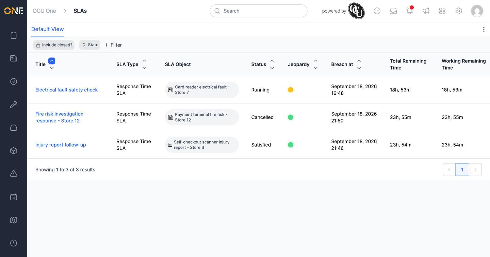
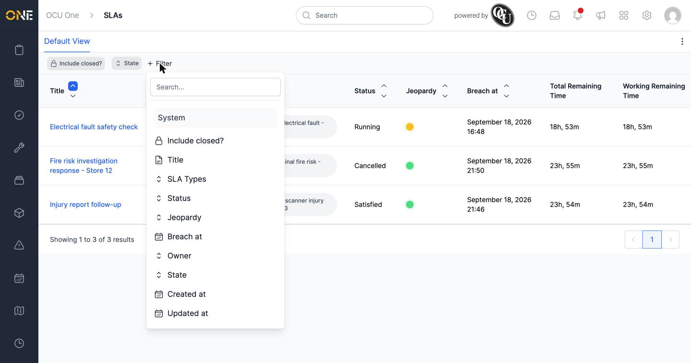
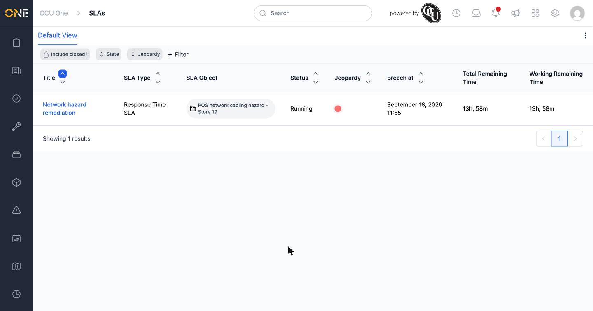

# Browsing and filtering all SLAs

The main **SLAs** page lists every SLA you have access to, across every record, project, ticket, or user it's attached to.

## The list view

Open **SLAs** from the sidebar. Each row shows the SLA's title, its SLA type, the item it's tracking (**SLA Object**), its status, jeopardy (as a coloured dot), breach date, and how much total and working time is left.

By default, only **Active** SLAs show — deactivated ones are hidden unless you filter for them (see below).

## Filtering the list

Two filter chips sit above the list by default: **Include closed?** and **State**.

Click **+ Filter** to see everything else available: **Title**, **SLA Types**, **Status**, **Jeopardy**, **Breach at**, **Owner**, **State**, **Created at**, and **Updated at**.

For example, add **Jeopardy** and choose **Red** to find SLAs that are overdue or close to breaching. Since deactivated SLAs are excluded by default, also add "Inactive" to the **State** filter if you want those included too.

Multiple filters combine together — for example, Jeopardy **and** Status narrows the list to SLAs matching both at once.

## Things to know

- **State** covers Active, Inactive, and Closed — it's a separate concept from **Status** (Pending, Running, Paused, Satisfied, Breached, Cancelled), which tracks where the SLA is in its own lifecycle.
- Jeopardy is shown as a coloured dot (green, amber, or red) rather than text — filter by it using the same colour names.
- Click an SLA's title in the list to open its overview.
