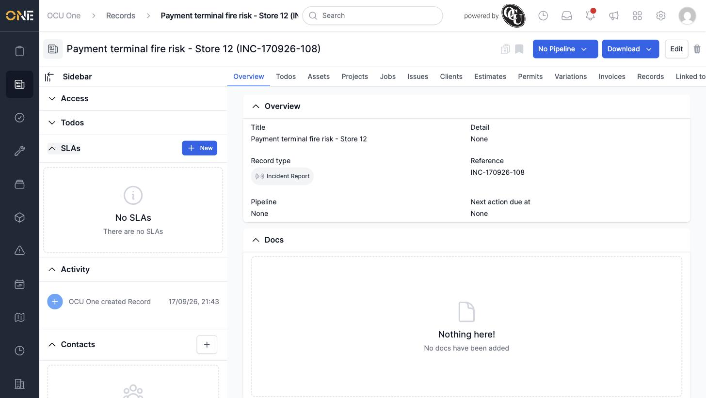
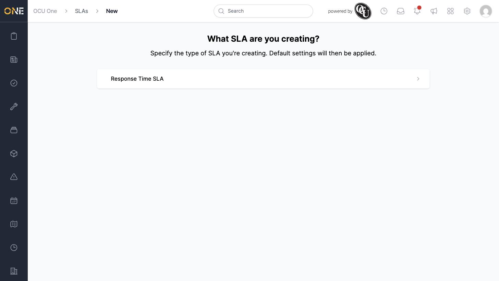
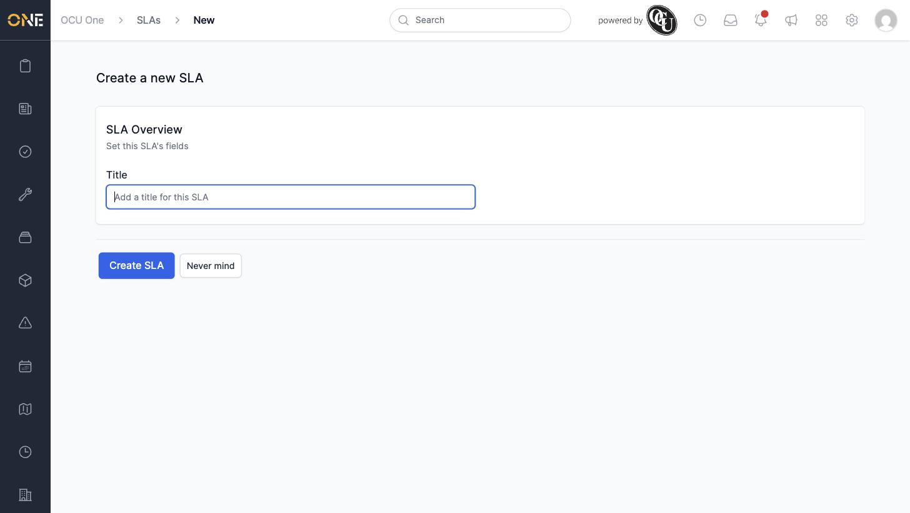
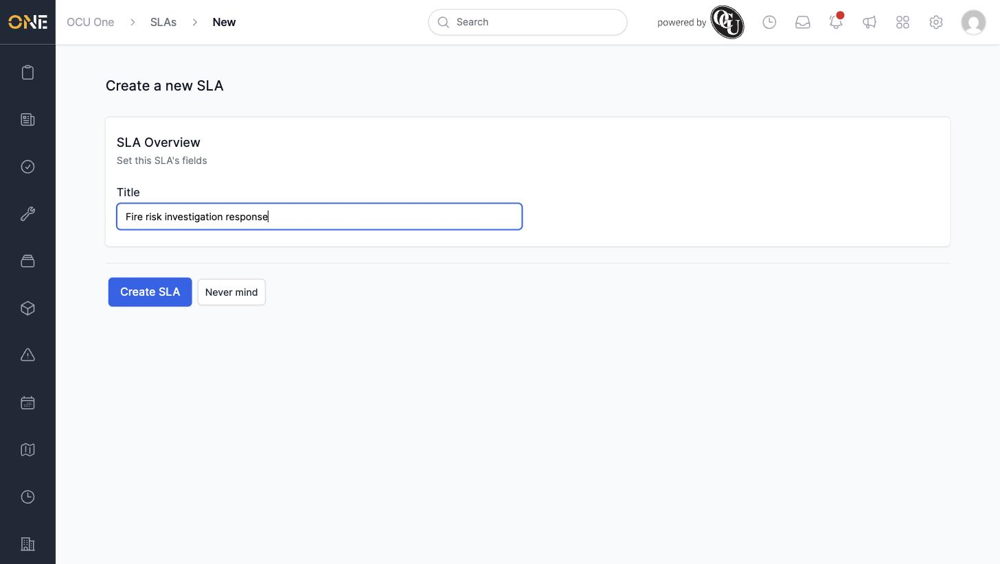
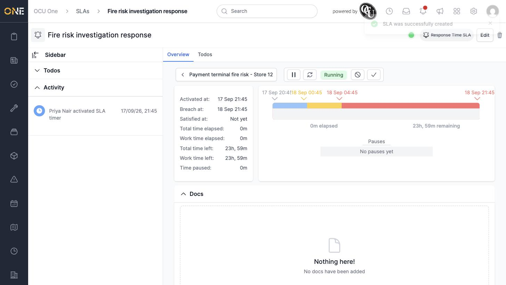

# Creating an SLA on a job or other record

An **SLA** (Service Level Agreement) is a timer that tracks how long a piece of work has been outstanding, and warns you as it gets close to breaching its target time. SLAs can be added to records, projects, tickets, and users — this guide walks through adding one to a record.

## Opening the SLAs panel

Open the record (or other item) you want to track, and expand the **SLAs** section in the sidebar. If none have been added yet, it shows an empty state.

## Choosing an SLA type

Click **+ New**. You're shown a list of SLA types that can be attached to this kind of record — pick the one that matches the situation.

## Naming and creating the SLA

Give the SLA a title describing what it's tracking, then click **Create SLA**.

The SLA starts running immediately — its timer, breach date, and progress bar are all calculated automatically from the SLA type's settings.

## Things to know

- Which SLA types you can choose from depends on what's been set up for that record/ticket/project type in Settings — if you don't see the type you expect, ask an admin to check it's been attached there.
- Once created, an SLA's **Activated at** and **Breach at** dates are set automatically — you can't set these manually when creating it.
- The SLA is immediately visible on the item it was created from, and also appears in the main SLAs list.
