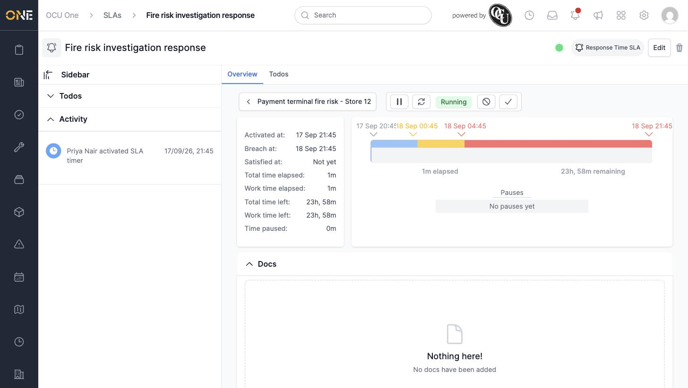
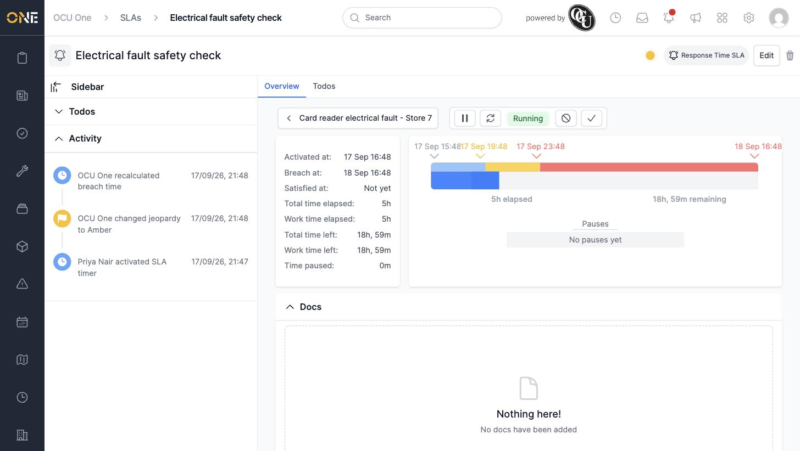
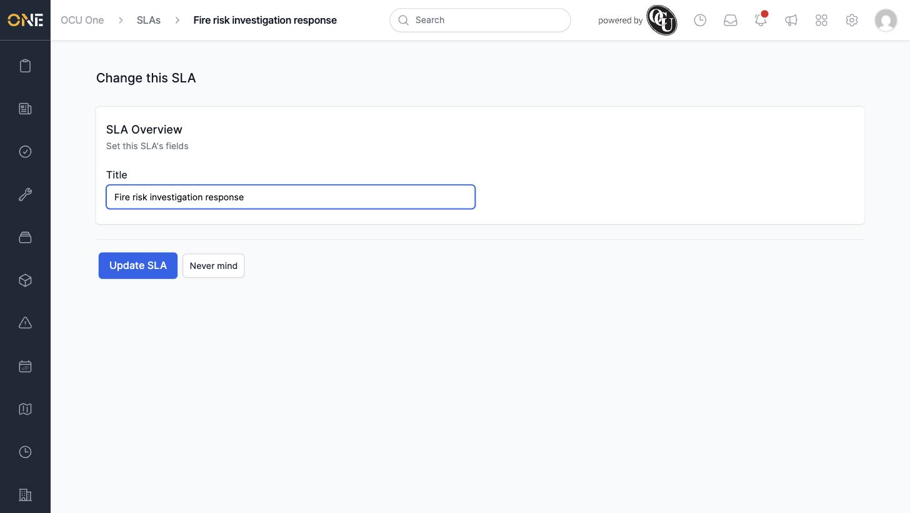
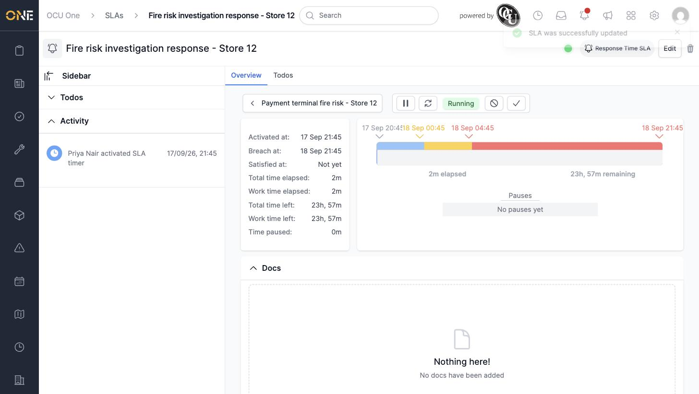

# Monitoring and editing an SLA's progress

Once an SLA is running, its overview page shows exactly how much time is left before it breaches, and lets you update its title.

## Reading the progress view

Open an SLA to see its full progress view: a colour-coded bar showing how far through the SLA's timeline you are, with markers for when it started, when it enters amber, when it enters red, and when it's due to breach.

The panel on the left gives the same information as numbers: **Activated at**, **Breach at**, **Satisfied at** (if it's been satisfied), **Total time elapsed**, **Work time elapsed**, **Total time left**, **Work time left**, and **Time paused**. Below the progress bar, any pauses the SLA has had are listed — or "No pauses yet" if it hasn't been paused.

A small coloured dot next to the SLA's title (top right) shows its current jeopardy level — green while there's plenty of time left, amber once it's getting close, and red once it's overdue or breached.

## Editing an SLA

Click **Edit** in the top right. The only field you can change is the **Title**.

Click **Update SLA** to save.

## Things to know

- Jeopardy level, breach date, and elapsed/remaining time are all calculated automatically — editing an SLA never changes these directly.
- Every jeopardy change and breach-time recalculation is recorded in the SLA's activity log, so you can see exactly when it moved from green to amber to red.
- "Work time" excludes anything outside the SLA type's configured working hours (and public holidays, if the type excludes them) — it can be shorter than the real-world elapsed time.
