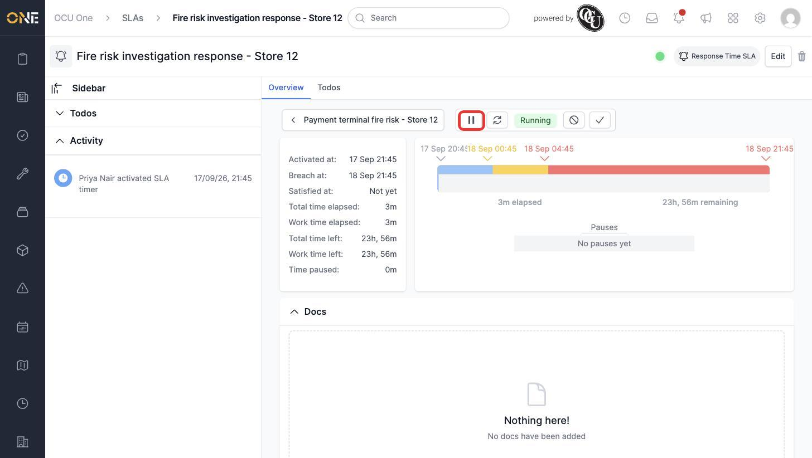
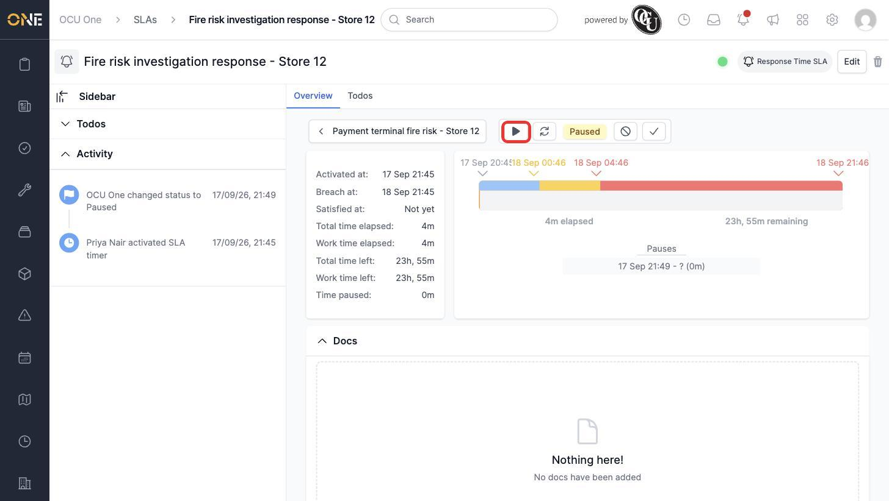
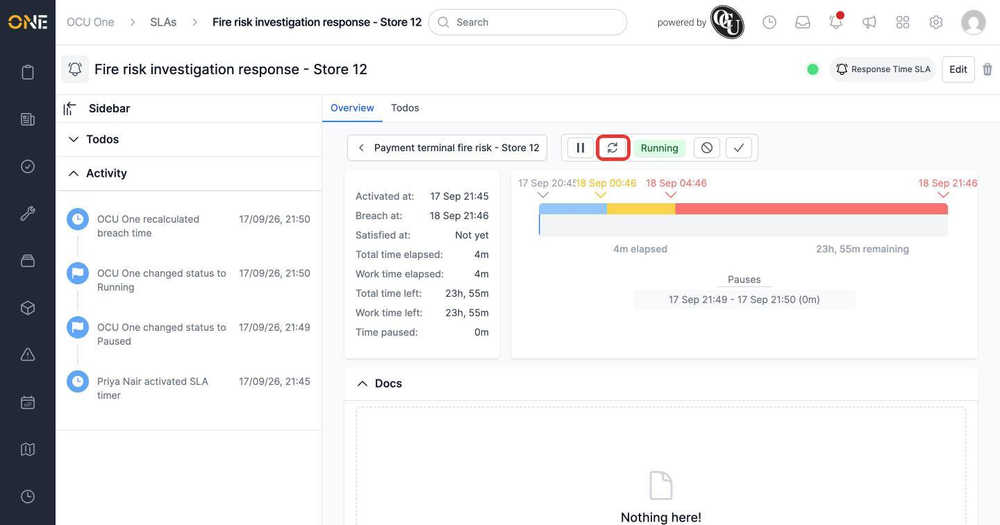
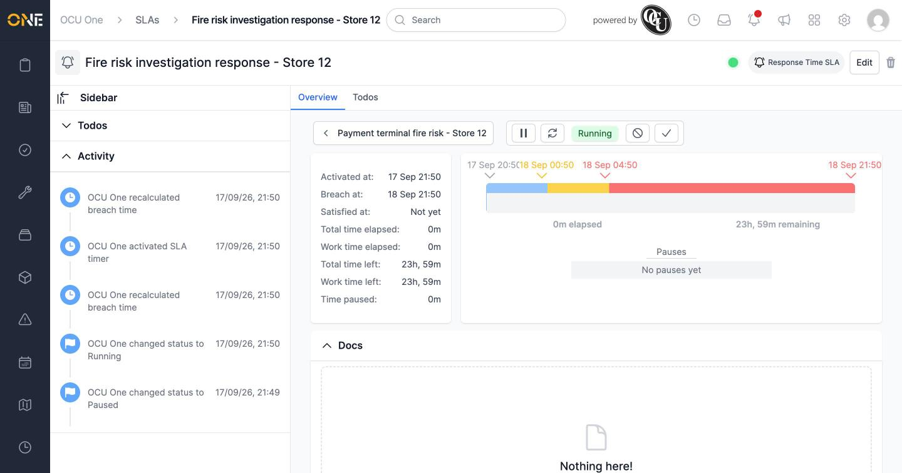
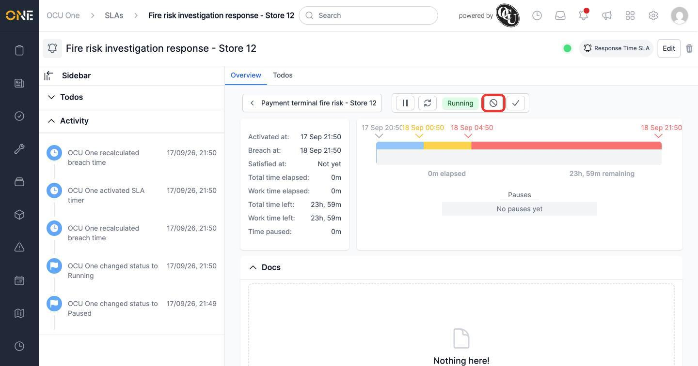
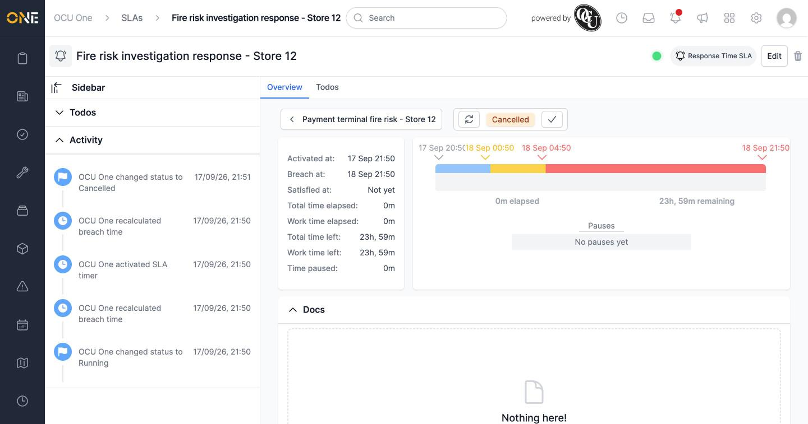
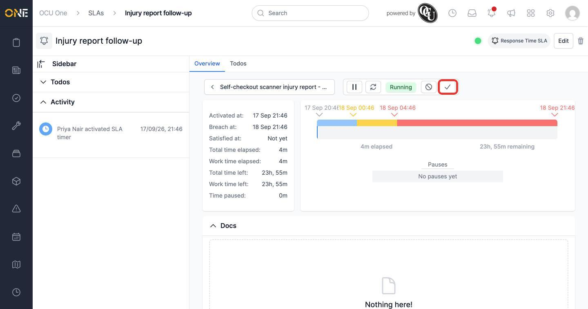
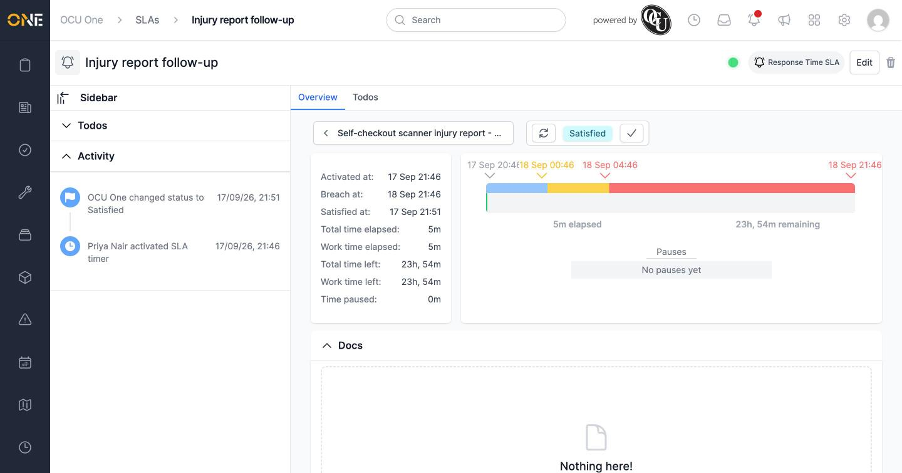

# Pausing, resuming, restarting, cancelling, or satisfying an SLA

While an SLA is running, a row of command buttons on its overview page let you control its timer. Which buttons show depends on the SLA's current status.

## Pausing and resuming

Click the **Pause** button to stop the SLA's clock — useful if work is on hold waiting on something outside your control. You'll be asked to confirm ("Are you sure you want to pause this SLA?").

Once paused, the SLA's status badge changes to **Paused**, the Pause button becomes a **Play** (resume) button, and the pause is logged in the Pauses list with a start time.

Click **Play** to resume it (confirming "Are you sure you want to resume this SLA?"). The status returns to **Running**, the breach date is pushed back by however long it was paused, and the pause entry now shows both a start and end time.

## Restarting

Click the circular arrow (**Restart**) icon to reset the SLA back to a fresh timer — clearing all its pauses and recalculating the breach date from now. Confirm the prompt ("Are you sure you want to restart this SLA?") to go ahead.

## Cancelling

Click the no-entry (**Cancel**) icon to stop the SLA without marking it as satisfied — for example, if the underlying record is closed or no longer relevant. Confirm the prompt ("Are you sure you want to cancel this SLA?").

Once cancelled, the status badge reads **Cancelled**, and only the Restart and Satisfy actions remain available.

## Satisfying

Click the tick (**Satisfy**) icon once the work the SLA is tracking is actually done. Confirm the prompt ("Are you sure you want to satisfy this SLA?").

The status badge changes to **Satisfied**, and the **Satisfied at** field on the left is filled in with the time it was marked done.

## Things to know

- Every one of these actions asks you to confirm first — there's no undo once you click through, other than using Restart to reset a cancelled or satisfied SLA back to running.
- Which buttons are available depends on the SLA's current status: a running SLA can be paused, restarted, cancelled, or satisfied; a paused one shows Play instead of Pause; a cancelled or satisfied SLA only shows Restart and Satisfy (or just Restart, if already satisfied).
- Pausing and resuming doesn't lose any progress — the time already spent still counts, and only the breach date shifts to account for the pause.
