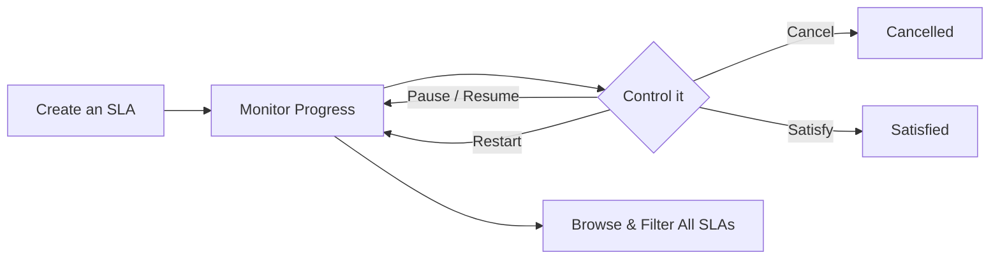

# SLAs — Overview

An **SLA** (Service Level Agreement) is a timer attached to a record, project, ticket, or user, tracking how long a piece of work has been outstanding and warning you as it gets close to breaching its target time. This area covers creating an SLA, watching its progress, and the actions that control it.

## The core pieces

An SLA has a **title**, an **SLA type** (which sets its amber/red/breach thresholds and working hours), and a **status** (Pending, Running, Paused, Satisfied, Breached, or Cancelled). Separately, its **jeopardy** — green, amber, or red — shows how close it is to breaching, shown as a coloured dot. An SLA also has a **state** (Active, Inactive, or Closed), which is a different concept from its status.

## The end-to-end flow

It starts with [Creating an SLA on a job or other record](Creating%20an%20SLA%20on%20a%20job%20or%20other%20record.md), which covers adding one from a record, project, ticket, or user's SLAs panel and picking an SLA type.

Once running, [Monitoring and editing an SLA's progress](Monitoring%20and%20editing%20an%20SLA's%20progress.md) covers reading its progress bar and timing fields, watching its jeopardy level change, and the one thing you can edit — its title.

[Pausing, resuming, restarting, cancelling, or satisfying an SLA](Pausing%2C%20resuming%2C%20restarting%2C%20cancelling%2C%20or%20satisfying%20an%20SLA.md) covers the command buttons that control an SLA's timer and bring it to a close, whichever way the work actually finished.

[Activating or deactivating an SLA](Activating%20or%20deactivating%20an%20SLA.md) documents what's there today — currently blocked by an open app bug (see below).

Finally, [Browsing and filtering all SLAs](Browsing%20and%20filtering%20all%20SLAs.md) covers the main SLAs list and its filters, for finding SLAs across everything you have access to.

## The flow at a glance

- **Create an SLA** — attach one to a record, project, ticket, or user, and pick its type.
- **Monitor Progress** — watch its timer, jeopardy level, and breach date.
- **Control it** — pause/resume, restart, cancel, or satisfy, depending on how the work is going.
- **Browse & Filter** — find SLAs across everything, by status, jeopardy, type, or state.

## Known issues

[Activating or deactivating an SLA](Activating%20or%20deactivating%20an%20SLA.md) is currently blocked from human verification — the routes work, but there is no button, icon, or link anywhere in the app that triggers them. See `Zz - Known Bugs/` for the full write-up.
