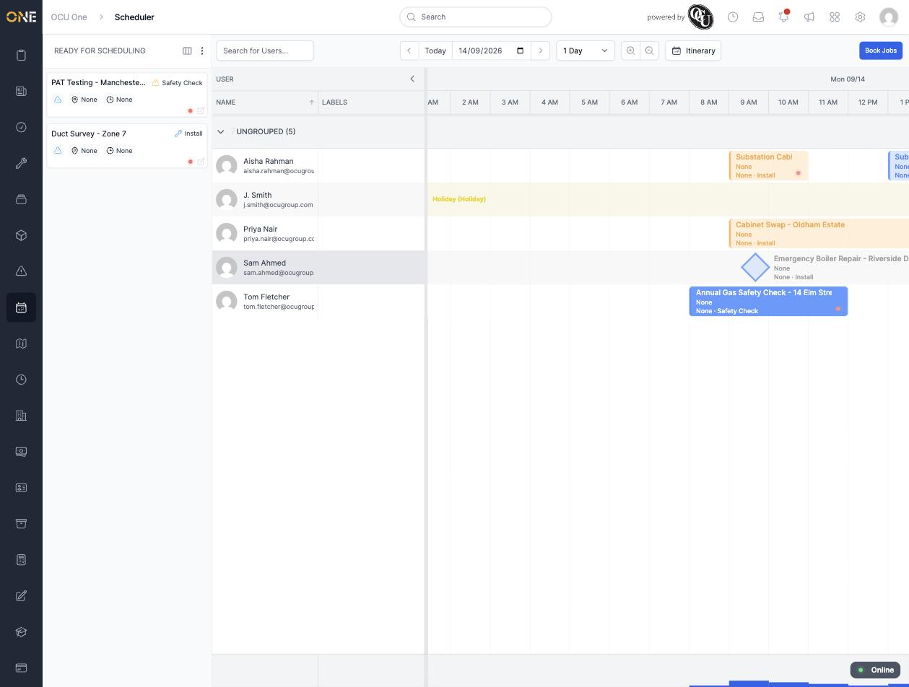
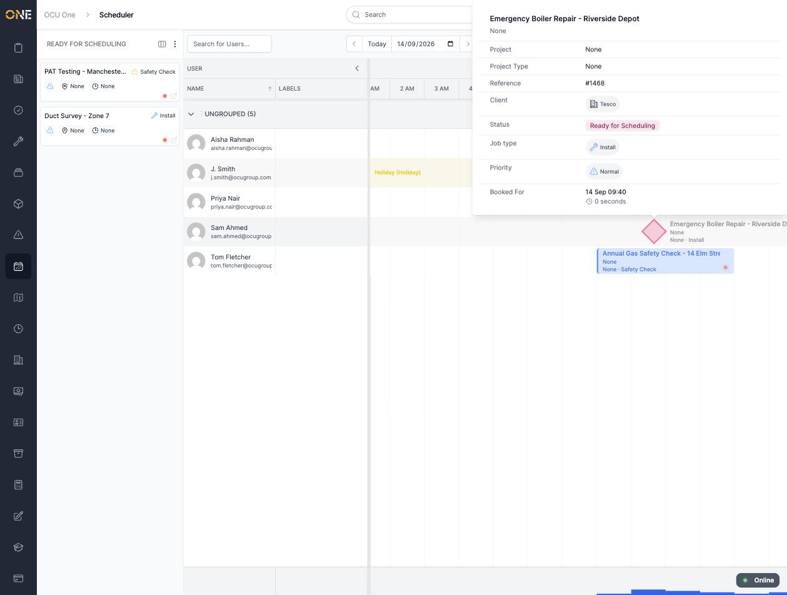
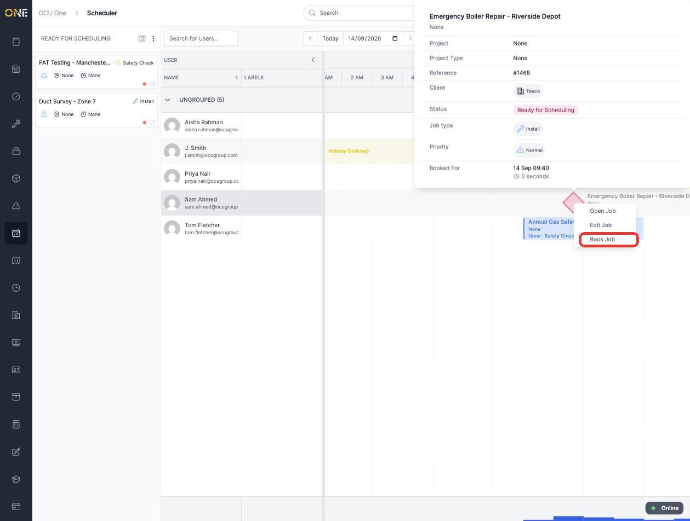
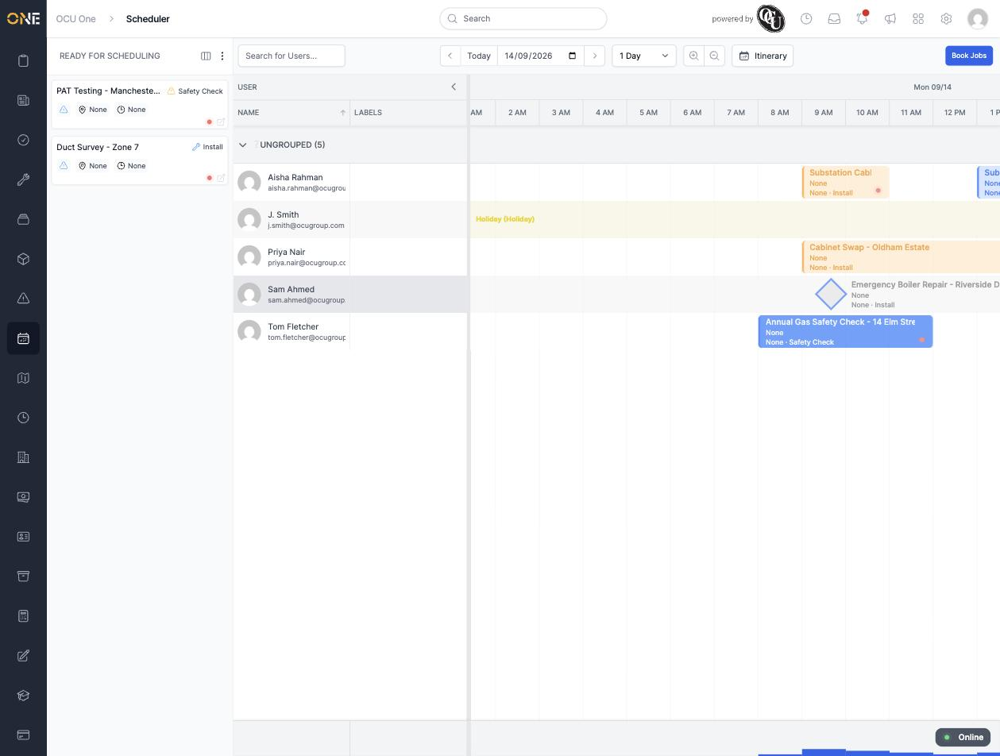

# Booking a job on the scheduler

Jobs that are ready for scheduling but don't yet have a time or a user sit in the panel on the left of the board. Booking one is a two-step drag-and-confirm: drop it onto a free slot, then confirm the booking.

## Dragging a job onto a user's row

Jobs waiting to be scheduled are listed in the **Ready for Scheduling** panel on the left, each showing its job type and a warning icon if it isn't allocated yet:

Click and drag a job from the panel onto a free space on the user's row you want to book it to, at the time you want it to start. Letting go drops it into place — the job disappears from the Ready for Scheduling panel and appears on that user's row, still shown in its paler, tentative colour, along with a short tooltip confirming the details:

*At this point the job has a user and a time slot, but it hasn't actually been booked yet — its status is still "Ready for Scheduling".*

## Confirming the booking

Right-click the job on its new row and choose **Book Job**:

The block switches to its solid, booked colour straight away:

## Things to know

- Dragging only places the job — it stays in "Ready for Scheduling" status until you separately choose **Book Job**. If you drag it into the wrong slot, drag it again to a different time or user before booking it.
- If you decide not to book it after all, right-click and choose **Unallocate Job** instead — see the guide on unallocating a job for what that does.
- A job can only be dragged onto the board while it's still in "Ready for Scheduling" status and unallocated — anything already booked, in progress, or otherwise assigned won't appear in this panel to drag.
