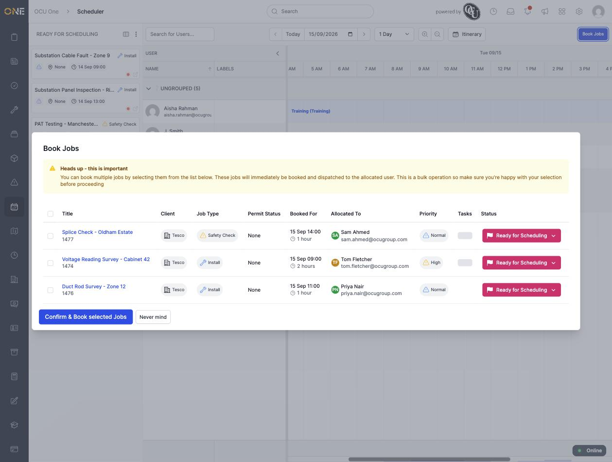
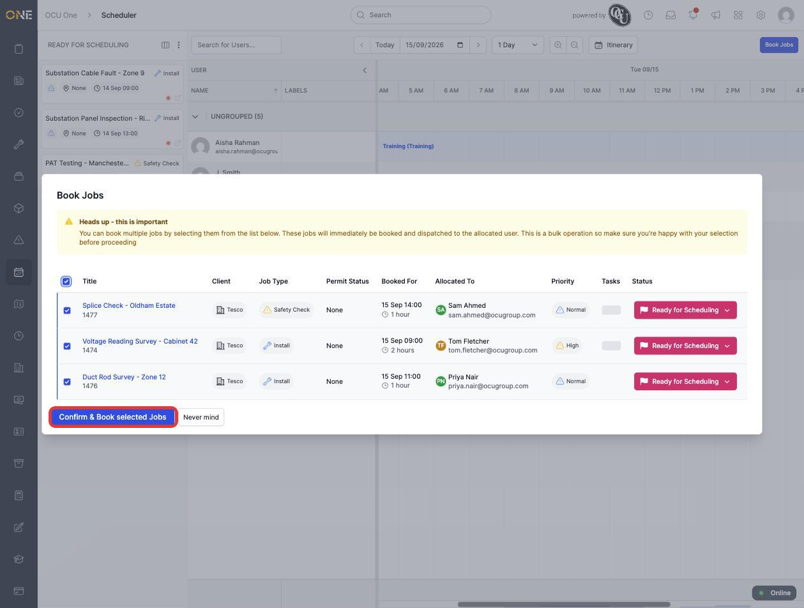
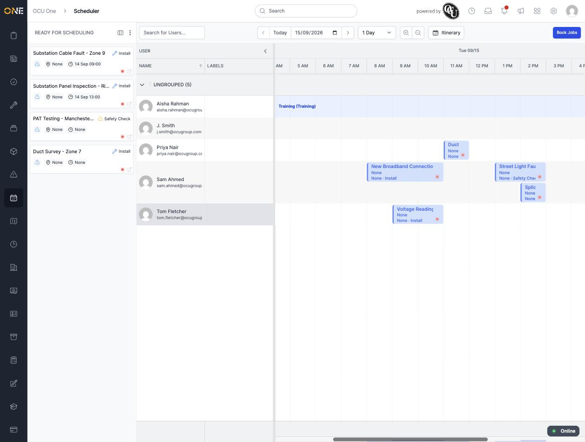

# Bulk-booking many jobs

If you've already dragged several jobs onto the board and they're all sitting there allocated and timed but not yet booked, you can book them all at once instead of confirming each one individually.

## Opening the picker

Click **Book Jobs** in the top-right corner of the scheduler board. A list opens of every job that's currently allocated, timed, and still in "Ready for Scheduling" status within the date range you're viewing:

*A warning banner reminds you this is a bulk action — every job you tick will be booked and dispatched to its allocated user as soon as you confirm.*

## Selecting and booking

Tick the checkbox next to each job you want to book, or tick the header checkbox to select every job in the list:

Click **Confirm & Book selected Jobs**. The modal closes and, back on the board, every selected job switches to its solid, booked colour:

## Things to know

- The list only shows jobs within the date range currently visible on the board — widen the time span (see the guide on using the scheduling board) first if a job you expect to book isn't showing up here.
- Only jobs that are already allocated to a user **and** have a booked time show up in this picker — a job still sitting unallocated in the Ready for Scheduling panel won't appear until you've dragged it onto someone's row.
- Booking through this picker has the same effect as right-clicking a single job and choosing **Book Job** — it's simply a faster way to confirm several at once.
