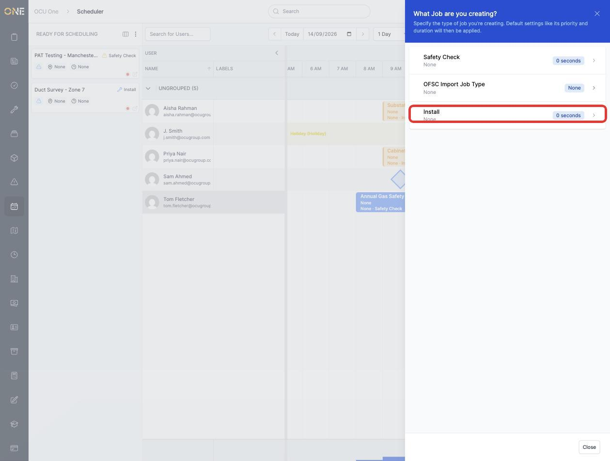
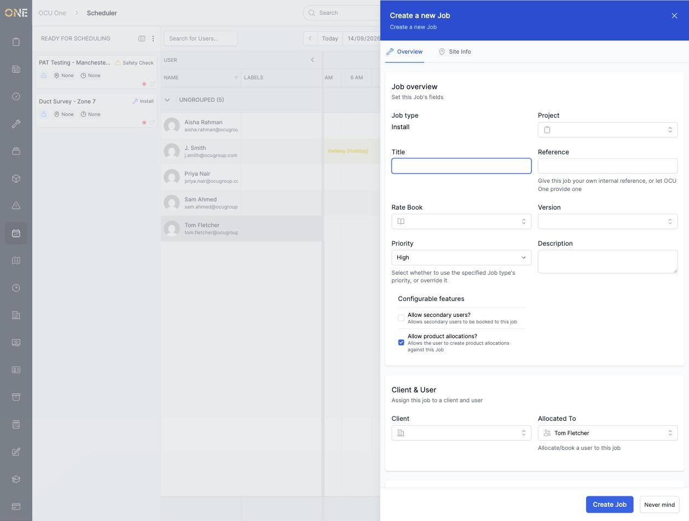
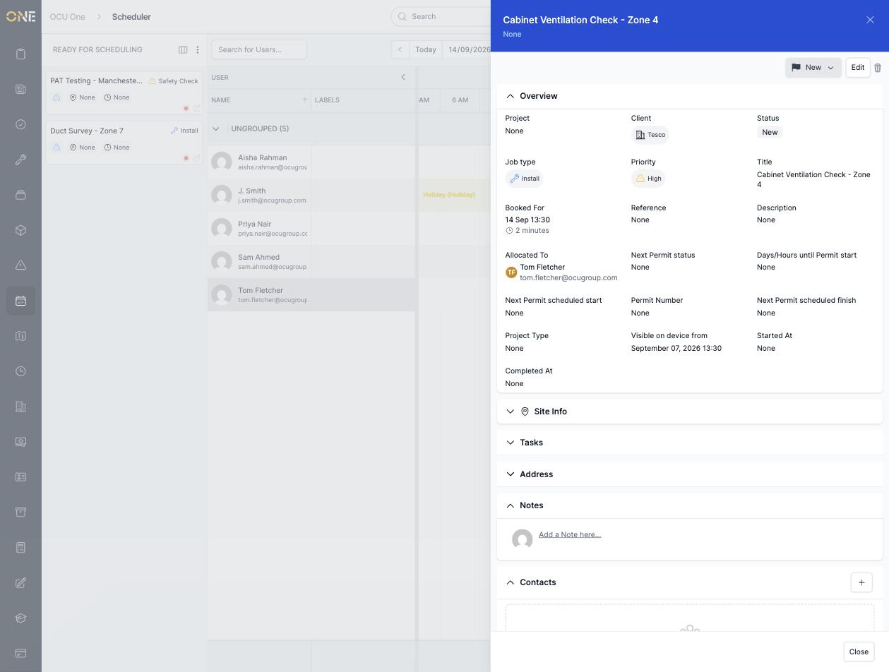

# Creating a job directly on the scheduler

If the job you need doesn't exist yet, you don't have to leave the scheduler to create it — click and drag across an empty part of a user's row to open a blank slot ready to fill in.

## Drag-creating a slot

Click on an empty part of a user's row and drag sideways to mark out how long the job should take. Letting go opens a **What Job are you creating?** panel, listing the job types available to you:

*Only the job types this environment actually makes visible to you are listed here — which types you see depends on your permissions.*

## Filling in the job

Choose a job type to open the full **Create a new Job** form, already pre-filled with the user and start time you dragged out on the board:

Fill in a **Title** and a **Client**, then click **Create Job**. The job's overview opens straight away, showing the details you entered along with the booked time you dragged out on the board:

## Things to know

- A job created this way starts in "New" status, not "Booked" — you'll still need to move it through your usual booking/status flow before it counts as scheduled work, the same as a job created anywhere else in OCU One.
- The rest of the form (Project, Rate Book, Priority, Description, and the Site Info tab) works exactly like the regular new-job screen — see the Jobs guides for what each of those fields does.
