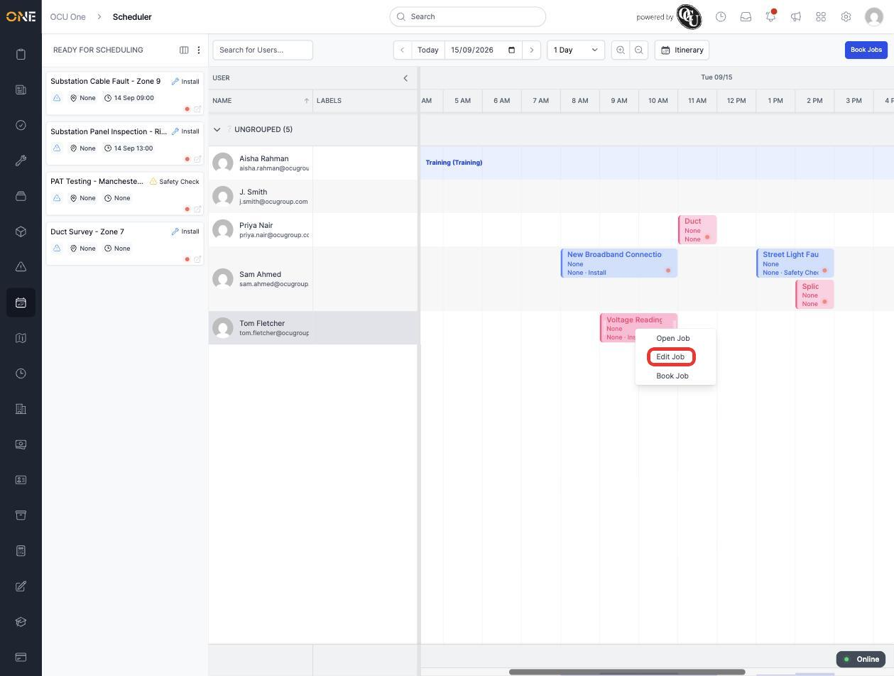
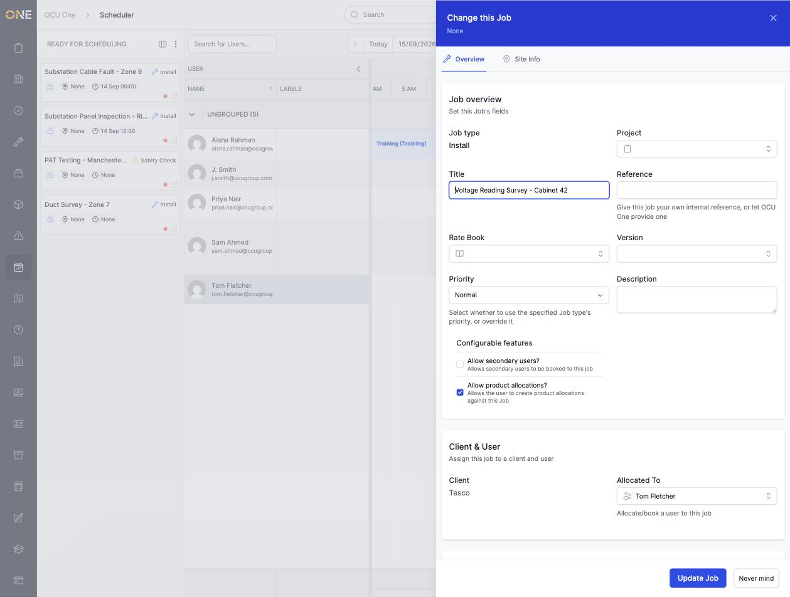
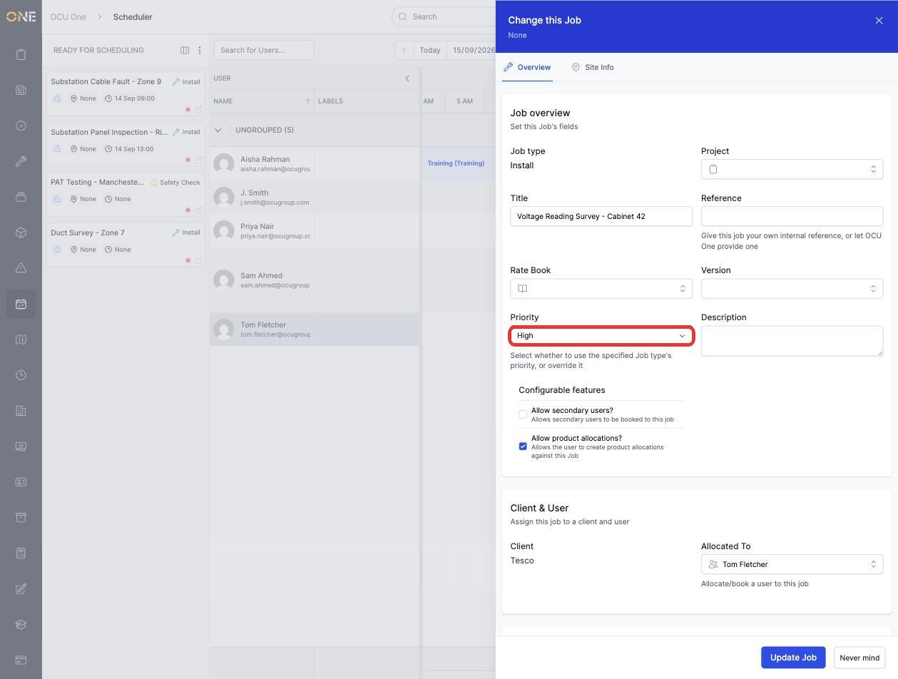
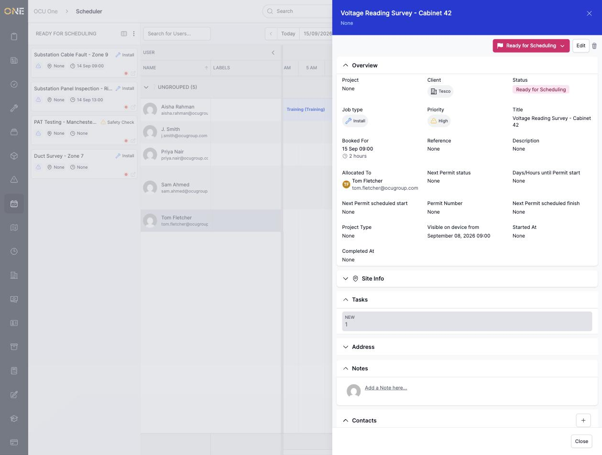

# Editing a job from the scheduler

You can update a job's details without leaving the scheduler board — as long as it isn't already fully booked.

## Opening the edit form

Right-click a job on the board that isn't in "Booked" status and choose **Edit Job**:

This opens the same **Change this Job** form used elsewhere in OCU One, pre-filled with the job's current details:

## Making changes

Update whichever fields need changing — here the **Priority** is changed from Normal to High:

Click **Update Job**. The job's overview reopens showing the new value:

## Things to know

- **Edit Job** only appears in the right-click menu for jobs that *aren't* already **Booked** — once a job is booked, edit it from its own page instead (or unbook it first if you need to change something the scheduler-side form doesn't cover).
- This form covers the same fields as the regular job edit screen — Title, Job type, Rate Book, Priority, Description, Client, and who it's allocated to — plus a separate **Site Info** tab for address details.
- Editing a job here doesn't change its booked time or which user it's allocated to on the board — to move it, drag it to a different slot instead.
