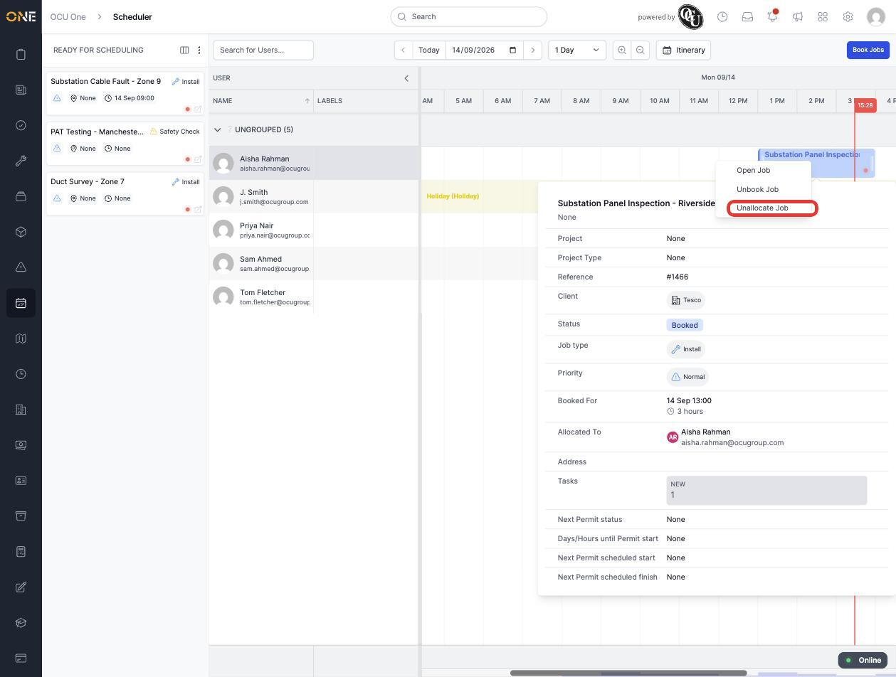
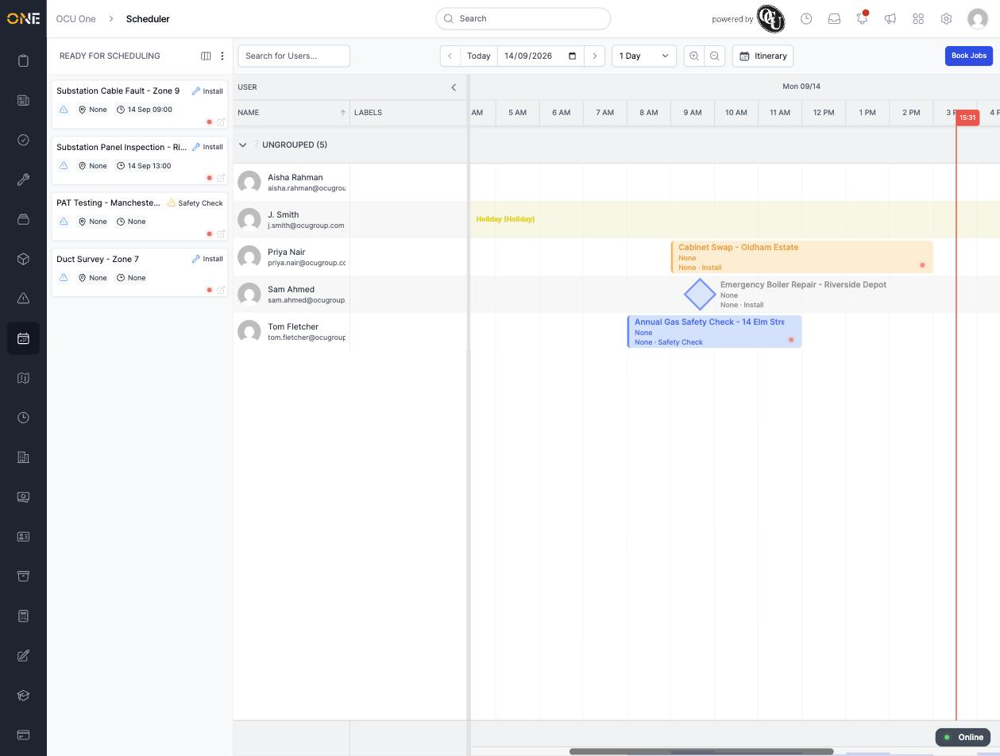
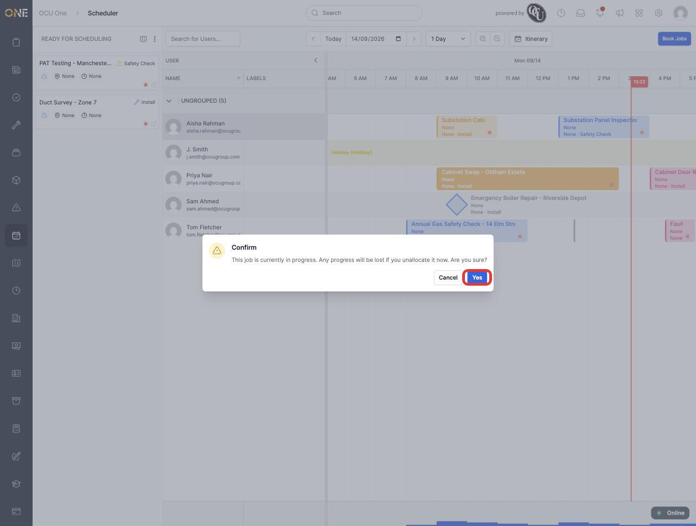
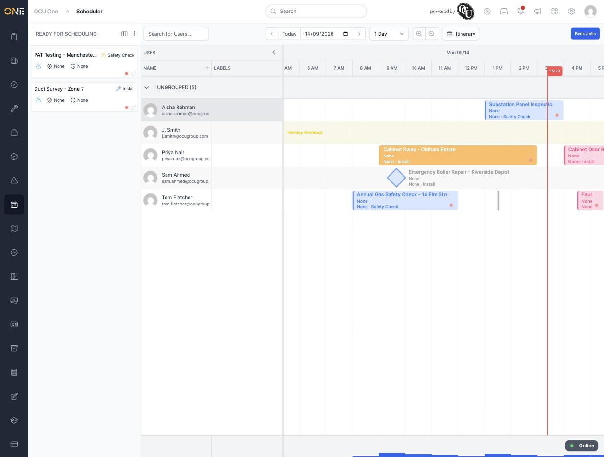

# Unallocating a job from a user on the scheduler

Unallocating goes further than unbooking — it removes the job from the user's row entirely and sends it back to the **Ready for Scheduling** panel, with no user or time attached, ready to be booked to someone else from scratch.

## Unallocating a booked job

Right-click a booked job on the board and choose **Unallocate Job**:

For a job that's simply **Booked**, this happens immediately with no confirmation — the job drops off the user's row and reappears in the Ready for Scheduling panel on the left, unallocated:

## Unallocating a job that's in progress

If the job is already **In Progress**, OCU One asks you to confirm first, since the field user could be actively working on it:

Click **Yes** to go ahead. The job disappears from the board — because it's still marked "In Progress" underneath rather than "Ready for Scheduling", it won't reappear in the Ready for Scheduling panel until its status is changed back:

## Things to know

- Unallocating clears both the user *and* the booked time — unlike unbooking, which only changes the status and leaves the job sitting where it was. If you just want to free up the slot without losing the placement, unbook it instead (see the guide on unbooking a job).
- The confirmation dialog only appears for jobs that are **In Progress**. A merely **Booked** job unallocates straight away with no prompt, so double-check you've right-clicked the correct job before choosing it.
- **Unallocate Job** only appears in the menu for jobs that are Booked or In Progress — you won't see it on a job that's already unallocated or in an earlier/later status.
