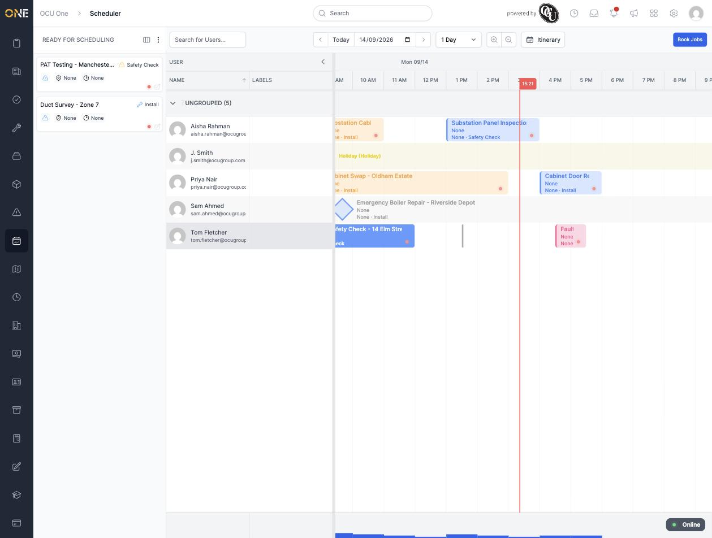
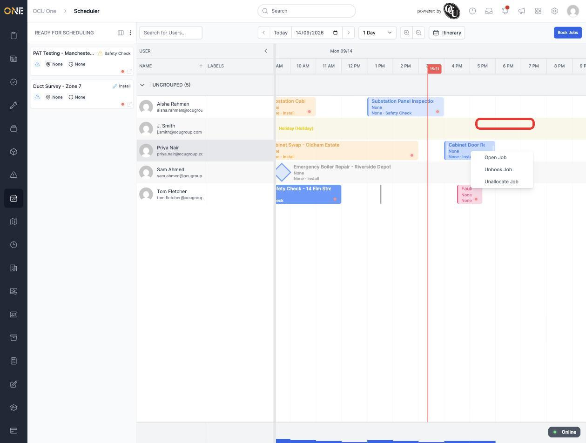
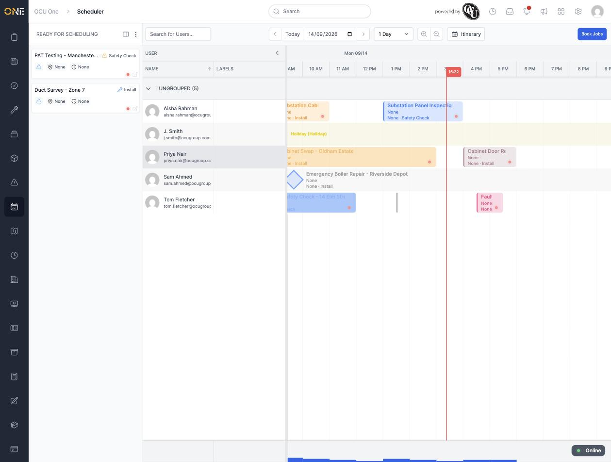

# Unbooking a job from the scheduler

If a booked job needs to come off the schedule but should stay with the same user and time slot for now — for example while you work out a new time — you can unbook it right from the board, without opening the job itself.

## Unbooking

Right-click a booked job on the board and choose **Unbook Job**:

The job's block immediately switches to its paler, "Ready for Scheduling" styling — still on the same row, at the same time:

## Things to know

- Unbooking only changes the job's status back to "Ready for Scheduling" — it keeps the same allocated user and the same booked time, so it's still sitting in the same spot on the board ready to be re-booked (right-click it and choose **Book Job**) once whatever needed sorting out is resolved.
- If you want to remove the job from that user's row entirely rather than just unbook it, use **Unallocate Job** instead — see the guide on unallocating a job.
- Unlike booked or in-progress jobs, this option isn't available once a job is already unallocated or completed — the right-click menu only offers what's valid for the job's current status.
