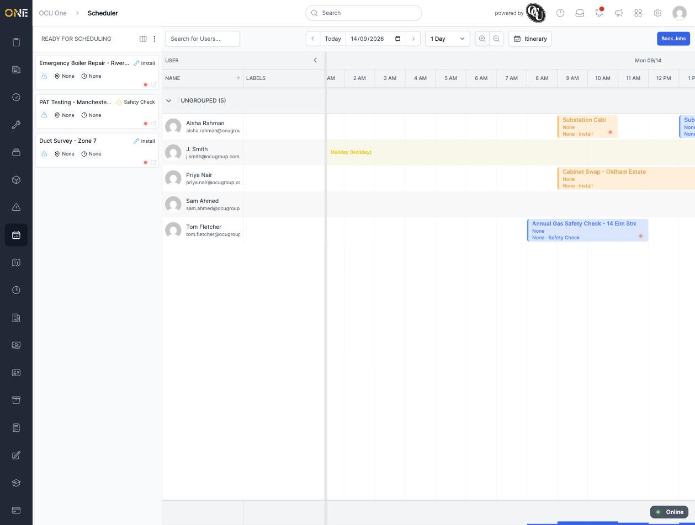
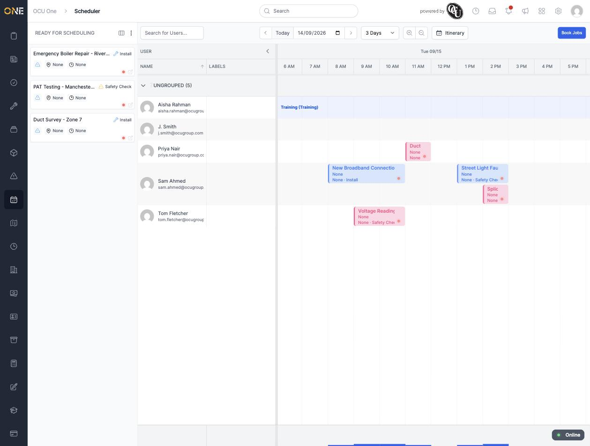
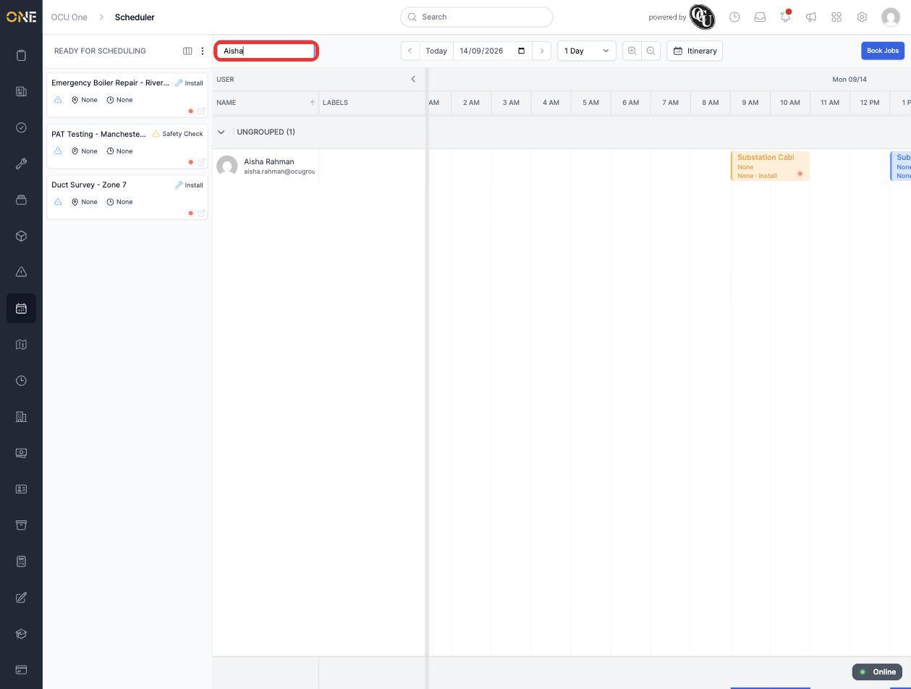

# Using the scheduling board (navigation, zoom, time span, user search)

The Scheduler is where you assign work to field users on a calendar — each bookable person gets their own row, and you drag jobs onto their row to book them in. This guide covers finding your way around the board itself; other guides cover the actual booking, editing, and unbooking actions.

## Getting there

Click the scheduler icon in the left-hand sidebar.

## What's on this page

The board has two halves. On the left, a **Ready for Scheduling** panel lists jobs that haven't been assigned a time or a user yet. On the right, a calendar grid shows every bookable user as a row, with their booked jobs laid out along a timeline:

*Solid, coloured blocks are booked or in-progress jobs. Paler blocks with a dashed border are jobs that are allocated and timed but not yet booked.*

Each user's row also shows any **availability** they've logged — for example a full-day "Holiday" or "Training" block, shown as a shaded band behind the timeline for that day.

## Changing the date range

Use the **<** and **>** arrows either side of the date field to move backwards and forwards, or click **Today** to jump back to the current day. You can also type a date directly into the date field.

The dropdown next to the date controls (showing **1 Day** by default) lets you widen the view to **2 Days**, **3 Days**, **1 Week**, **2 Weeks**, or **1 Month** at once — useful for seeing a user's workload across the week rather than one day at a time:

*A wider time span makes it easier to see gaps in someone's schedule before dragging a job onto their row.*

## Zooming the timeline

The two magnifying-glass icons next to the time span dropdown zoom the timeline in and out, stretching or compressing how much space each hour takes up on screen — handy for getting a precise drop position when a user's day is packed with short jobs.

## Searching for a user

Type into the **Search for Users...** box above the calendar grid to filter the rows down to a single person by name:

*Clear the search box to bring every bookable user's row back.*

## Things to know

- Only users marked as bookable for work appear on the board at all — someone who isn't available for scheduled work won't show up as a row, however you filter.
- The **Itinerary** toggle next to the zoom controls switches the grid to a route/itinerary-style view — not covered here.
- What you can see on the board depends on your job-type permissions: a job type you don't have read access to simply won't appear, on either the board or the Ready for Scheduling panel, with no error shown.
