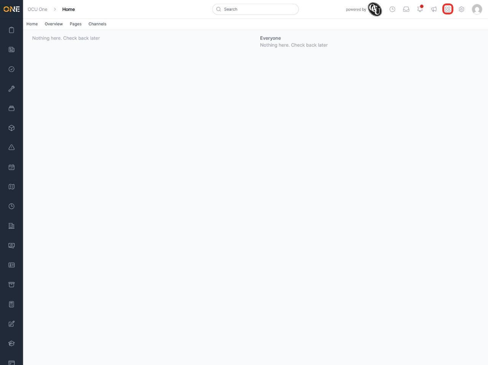
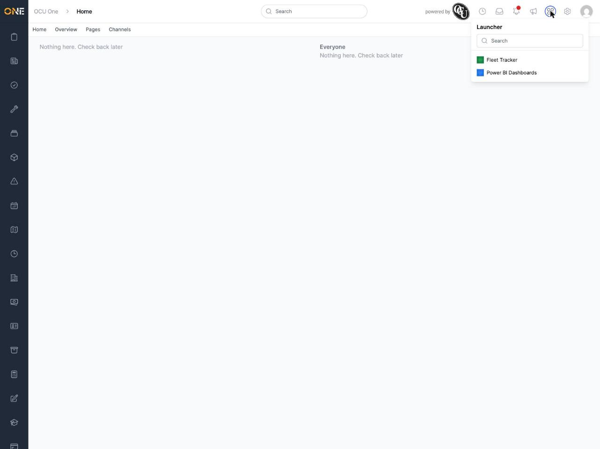
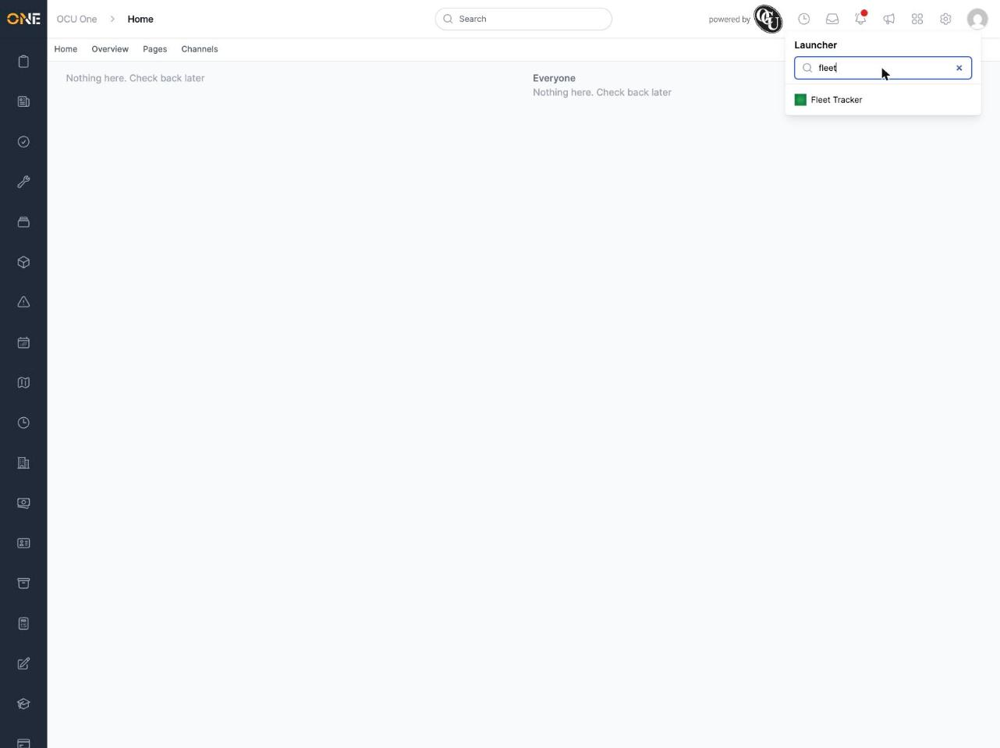

# Launching connected apps from the App Launcher

If your organisation has connected other tools to OCU One — a reporting dashboard, a fleet tracking system, and so on — you can jump straight to them from the App Launcher, without having to remember a separate web address or dig through bookmarks.

## Opening the launcher

Click the grid icon in the top right of any page, next to the notification bell.

This opens the **Launcher** panel, listing every connected app your organisation has set up, each with its own icon.

## Finding an app

If your organisation has a lot of connected apps, use the **Search** field at the top of the panel to narrow the list down by name as you type.

You can also use the up and down arrow keys to move through the list, and press Enter to open whichever app is highlighted.

## Opening an app

Click an app's name (or press Enter while it's highlighted) to open it. It launches in a new browser tab, so you don't lose your place in OCU One.

If your organisation hasn't connected any apps yet, the panel will simply say there are none configured. Connecting apps is managed separately by an administrator, not from this panel.
