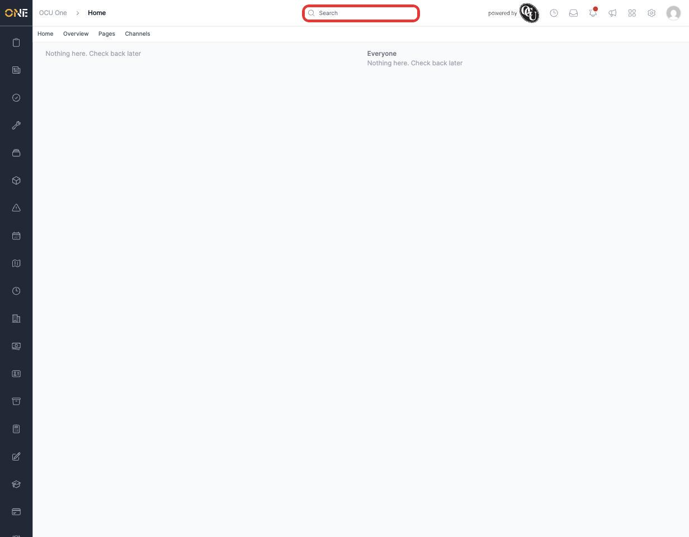
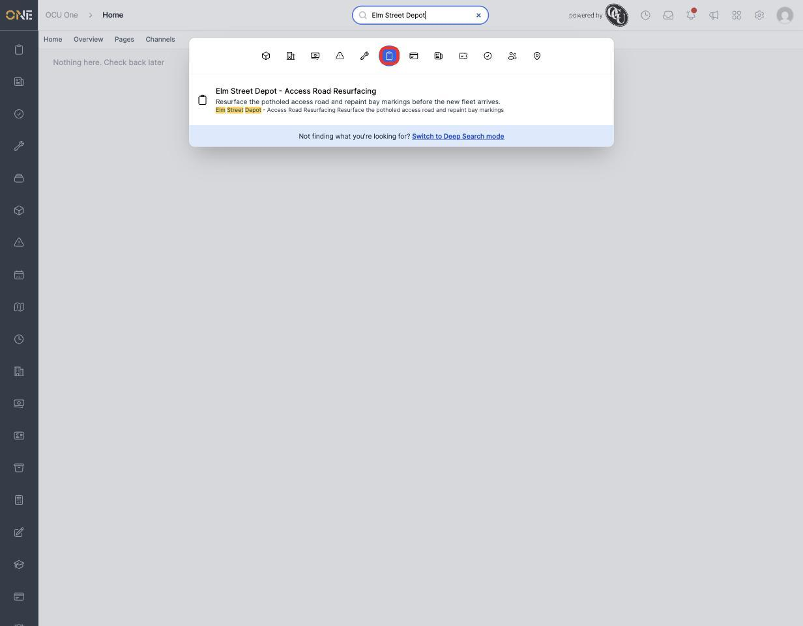
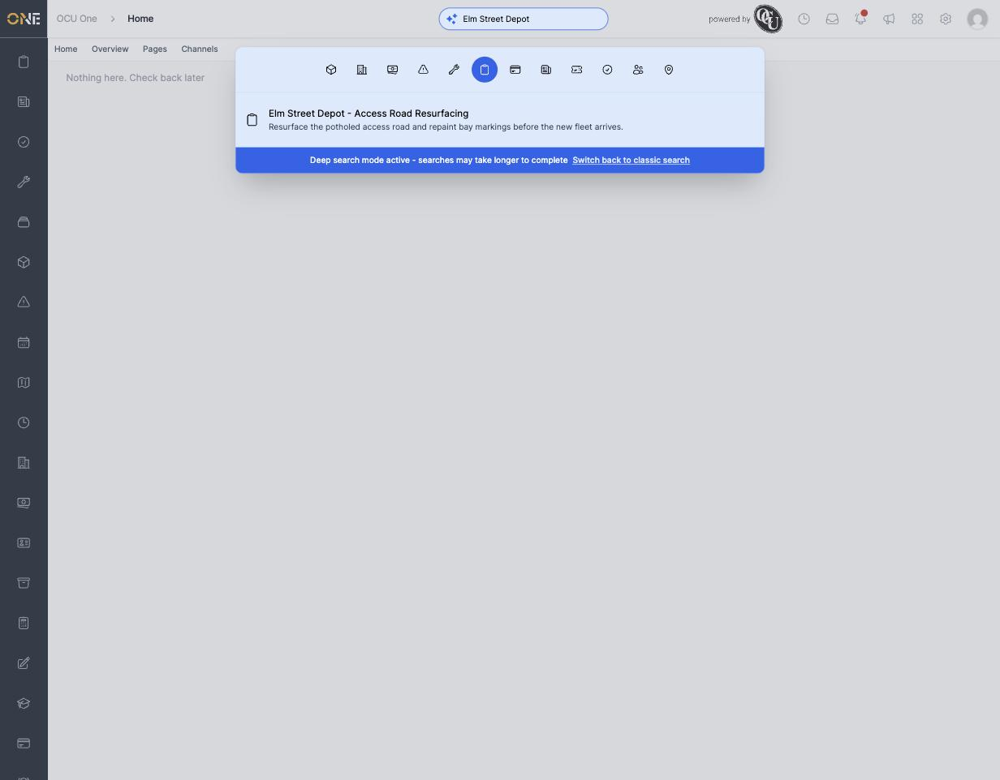

# Using global search / command palette

The search bar at the top of every page lets you jump straight to a project, job, record, ticket, or almost anything else in OCU One, without navigating through menus to find it.

## Opening search

Click the **Search** bar at the top of the page.

This opens a panel with a row of icons across the top — one for each type of thing you can search for (Projects, Jobs, Records, Tickets, Users, and more). Click one or more of these to choose what you want to search within. If you don't pick any, the panel will just ask you to choose what you're searching for.

## Searching

Type at least 3 characters to start searching. Results appear as you type, each showing an icon for what kind of thing it is, its name, a short description, and — when your search term is found in the text — the matching part highlighted.

Click any result to go straight to it.

If nothing matches, you'll see a message letting you know your search didn't find anything, so you can try different words.

## Deep Search

If you're confident something exists but the normal search isn't finding it, use **Deep Search**. There's a link at the bottom of the search panel to switch into this mode — the whole panel turns blue and the search icon changes to a sparkle to remind you it's active.

Deep Search looks at the full text of a record rather than just matching whole words, so it can catch things a normal search misses — at the cost of being slower to return results. It stays switched on (even if you close and reopen the search panel) until you click **Switch back to classic search** to turn it off again.
