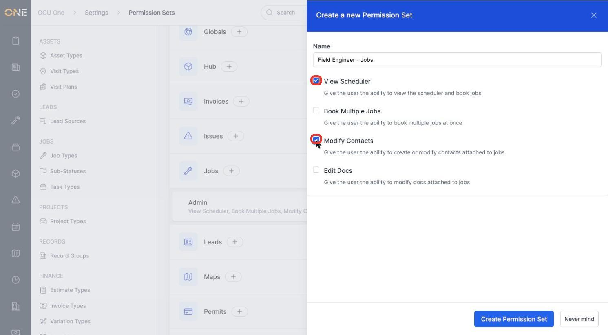
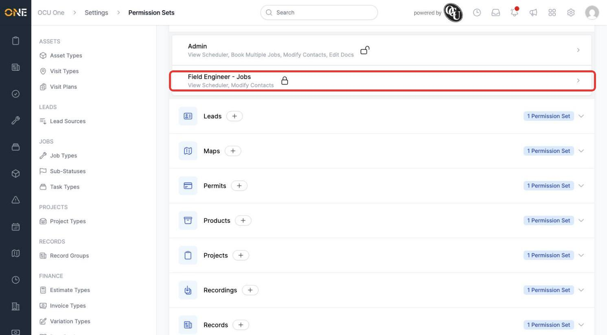
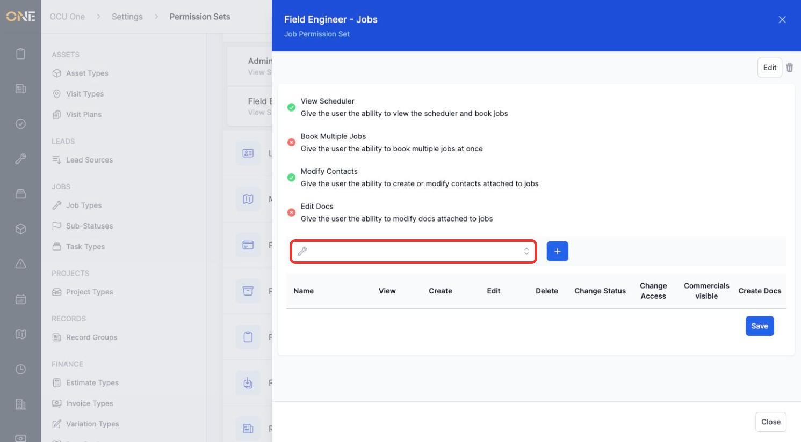
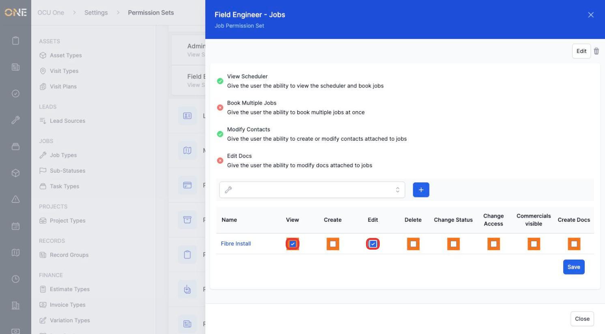
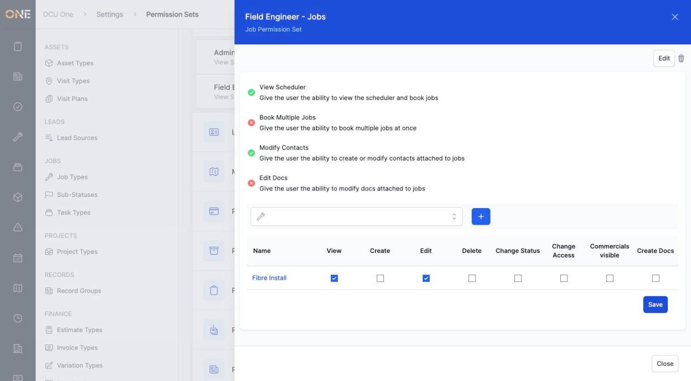

# Creating permission sets (per-module grants and per-type overrides)

**Permission Sets** define what someone can do within one area of the app — Jobs, Clients, Invoices, and so on. Each module has its own list of permission sets, and every permission set can optionally be fine-tuned per type (for example, different access on "Fibre Install" jobs than on other job types).

## Creating a permission set

1. From **Settings > Permission Sets**, find the module you want (for example **Jobs**) and click its **+** button.
2. Give it a **Name** (for example **Field Engineer - Jobs**) and tick the module-wide grants that apply — for Jobs, that's **View Scheduler**, **Book Multiple Jobs**, **Modify Contacts**, and **Edit Docs**. Each option explains exactly what it grants.

   

3. Click **Create Permission Set**. It appears alongside the module's existing permission sets.

   

## Adding a per-type override

1. Open the permission set. Its module-wide grants show at the top (green tick = granted, red cross = not granted), followed by a type picker and a table for per-type overrides.

   

2. Pick a specific type from the dropdown (for example **Fibre Install**, a Job Type) and click **+**. A new row appears in the table with its own checkboxes: **View**, **Create**, **Edit**, **Delete**, **Change Status**, **Change Access**, **Commercials visible**, **Create Docs**.
3. Tick whichever apply for that type (for example **View** and **Edit**) — these override the module-wide grants specifically for that type.

   

4. Click **Save**. The row's checkboxes confirm the override is now active for that type.

   

## Things to know

- Module-wide grants (top of the panel) apply to every type in that module by default — per-type rows only need to be added where a specific type needs different access.
- The columns available in the per-type override table vary by module — Jobs shows View/Create/Edit/Delete plus job-specific columns like Change Status; other modules show whatever's relevant to them.
- A permission set only does something once it's attached to a **Role** — see [Creating roles and assigning permission sets](Creating%20roles%20and%20assigning%20permission%20sets.md) for how that connection is made.
