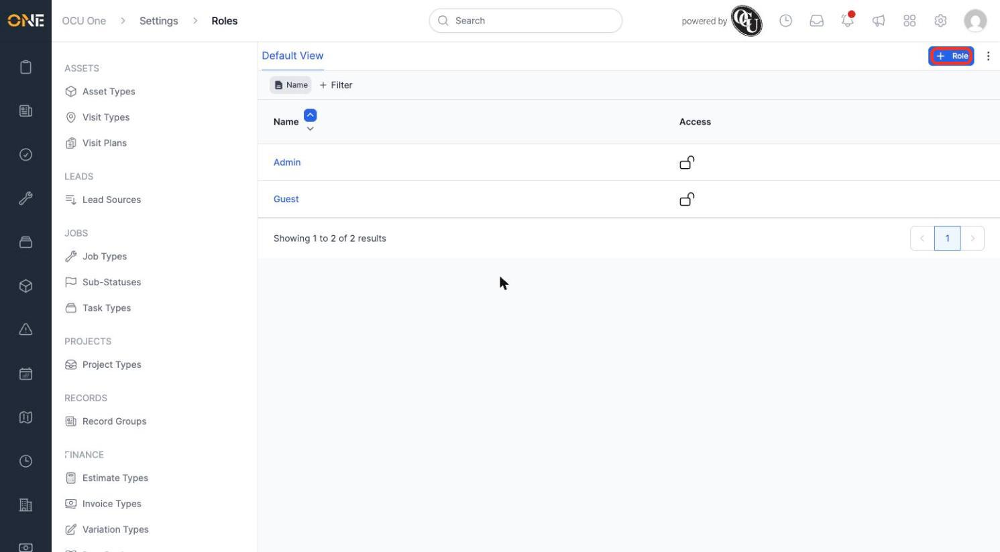
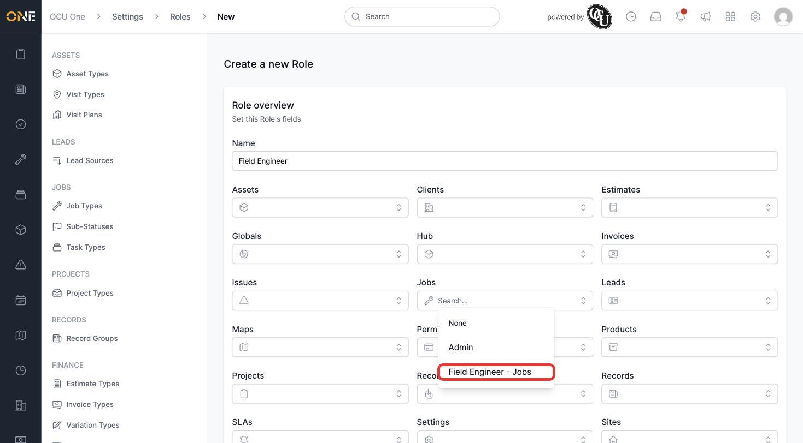
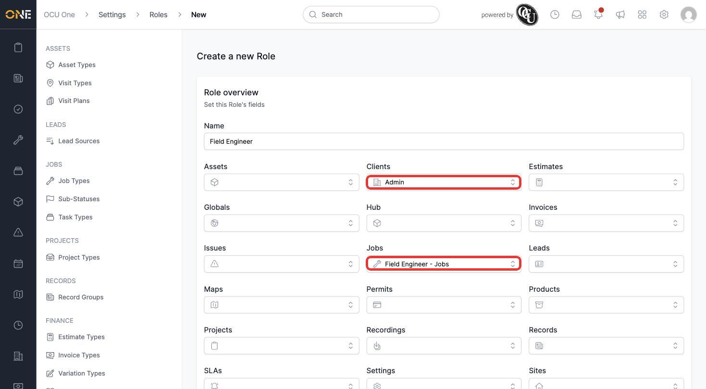
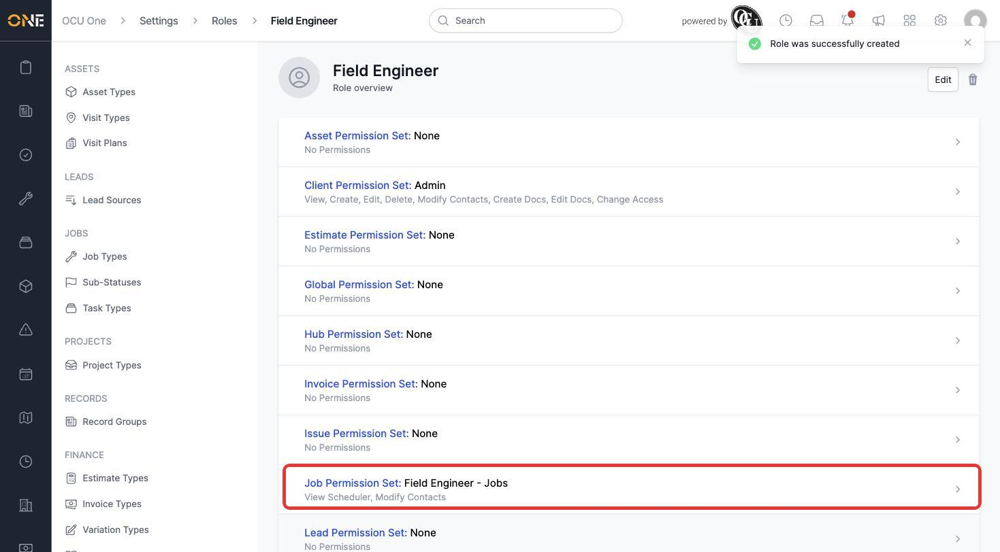
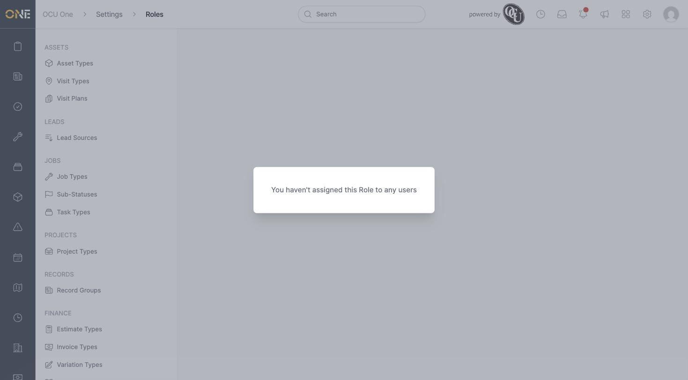

# Creating roles and assigning permission sets

A **Role** is what actually gets applied to a person — it brings together one permission set per module into a single package, so assigning someone a role sets their access everywhere at once.

## Creating a role

1. From **Settings > Roles**, click **+ Role**.

   

2. Give it a **Name** (for example **Field Engineer**). Below that is one dropdown per module — Assets, Clients, Estimates, Jobs, and every other module in the app — each offering **None** plus every permission set that exists for that module.

   

3. Pick a permission set for each module that matters for this role — for example **Field Engineer - Jobs** under **Jobs** (see [Creating permission sets (per-module grants and per-type overrides)](Creating%20permission%20sets%20%28per-module%20grants%20and%20per-type%20overrides%29.md)) and the existing **Admin** under **Clients**. Any module left on **None** means no access to that module at all.

   

4. Click **Create Role**. Its overview page lists every module with the permission set assigned (or **None**) and a summary of what that set grants.

   

## Users tab

A role also has its own **Users** tab, listing everyone currently assigned to it — empty until people are actually assigned.

## Things to know

- A role is really just a bundle of module → permission set pairings — all the actual grants live on the permission sets themselves, not on the role.
- Leaving a module on **None** is a real, deliberate choice — it removes that module entirely for anyone with this role, rather than falling back to some default.
- A newly created role starts with nobody assigned to it — assigning people happens separately, not as part of creating the role itself.
