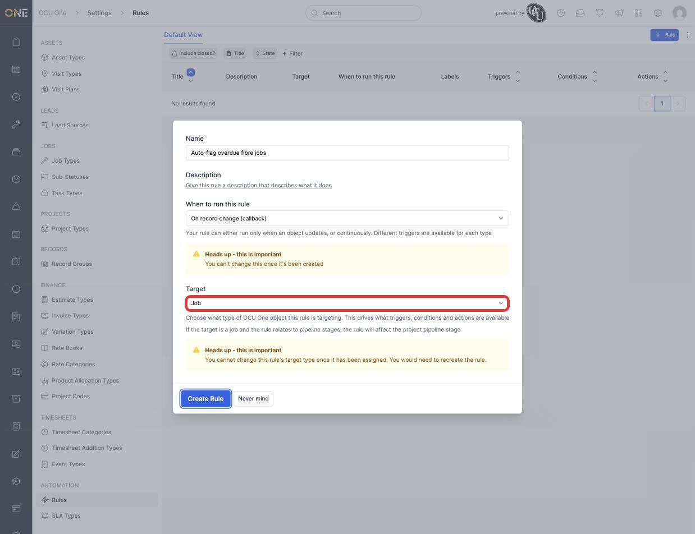
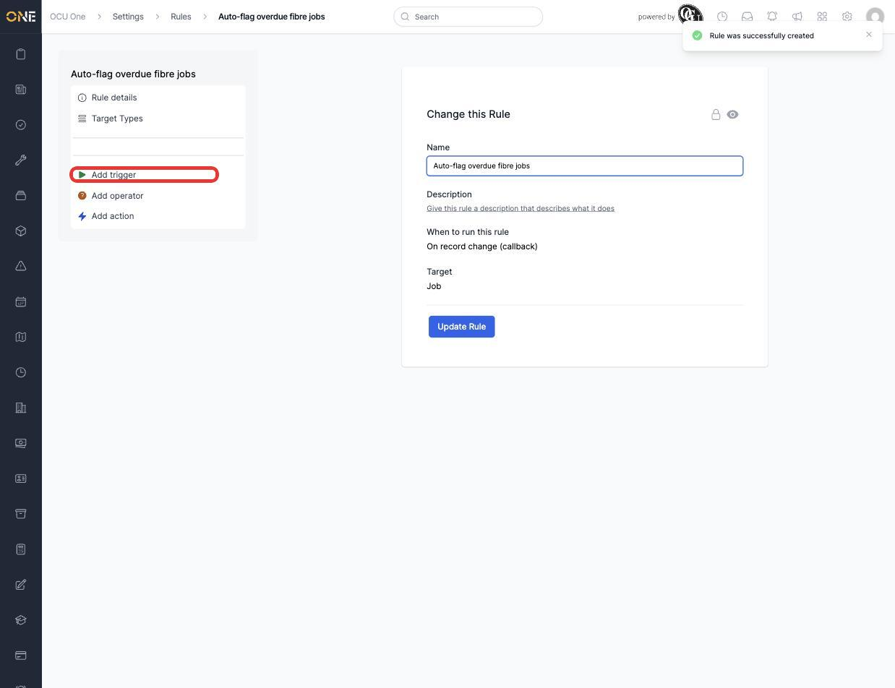
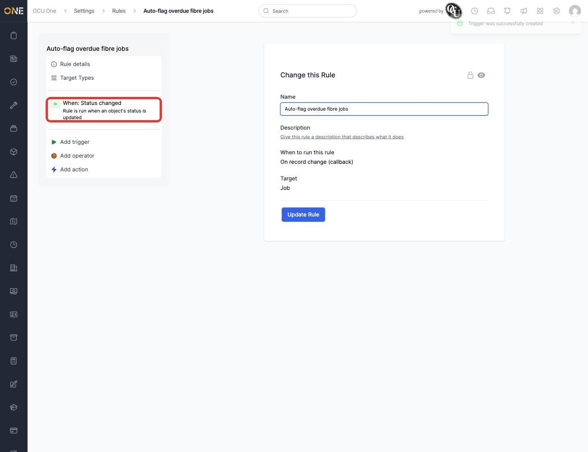
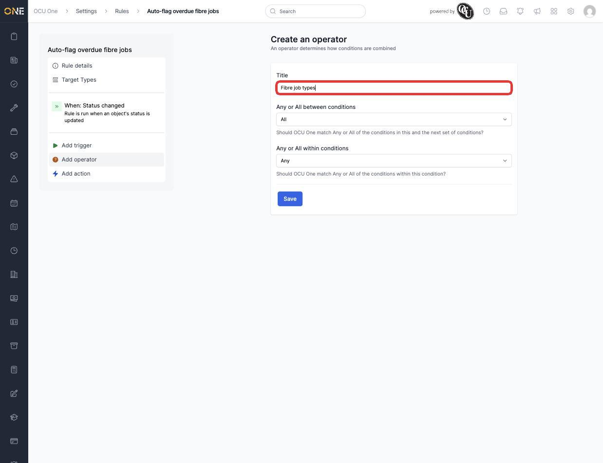
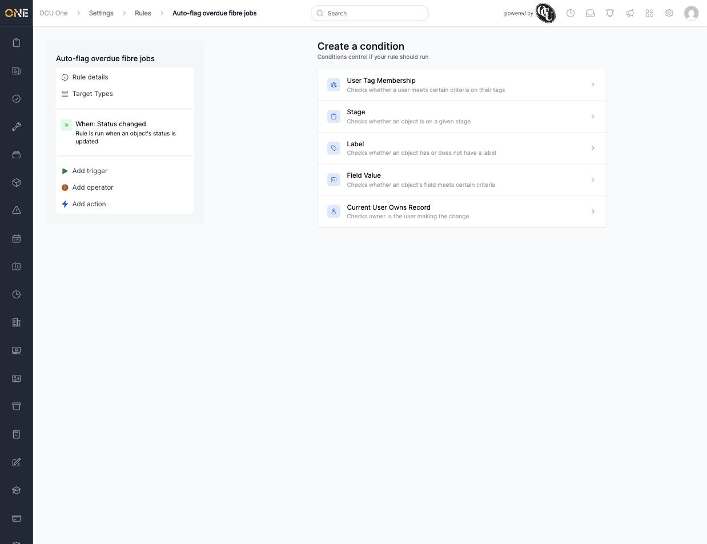
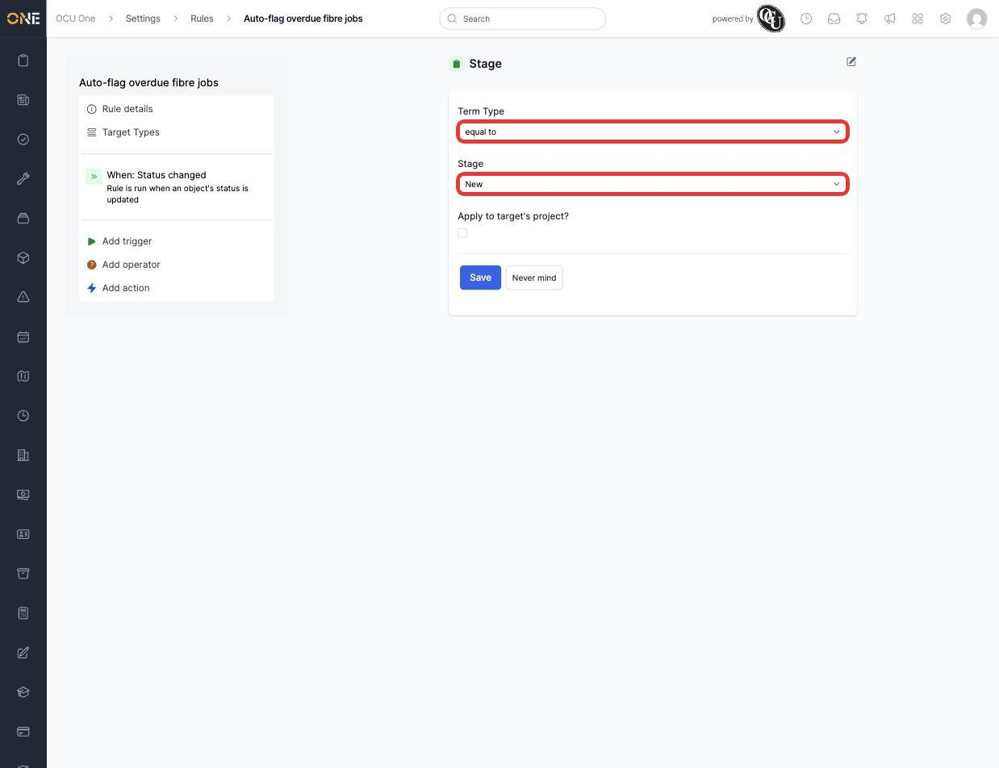
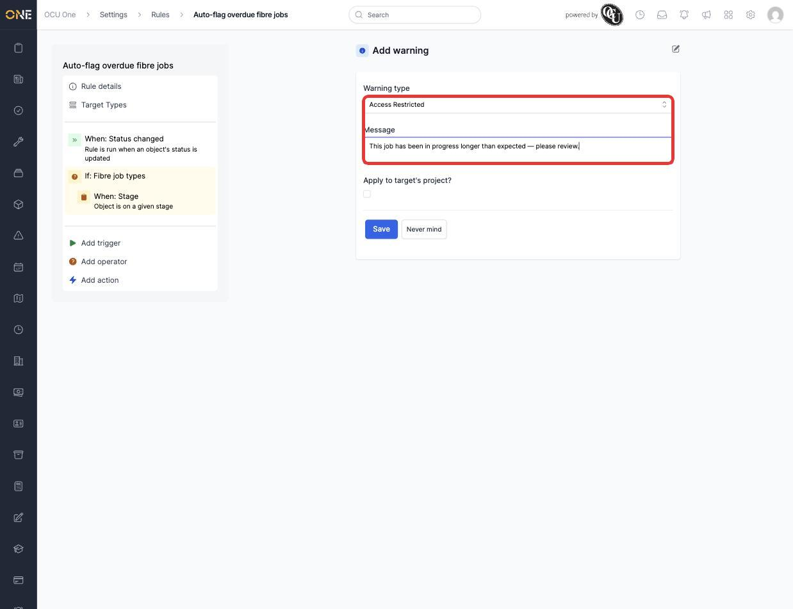
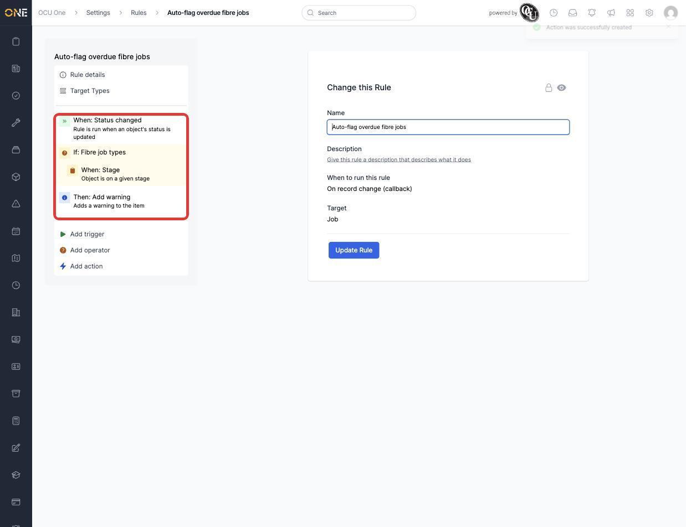

# Building an automation rule

**Rules** let the system watch for something happening — a status change, a stage move, a warning appearing — and automatically react, without anyone needing to do it by hand. A rule is built from three pieces: a **trigger** (what starts it), optional **conditions** (what has to be true), and one or more **actions** (what happens).

## Creating a rule

1. From **Settings > Rules**, click **+ Rule**. Give it a **Name** (for example **Auto-flag overdue fibre jobs**), and choose **When to run this rule** — **On record change (callback)** runs only when something updates, while **Continuously (service)** runs on a repeating schedule. This can't be changed once the rule is created.
2. Choose the **Target** — the type of OCU One object this rule watches (Project, Job, Client, Lead, Record, Task, Ticket, Timesheet, Estimate, Issue, Permit, Variation, Invoice). This also can't be changed later — a rule targeting the wrong object type has to be recreated from scratch.

   

3. Click **Create Rule**. You land on the rule's own page, with a sidebar for building it out: **Add trigger**, **Add operator**, and **Add action**.

   

## Adding a trigger

1. Click **Add trigger** to see every available trigger type for this rule's target — see [Common trigger types reference](Common%20trigger%20types%20reference.md) for the full list.

   

2. Pick one (for example **Status changed**), configure it — here, **On Status** defaults to **New** — and click **Save**. The sidebar now shows it as the rule's trigger.

   

## Adding a condition group

1. Click **Add operator** to create a condition group — give it a **Title** (for example **Fibre job types**) and set whether OCU One should match **Any or All** conditions within it, and **Any or All** between this group and others.

   

2. Click **Save**, then click **+ Add a new condition** to pick a condition type — see [Common trigger types reference](Common%20trigger%20types%20reference.md) for triggers and [Common action types reference](Common%20action%20types%20reference.md) for actions; conditions have their own smaller set: **User Tag Membership**, **Stage**, **Label**, **Field Value**, and **Current User Owns Record**.

   

3. Configure the condition — for example **Stage**, with **Term Type** set to **equal to** — and click **Save**. The sidebar now nests it under the operator: **If: Fibre job types** → **When: Stage**.

   

## Adding an action

1. Click **Add action** to see every available action for this rule's target — see [Common action types reference](Common%20action%20types%20reference.md) for the full list.
2. Pick one (for example **Add warning**), choose the **Warning type** (for example the existing **Access Restricted**), write the **Message** to show when it triggers, and click **Save**.

   

3. The sidebar now shows the complete rule tree — trigger, condition, and action in sequence.

   

## Things to know

- **When to run this rule** and the rule's **Target** are both locked in at creation — get either wrong and the only fix is deleting the rule and starting over.
- Nesting conditions under an operator (rather than adding them loose) is what lets a rule express "all of these AND any of those" logic, not just a single flat list.
- A rule with no actions still saves fine, but won't visibly do anything — actions are what make a rule useful.
