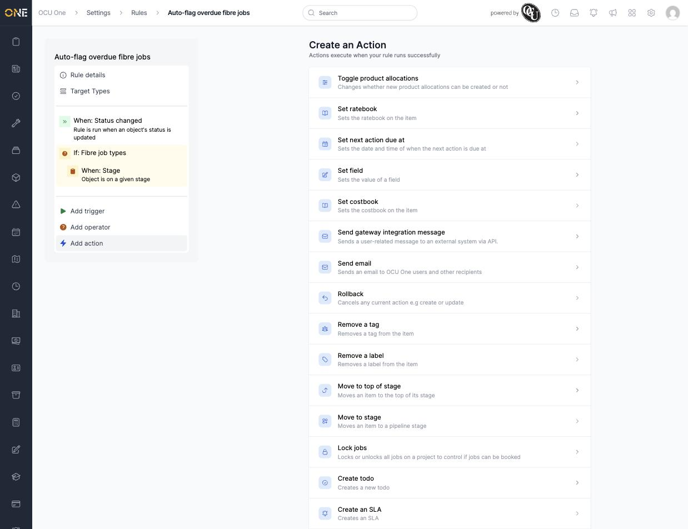
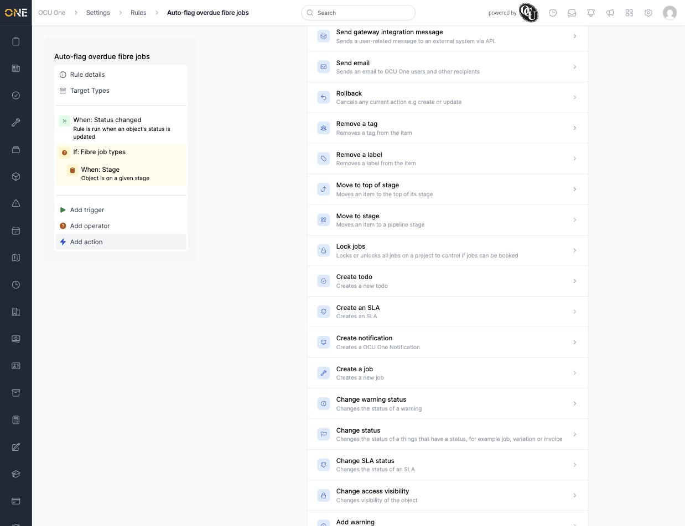
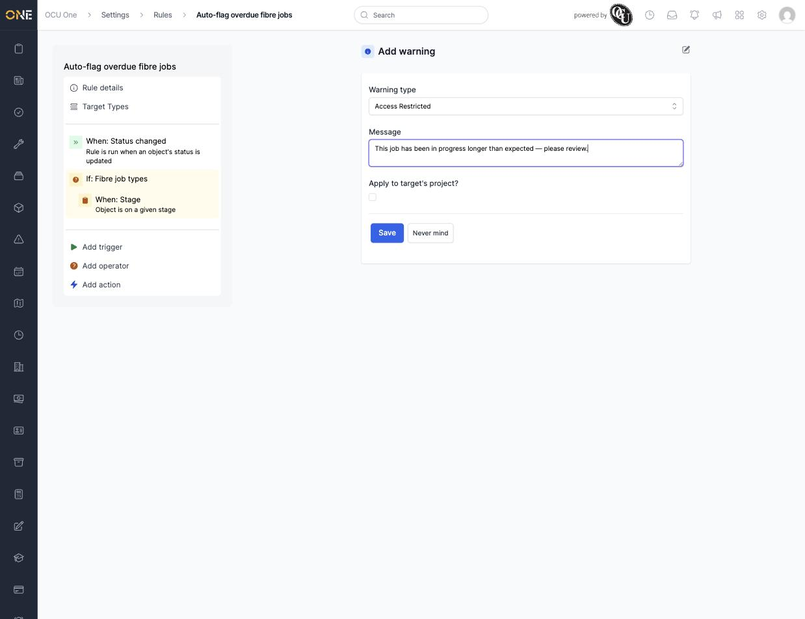

# Common action types reference

Actions are what a rule actually does once its trigger fires and its conditions pass. A rule can have more than one action, and they run in sequence. This is the full list as offered for a Job-targeted rule (see [Building an automation rule](Building%20an%20automation%20rule.md) for how actions fit into a rule).

## The full list

- **Toggle product allocations** — changes whether new product allocations can be created on the item.
- **Set ratebook** / **Set costbook** — sets the rate or cost book on the item.
- **Set next action due at** — sets the date and time the next action is due.
- **Set field** — sets the value of a custom field.
- **Send gateway integration message** — sends a user-related message to an external system via API.
- **Send email** — sends an email to OCU One users and other recipients.
- **Rollback** — cancels the current action (for example, a create or update) rather than letting it complete.
- **Remove a tag** / **Remove a label** — removes a tag or label from the item.
- **Move to top of stage** / **Move to stage** — reorders an item within its stage, or moves it to a different pipeline stage.
- **Lock jobs** — locks or unlocks all jobs on a project, controlling whether they can be booked.
- **Create todo** / **Create an SLA** / **Create a job** — creates a new record of that type.
- **Create notification** — creates an OCU One notification.
- **Change warning status** / **Change SLA status** — changes the status of a warning or SLA.
- **Change status** — changes the status of anything that has one, such as a job, variation, or invoice.
- **Change access visibility** — changes the visibility of the object.
- **Add warning** — adds a warning to the item, with a **Warning type** and a custom **Message**.

  

- **Add owner's tags** — adds every tag of a specified type belonging to the item's owner.
- **Add a tag** / **Add a label** — adds a tag or label to the item.
- **Add assigned users** — adds the selected users as assigned users on the item.

## Things to know

- A rule can chain multiple actions — they execute in the order they're added, so an earlier action's effect (like a status change) can matter to a later one.
- **Rollback** is unusual among these actions: it's designed to stop something else from happening, not to make a change itself.
- Like triggers, the available actions are filtered to what makes sense for the rule's target type.
