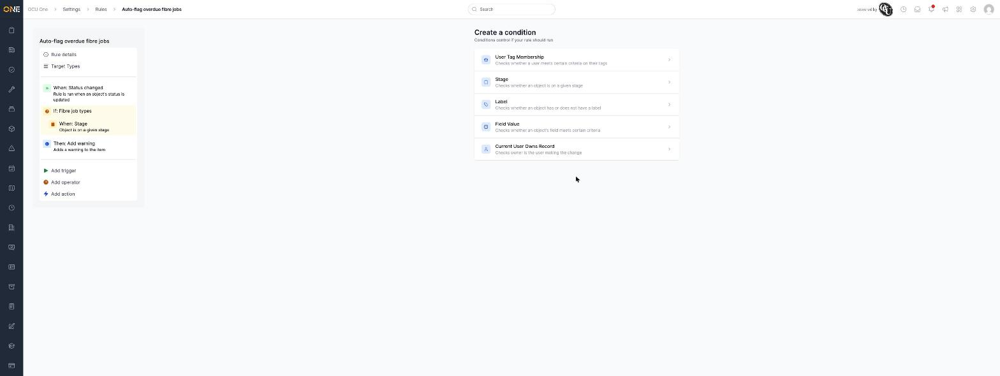
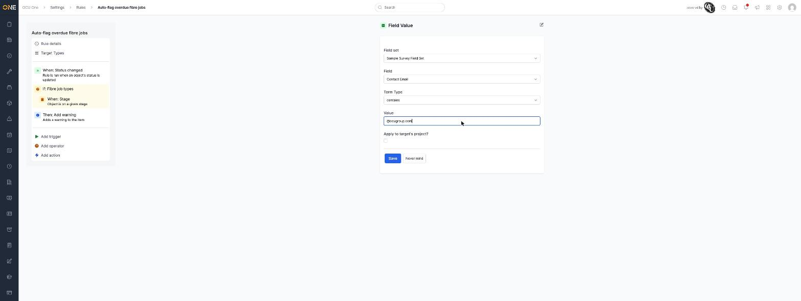

# Common condition types reference

Conditions decide whether a rule should actually run once its trigger fires — they sit inside a **condition group** (see [Building an automation rule](Building%20an%20automation%20rule.md) for how conditions fit into a rule). This is the full list of condition types available when building a condition group.

## The full list

- **User Tag Membership** — checks whether a user meets certain criteria on their tags. Configured with a **Term Type** (for example **contains**) and one or more **Tags** to match against.
- **Stage** — checks whether an object is on a given stage. Configured with a **Term Type** and the **Stage** to compare against.
- **Label** — checks whether an object has or does not have a label. Configured with a **Term Type**, the **Label** itself, and whether to **Apply to target's project?** instead of the object directly.
- **Field Value** — checks whether an object's field meets certain criteria. Configured with a **Field set**, then the specific **Field** within it, a **Term Type** (for example **contains**), a **Value** to compare against, and the same **Apply to target's project?** option.

  

- **Current User Owns Record** — checks whether the owner is the user making the change. This condition needs no configuration at all — just add it as-is.

## Things to know

- Most condition types share a **Term Type** field (**equal to**, **not equal to**, **contains**, and so on) that controls how the comparison is made — the exact options offered vary slightly by condition type.
- **Field Value** and **Label** both offer **Apply to target's project?** — turning this on checks the condition against the record's project instead of the record itself.
- **Current User Owns Record** is the simplest condition: there's nothing to fill in, it just checks ownership directly.
- Conditions only take effect once they're nested inside a condition group (an **operator**) — see [Building an automation rule](Building%20an%20automation%20rule.md) for how that grouping works.
