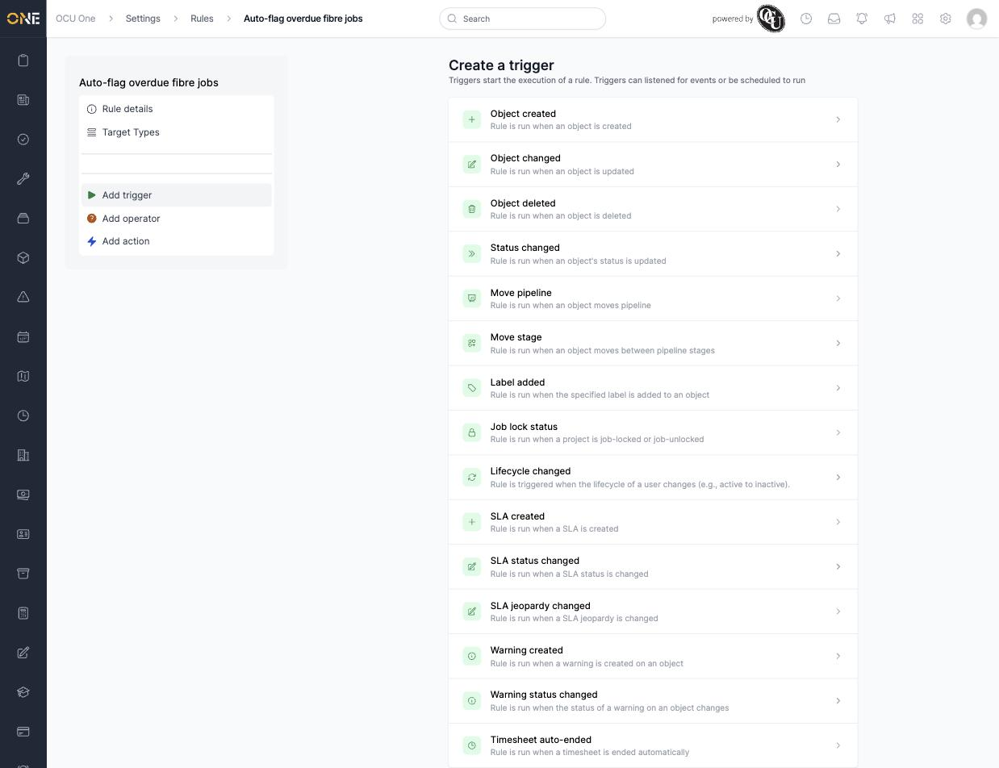

# Common trigger types reference

Every rule needs exactly one trigger — the event that starts it running. Which triggers are available depends on the rule's **Target** (see [Building an automation rule](Building%20an%20automation%20rule.md)); this is the full list as offered for a Job-targeted rule, with what each one means.

## The full list

- **Object created** — runs when a new record of the target type is created.
- **Object changed** — runs when any field on the record is updated.
- **Object deleted** — runs when the record is deleted.
- **Status changed** — runs when the record's status is updated; configured with **On Status**, the specific status to watch for.
- **Move pipeline** — runs when the record moves from one pipeline to another.
- **Move stage** — runs when the record moves between stages within a pipeline.
- **Label added** — runs when a specific label is added to the record.
- **Job lock status** — runs when a project becomes job-locked or job-unlocked.
- **Lifecycle changed** — runs when a user's lifecycle changes (for example active to inactive).
- **SLA created** — runs when an SLA is created on the record.
- **SLA status changed** — runs when an SLA's status changes.
- **SLA jeopardy changed** — runs when an SLA's jeopardy state changes.
- **Warning created** — runs when a warning is created on the record.
- **Warning status changed** — runs when the status of a warning on the record changes.
- **Timesheet auto-ended** — runs when a timesheet is ended automatically rather than by a user.

## Things to know

- **Status changed**, in particular, needs the specific status configured (**On Status**) — the trigger only fires for that one status, not any status change.
- Not every trigger applies to every target type — the list shown is filtered to what makes sense for the rule's target, so a Timesheet-targeted rule won't offer job-specific triggers like **Job lock status**.
- Only one trigger can be set per rule — to react to two different events, build two separate rules.
