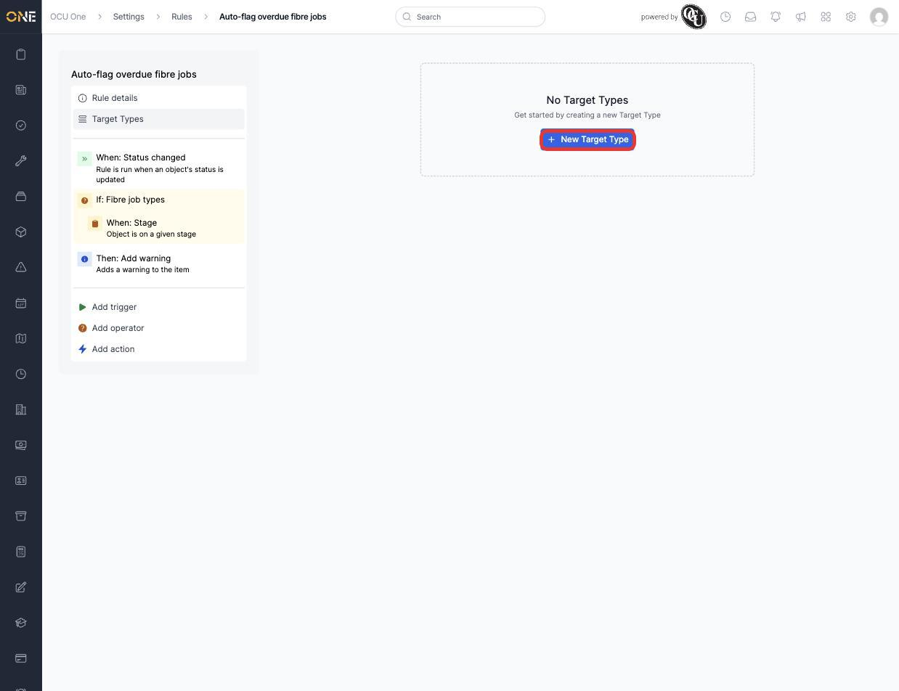
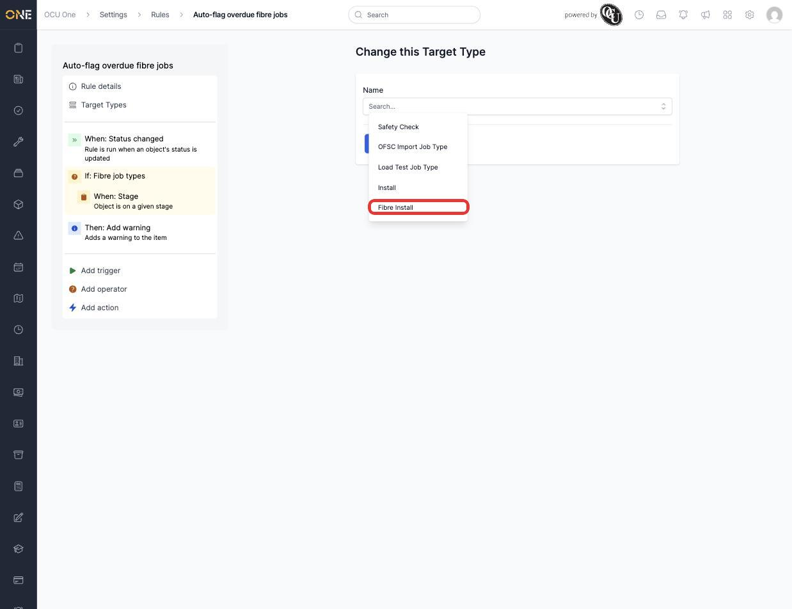
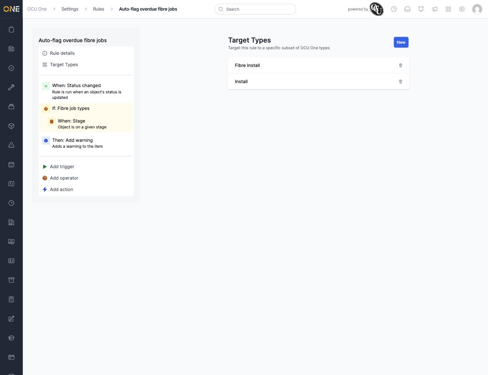

# Restricting an automation rule to specific record types

By default, a rule watches every record of its target type — every Job, every Ticket, and so on. **Target Types** narrows that down so the rule only fires for a specific subset, like just certain Job Types.

## Adding a target type

1. Open a rule (**Settings > Rules**) and click **Target Types** in its sidebar. With none added yet, the rule applies to every record of its target type.

   

2. Click **New Target Type**, then pick a specific type from the dropdown — the list is scoped to the rule's own target (for a Job-targeted rule, that's Job Types). For example, **Fibre Install**.

   

3. Click **Create Target Type**. It's now listed under **Target Types**, and the rule only fires for records of that type.

   

## Adding more than one

Repeat the same steps to add another — for example **Install** alongside **Fibre Install** — so the rule fires for either type. Each already-added type disappears from the dropdown so it can't be added twice.

## Things to know

- With zero Target Types added, a rule applies to every record of its target type — adding even one immediately narrows it down to only that type (and any others explicitly added).
- Deleting a Target Type (the trash icon) widens the rule back out — it doesn't disable it, and if it was the last one, the rule goes back to matching everything again.
- Target Types are additive (any matching type triggers the rule), not a further AND condition — for "this type AND this other condition," use a **Field Value** or **Stage** condition instead (see [Building an automation rule](Building%20an%20automation%20rule.md)).
