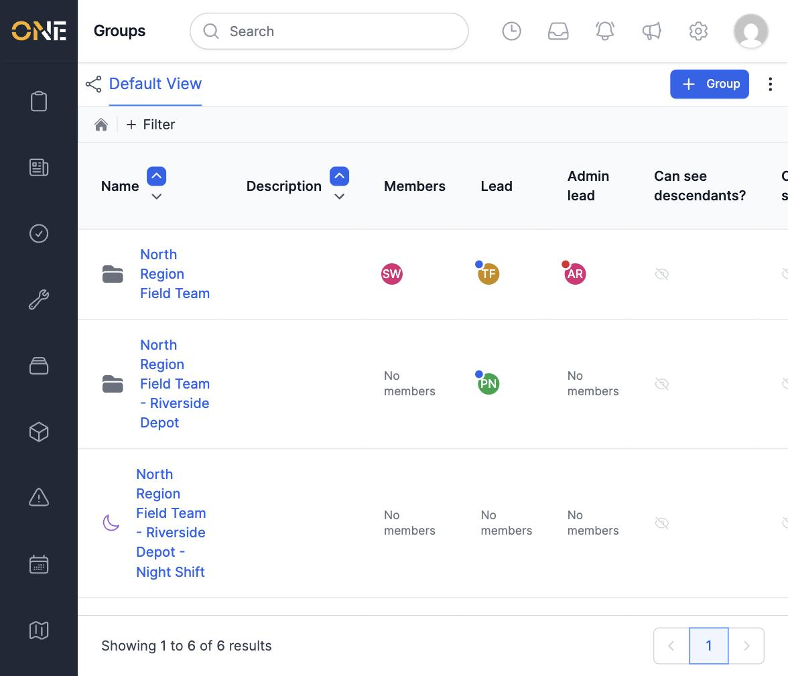
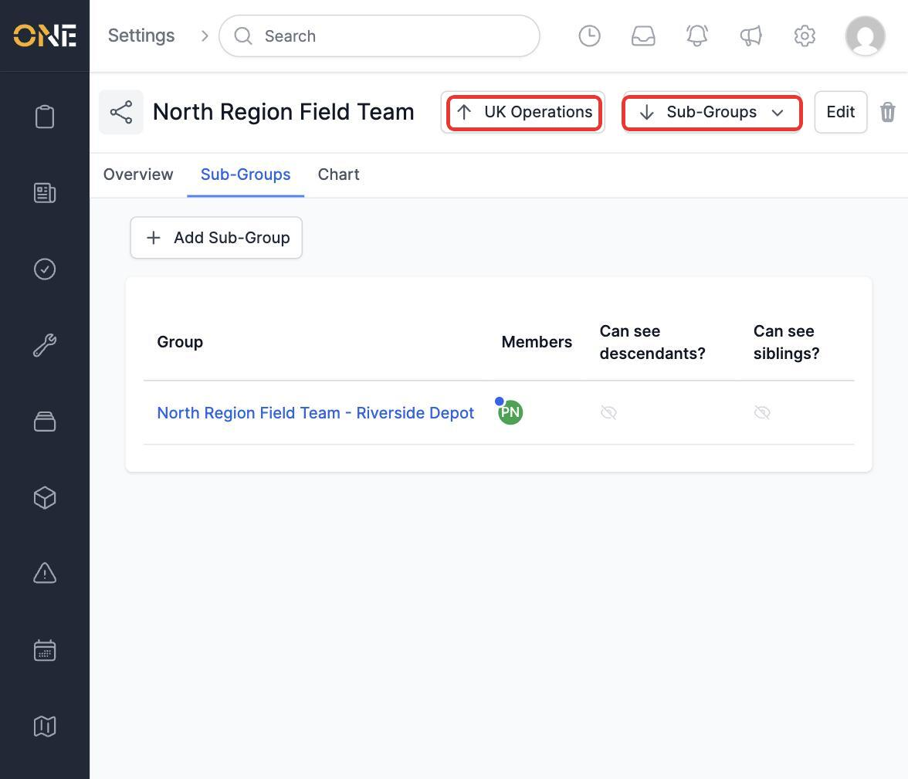
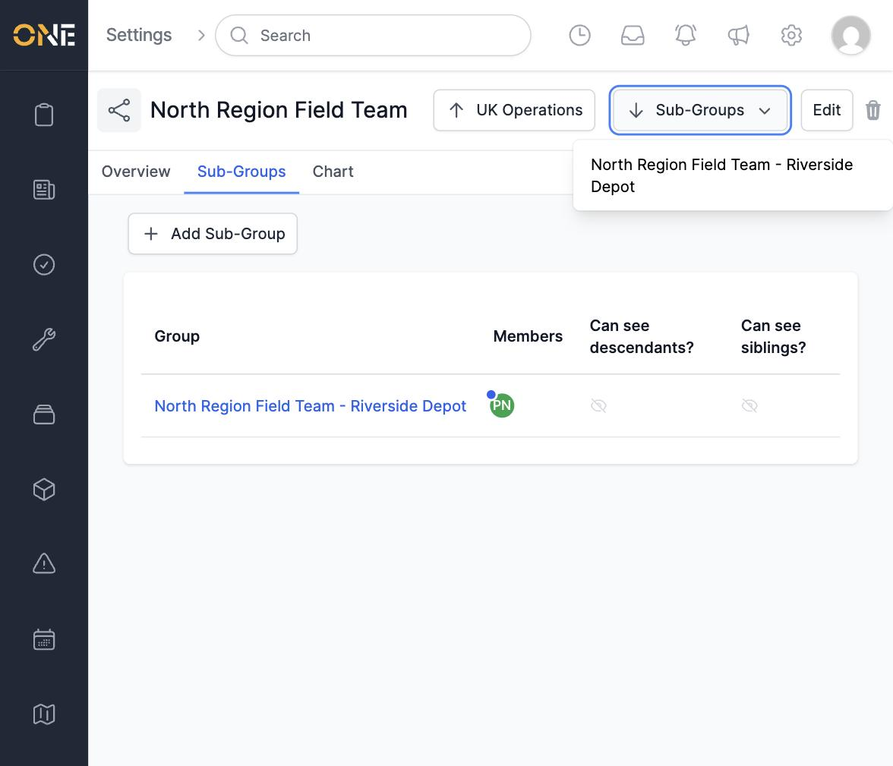
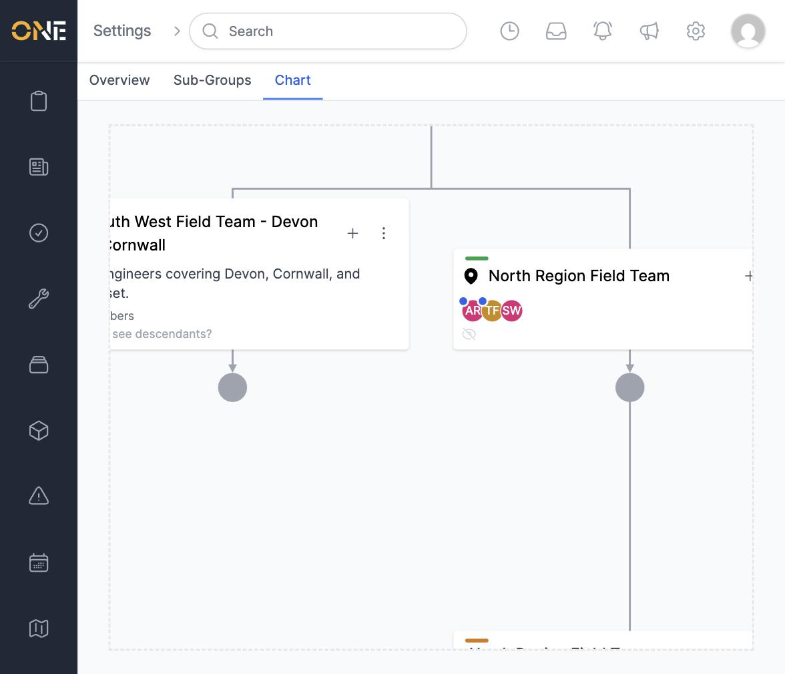
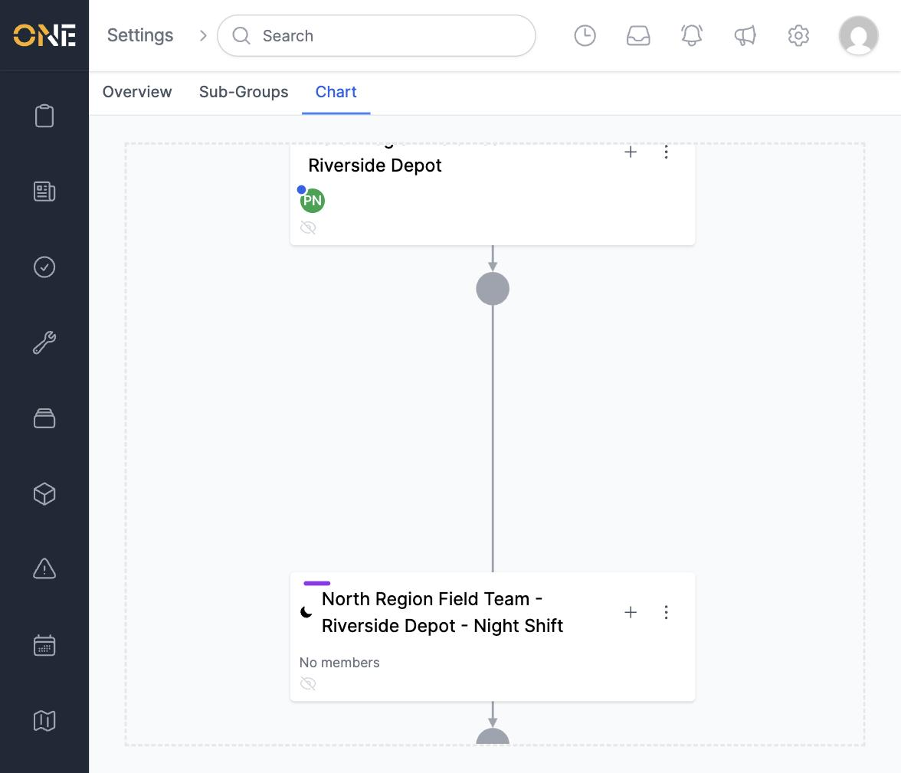

# Browsing the group hierarchy (table and org chart)

Groups can be nested many levels deep — for example a region, containing a depot, containing a shift team. There are two ways to browse this structure: a searchable **table**, and a visual **org chart**.

## Table view

Go to **Settings > Groups**. The default table lists every group you have access to, with its members, lead, and admin lead.

Click a group's name to open its record, or use **+ Filter** at the top to narrow the list down — for example by **Parent Group**, or by whether **Team timesheets enabled?** is on.

## Moving between levels from a group's page

Opening a group shows **Overview**, **Sub-Groups**, and **Chart** tabs, plus two navigation buttons in the header:

- **↑ [Parent name]** jumps straight up to the group's parent.
- **↓ Sub-Groups** opens a dropdown listing its immediate children, so you can jump straight down to one without leaving the page.

The **Sub-Groups** tab itself lists every direct child as a table, with the same **+ Add Sub-Group** button used to create new ones.

## Org chart

The **Chart** tab on any group draws its whole branch of the hierarchy as a connected diagram, from that group down through every descendant. Click and drag anywhere on the chart to pan around it.

Panning further down the North Region branch reveals its deeper levels — here, the "Riverside Depot" group and its own child, "Night Shift":

Each card on the chart shows the group's colour, icon, and member avatars, and has its own **+** (add a sub-group here) and **⋮** (more actions) controls, so the hierarchy can be edited directly from the chart as well as from the table.

## Things to know

- The table lists groups flat and alphabetically by name, regardless of depth — a grandchild group can appear anywhere in the list, not nested under its parent.
- The org chart is scoped to whichever group you opened it from — it only shows that group and its own descendants, not siblings or unrelated groups elsewhere in the hierarchy.
- Colour bands and icons on chart cards are set per-group when creating or editing it, so a well-chosen scheme makes it easy to tell branches of a large hierarchy apart at a glance.
