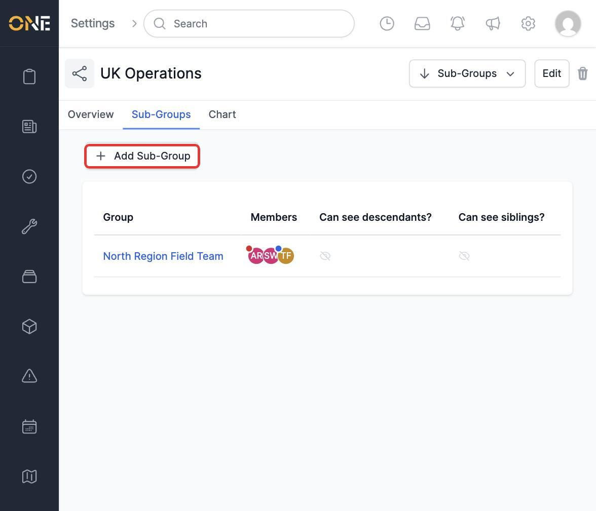
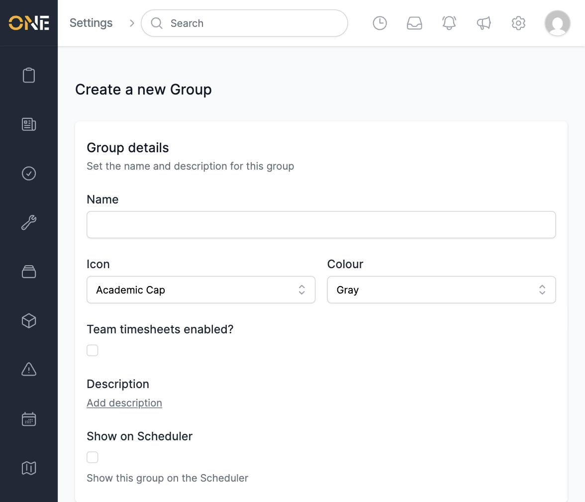
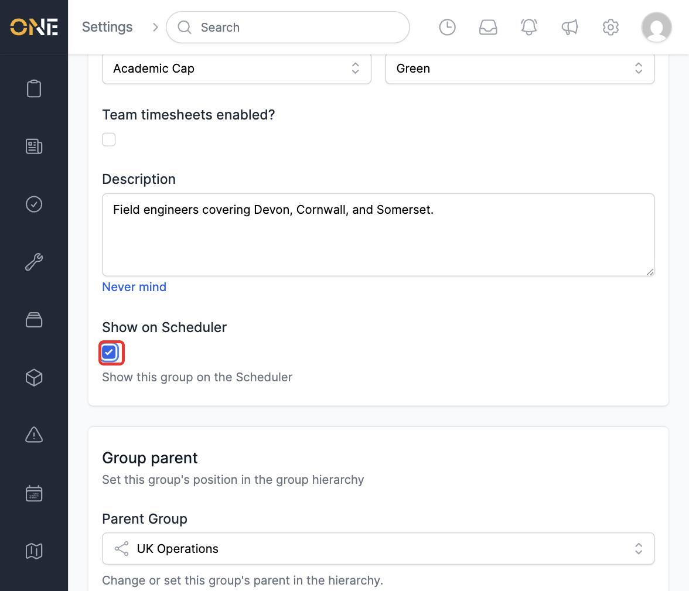
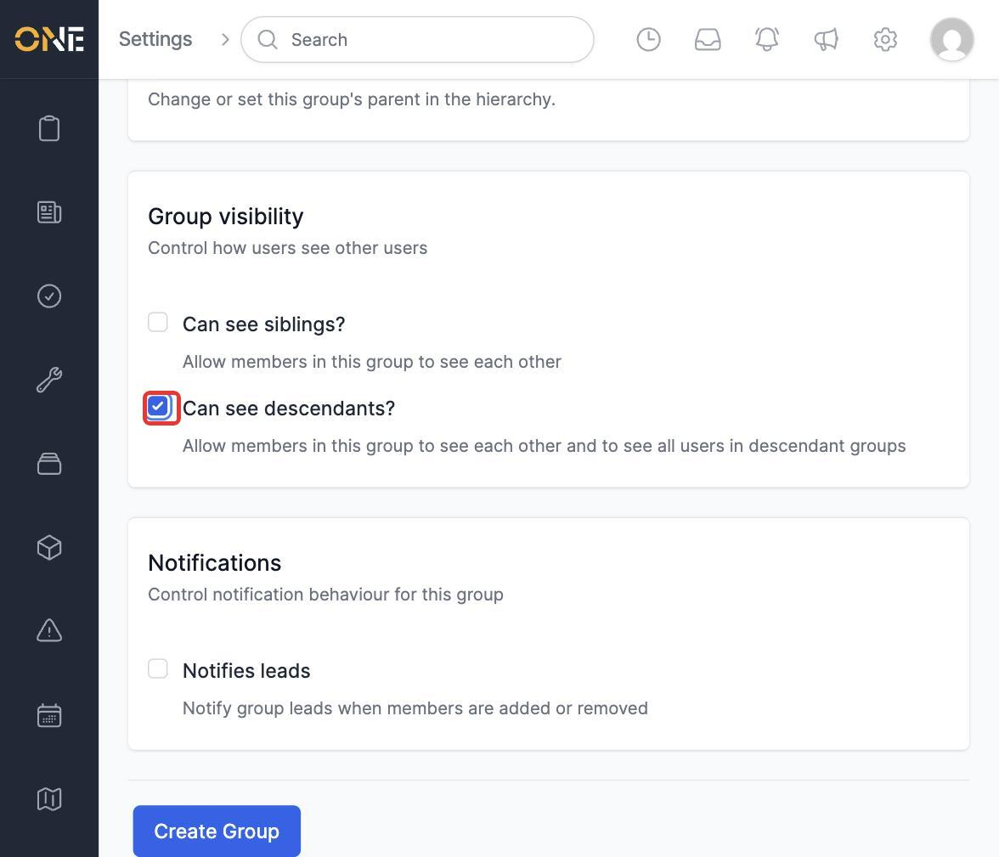
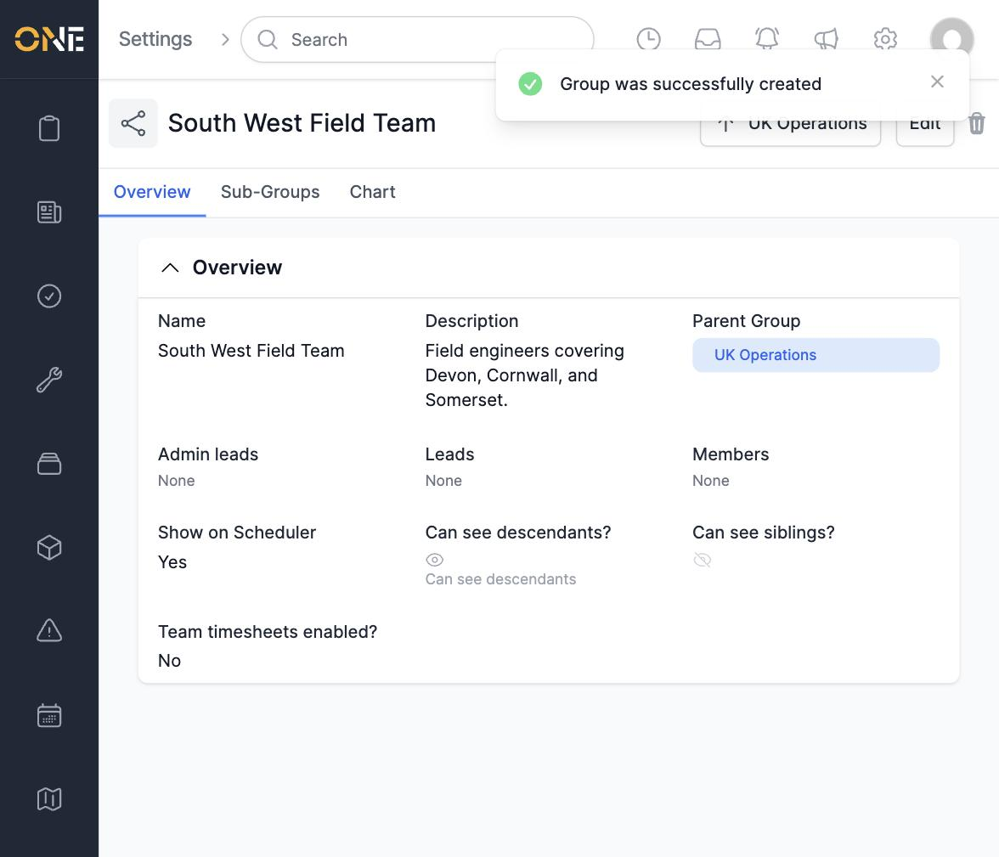
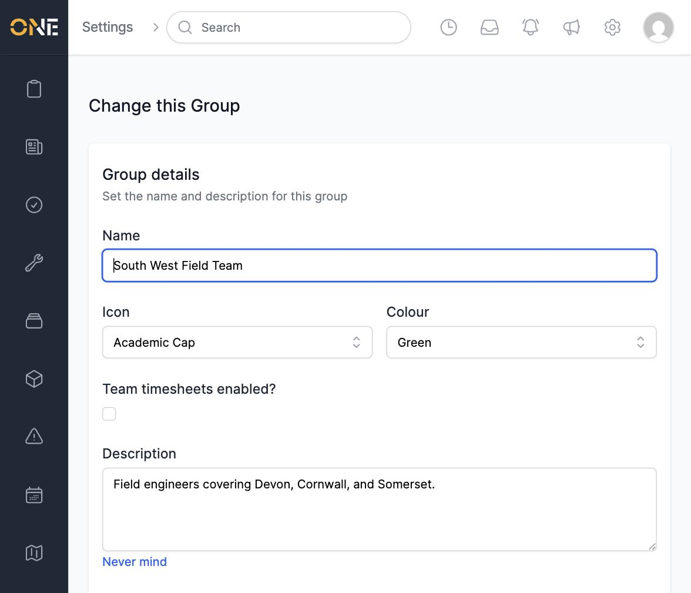
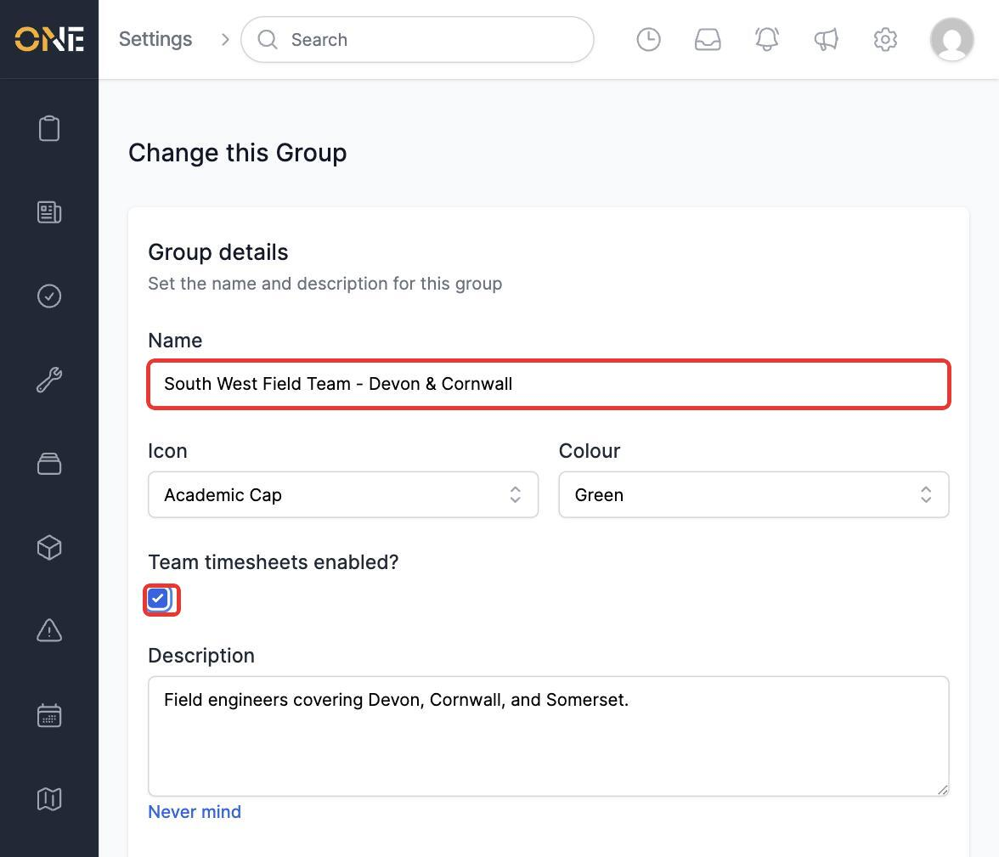
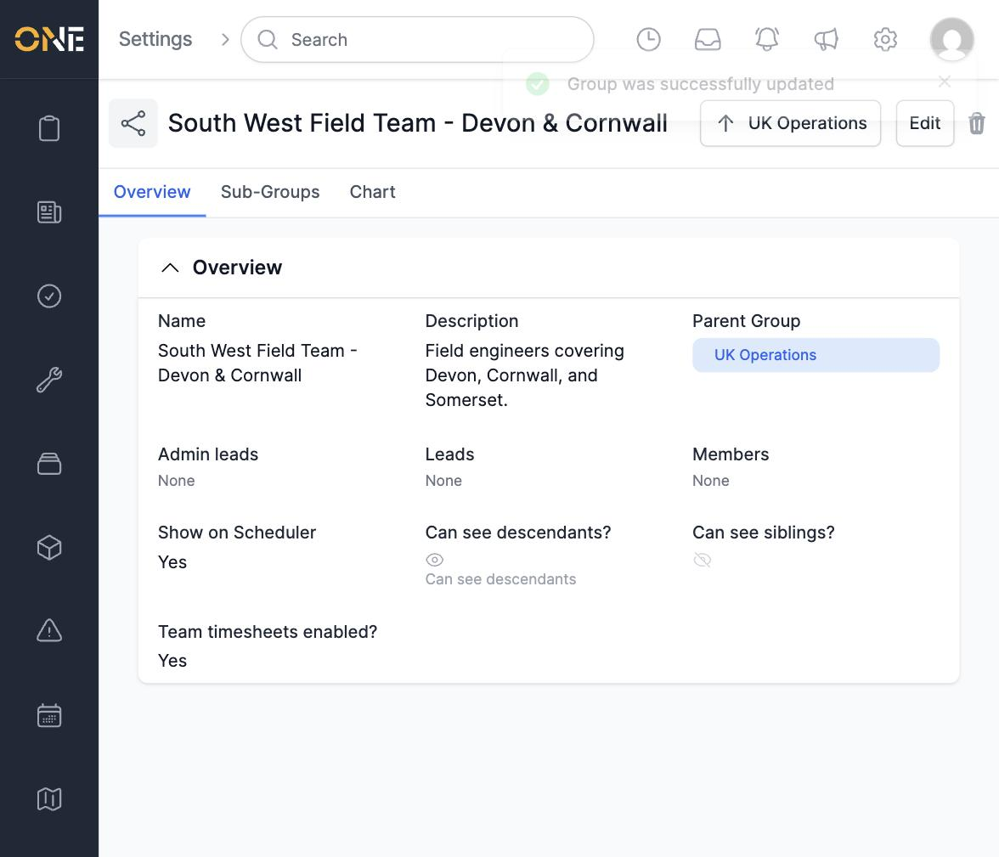

# Creating and editing team groups

Groups let an admin organise everyone in the business into teams — for example by region, department, or shift — and arrange those teams into a hierarchy. This is found under **Settings > Groups**.

## Creating a new group

1. Open the group you want the new group to sit under, and go to its **Sub-Groups** tab. Click **+ Add Sub-Group**.

   

2. Fill in the new group's details:
   - **Name** — for example **South West Field Team**
   - **Icon** and **Colour** — used to tell groups apart at a glance
   - **Team timesheets enabled?** — turns on team-level timesheet features for this group
   - **Description** — an optional note about the group's purpose

   

3. Fill in the description and, if this group should appear as its own row on the Scheduler, turn on **Show on Scheduler**.

   

4. Further down the form:
   - **Parent Group** is already set to the group you started from (here, **UK Operations**) — this can be changed to move the new group elsewhere in the hierarchy.
   - Under **Group visibility**, turning on **Can see siblings?** lets members of this group see each other; **Can see descendants?** additionally lets them see users in every group below this one.
   - Under **Notifications**, **Notifies leads** alerts the group's leads whenever a member is added or removed.

   

5. Click **Create Group**.

   

## Editing an existing group

1. From the group's **Overview** tab, click **Edit**.

   

2. Update any fields — for example, rename the group and turn on **Team timesheets enabled?**.

   

3. Click **Update Group** to save the changes.

   

## Things to know

- A new group's **Parent Group** defaults to whichever group you clicked "+ Add Sub-Group" from, but it can be changed to any other group, including clearing it to make the group a top-level group.
- **Can see siblings?** and **Can see descendants?** control visibility between *members*, not access to records — they decide who a group's members can see in user lists like autocompletes and the scheduler.
- A group can be deleted using the trash icon next to **Edit** on its Overview tab.
