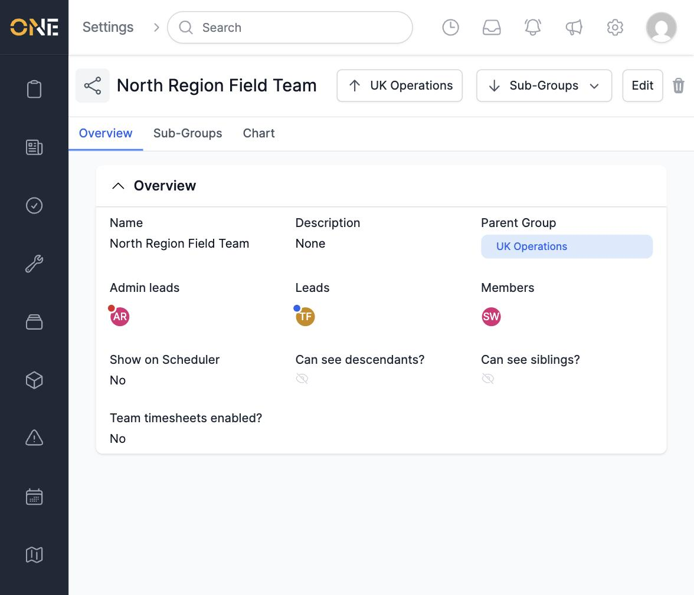
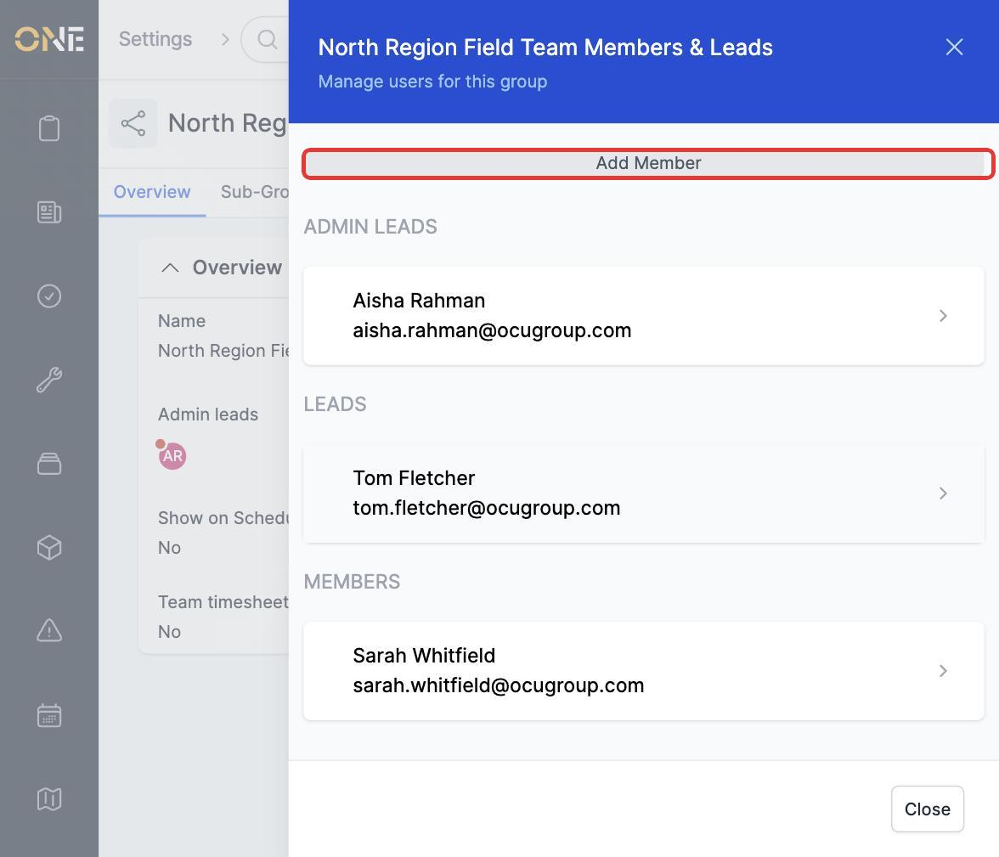
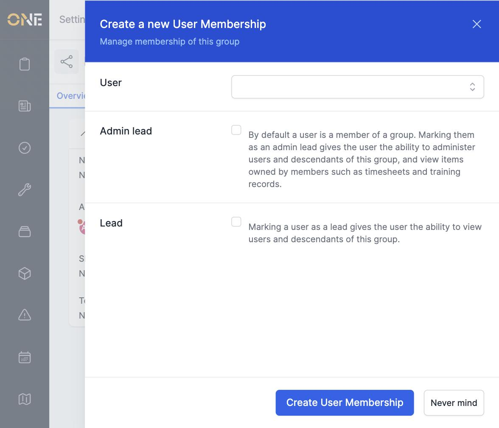
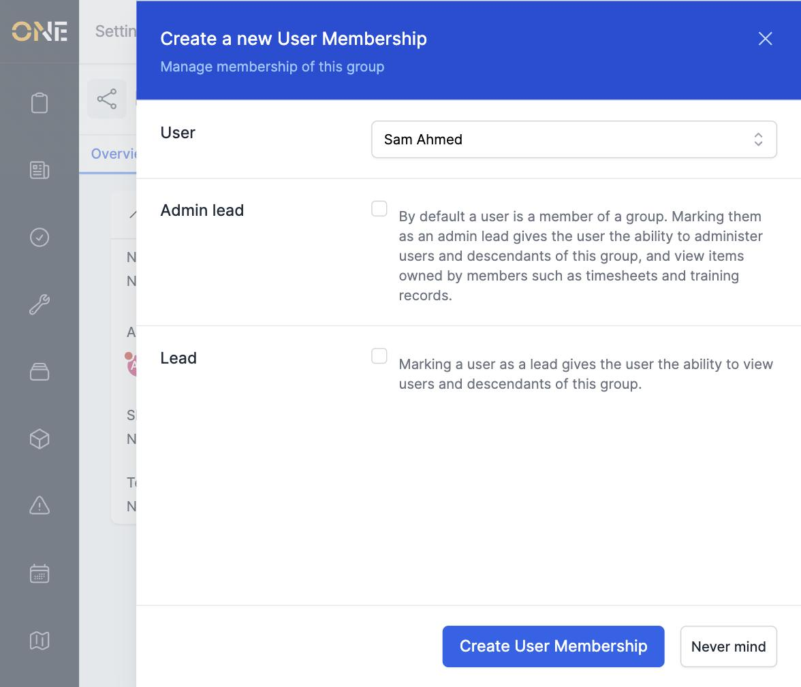
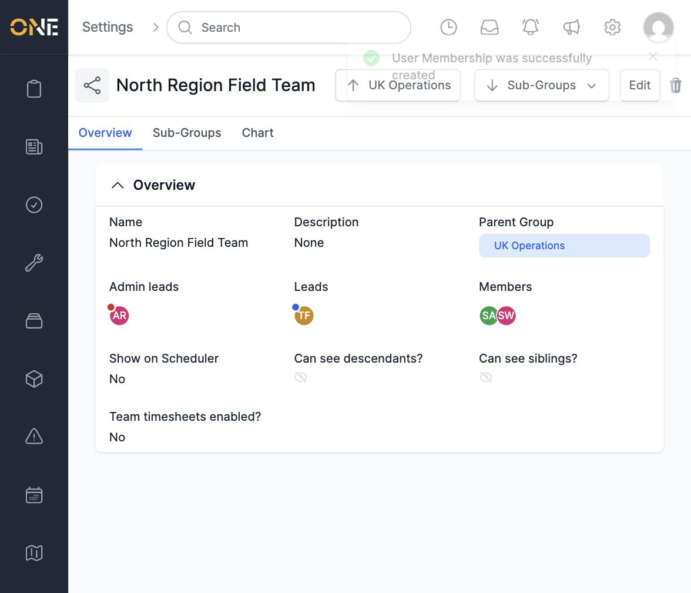
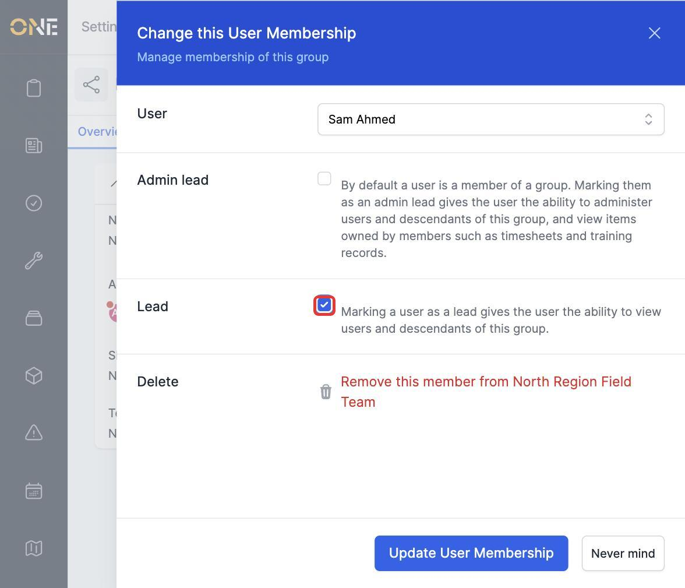
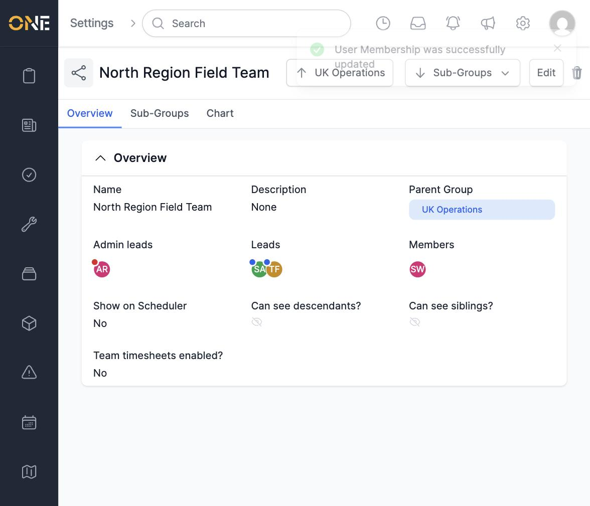

# Managing group membership (members, leads, admin leads)

Every group has a roster of people. Someone can be a plain **member**, a **lead**, or an **admin lead** — each level gives different visibility over the rest of the group.

## Viewing a group's roster

A group's Overview tab shows its **Admin leads**, **Leads**, and **Members** as avatars.

Click any of these avatars to open the **Members & Leads** panel, which lists everyone in the group grouped by role.

## Adding someone to a group

1. From the Members & Leads panel, click **Add Member**.
2. Search for the person by name in the **User** field.

   

3. Select the person from the search results.

   

   The form explains what each role does:
   - By default a new person is added as a plain **member**.
   - **Admin lead** gives the ability to administer users and descendants of this group, and view items owned by members such as timesheets and training records.
   - **Lead** gives the ability to view users and descendants of this group, without the admin abilities.

4. Click **Create User Membership**.

   

## Changing someone's role or removing them

1. Open the Members & Leads panel and click on the person's row.
2. Turn **Admin lead** or **Lead** on or off to change their role — for example, promoting Sam Ahmed to **Lead**.

   

3. Click **Update User Membership** to save the change.

   

To remove someone from the group entirely, open their row and use **Remove this member from [group name]** — this asks for confirmation before it deletes their membership.

## Things to know

- Removing someone's membership only removes them from that one group — it does not deactivate their account or remove them from any other group.
- A group can have more than one admin lead or lead at a time; roles aren't limited to a single person.
- Membership is separate from the **Can see siblings?** / **Can see descendants?** settings on the group itself — those control what members and leads are allowed to see, while roles here control who gets that visibility in the first place.
