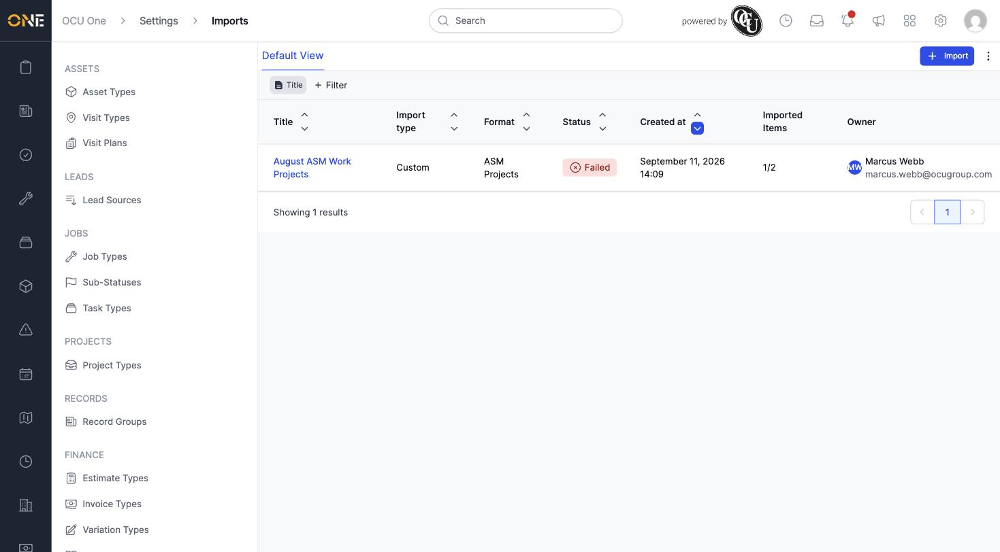
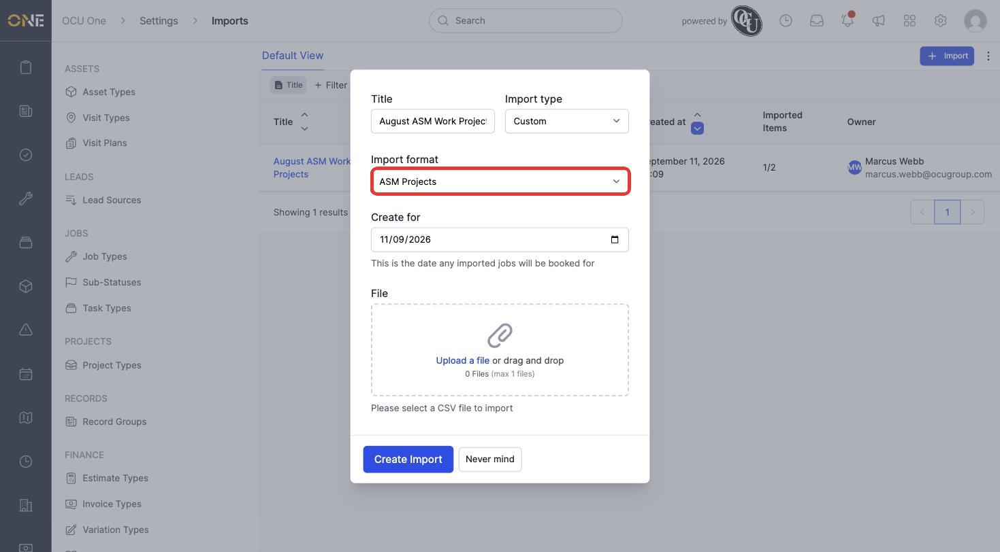
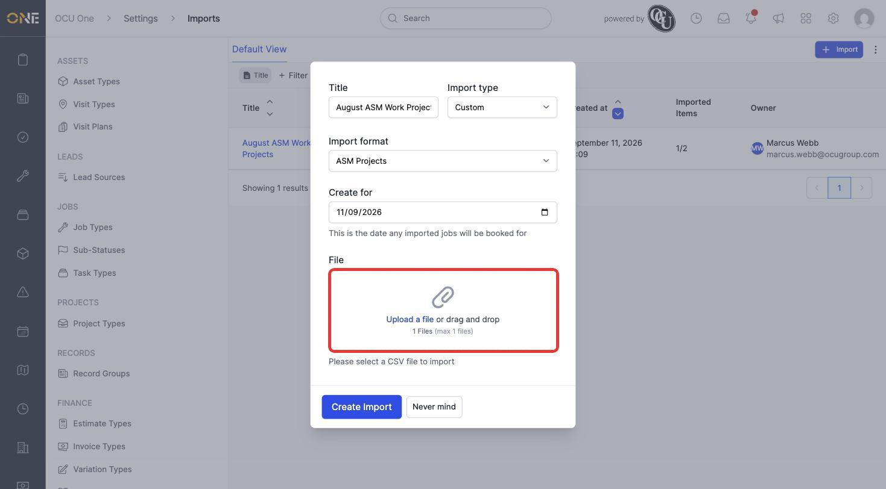
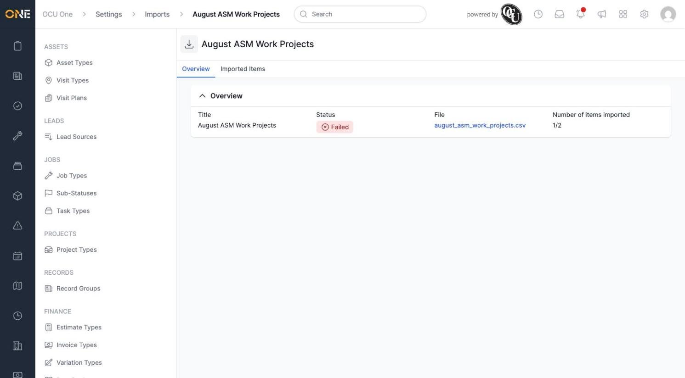
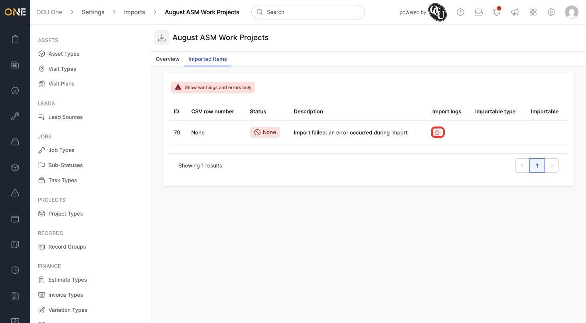

# Importing data via CSV

**Imports** let an admin bulk-load data from a CSV file into OCU One, instead of creating records one at a time. Each import uses a specific **format** matched to the kind of data and system it's coming from.

## Starting an import

1. From **Settings > Imports**, click **+ Import** and give it a **Title** (for example **August ASM Work Projects**).

   

2. Choose an **Import type** — **Custom** covers most external data formats, while **Invoice** and **Rate Book Version** are specialised types with their own dedicated flow. Choosing **Custom** reveals an **Import format** dropdown listing every supported format (for example **ASM Projects**, **OFSC Jobs**, **CSA Projects**) and a **Create for** date, which sets what date any jobs created by the import are booked for.

   

3. Click **Upload a file** (or drag and drop) to attach the CSV, then click **Create Import**.

   

## Reviewing the result

1. The import runs in the background and its **Status** updates once it finishes — **Completed** if everything imported, **Failed** if something went wrong. Opening the import's **Overview** tab shows its **Status**, a link to the original **File**, and **Number of items imported** as a fraction (rows successfully imported out of rows in the file).

   

2. The **Imported Items** tab lists every row from the file individually, with its own **Status** and **Description** explaining what happened to that row. **Show warnings and errors only** filters the list down to just the rows that need attention.

   

3. Clicking the warning icon under **Import logs** opens the technical detail behind that specific problem — useful to pass along if you need to ask for help resolving it.

## Things to know

- **Import format** determines exactly which CSV columns are expected — check with whoever's setting this up if a format's exact column layout isn't already documented for you.
- An import's overall **Status** reflects whether every row succeeded — a handful of individual row failures can be enough to mark the whole import **Failed**, even when most rows imported fine.
- Once created, an import can't be edited or re-run in place — fix the CSV and start a new import.
