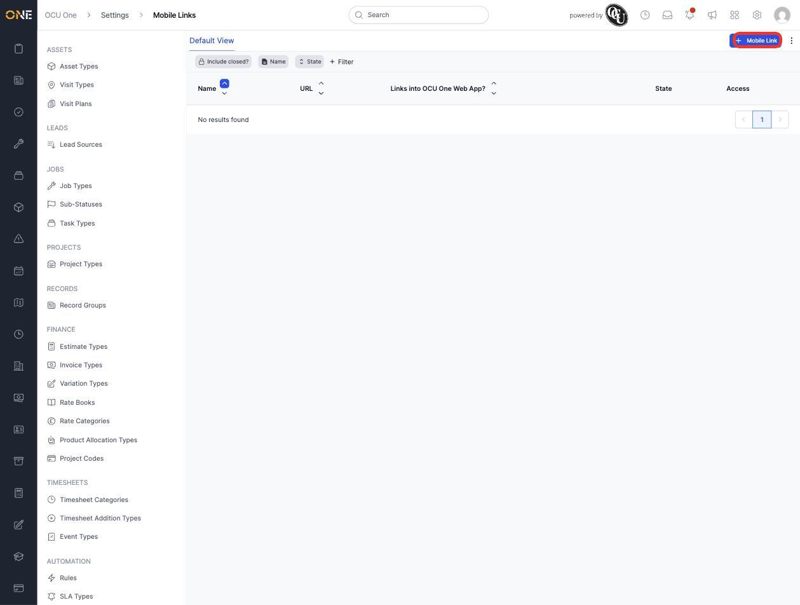
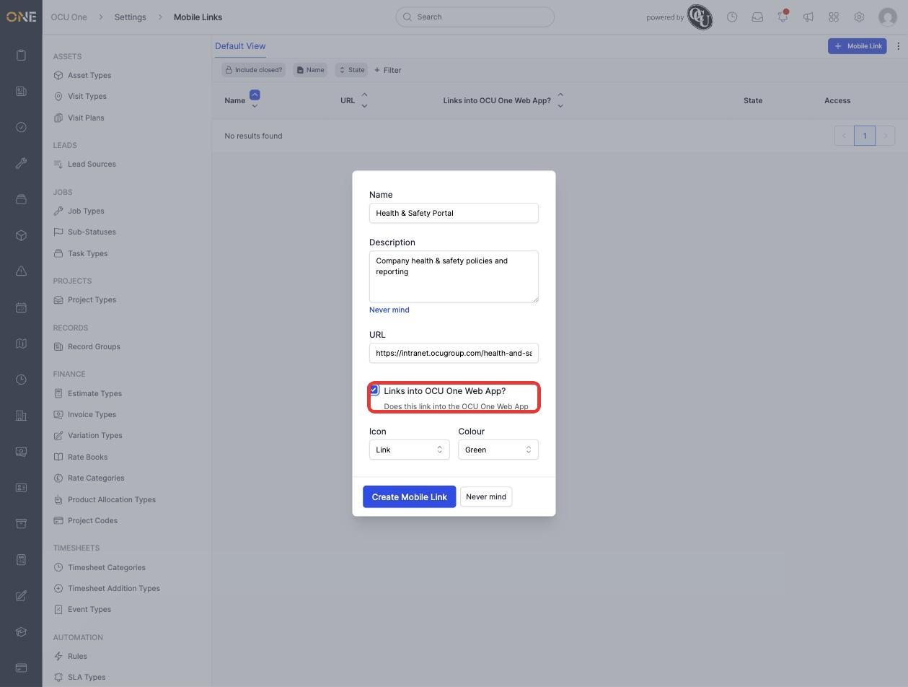
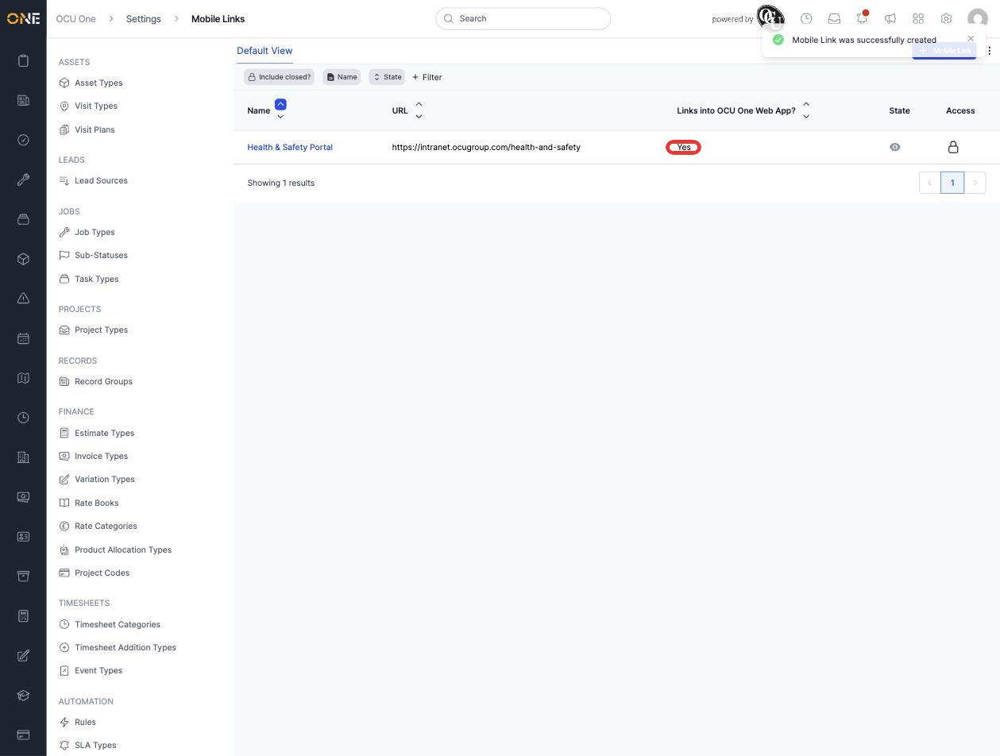

# Managing mobile app shortcut links

**Mobile Links** are shortcuts shown in the mobile app to external resources — a company intranet page, a policy document, a third-party portal — so field users can reach them without leaving the app.

## Creating a mobile link

1. From **Settings > Mobile Links**, click **+ Mobile Link**.

   

2. Give it a **Name** (for example **Health & Safety Portal**) and an optional **Description**. Enter the **URL** it should open, and tick **Links into OCU One Web App?** if the link points somewhere the mobile app can embed directly rather than opening in an external browser.

   

3. Pick an **Icon** and **Colour**, then click **Create Mobile Link**. It appears in the list with its URL and whether it links into the web app.

   

## Things to know

- **Links into OCU One Web App?** changes how the mobile app opens the link — ticked, it's treated as an embedded destination inside the app rather than handed off to the device's browser.
- Mobile Links are managed centrally here but only appear inside the mobile app itself — there's nothing to see on the web app's own navigation.
- Like most other Settings lists, an inactive Mobile Link can be deactivated rather than deleted, keeping it out of the mobile app without losing its configuration.
