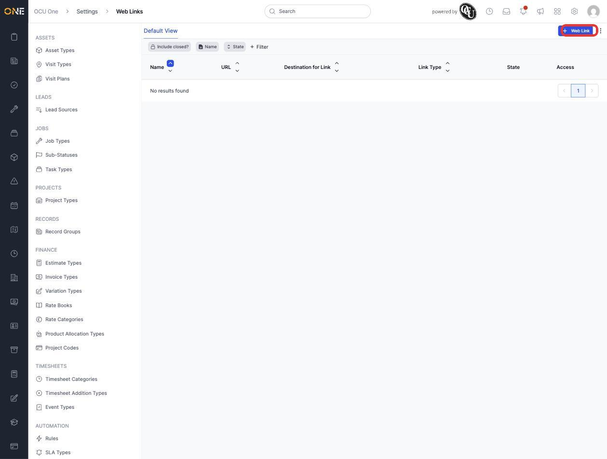
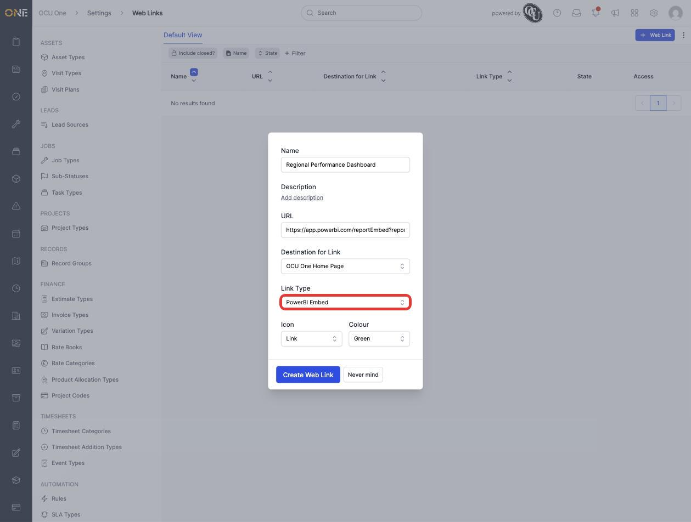
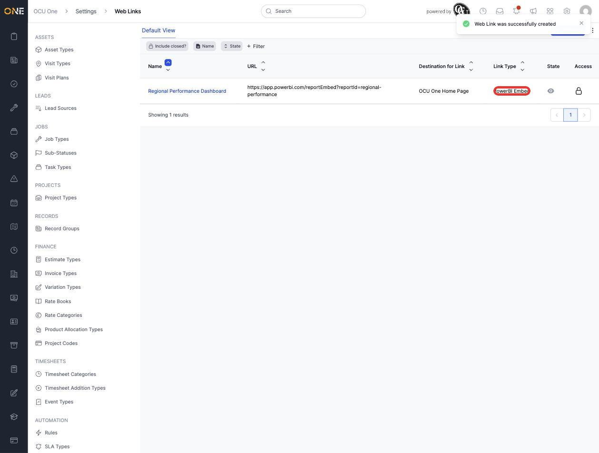

# Managing web dashboard links

**Web Links** surface an external dashboard or site inside the web app itself — for example, a Power BI report embedded directly on the home page rather than opened in a separate tab.

## Creating a web link

1. From **Settings > Web Links**, click **+ Web Link**.

   

2. Give it a **Name** (for example **Regional Performance Dashboard**) and the **URL** to embed. Choose a **Destination for Link** (where in the app it appears — currently just **OCU One Home Page**) and a **Link Type**: **Generic Web Site** for an ordinary embedded page, or **PowerBI Embed** for a Power BI report URL.

   

3. Click **Create Web Link**. It appears in the list with its URL, destination, and link type.

   

## Things to know

- **Link Type** determines how the URL is rendered once it reaches its destination — **PowerBI Embed** expects a Power BI report embed URL specifically, not just any Power BI link.
- **Destination for Link** controls where in the app the link surfaces; more destinations may be added over time; for now it's the **OCU One Home Page**.
- Web Links are separate from [Mobile Links](Managing%20mobile%20app%20shortcut%20links.md) — the two aren't shared, so a shortcut needed on both the web app and the mobile app has to be created twice, once in each place.
