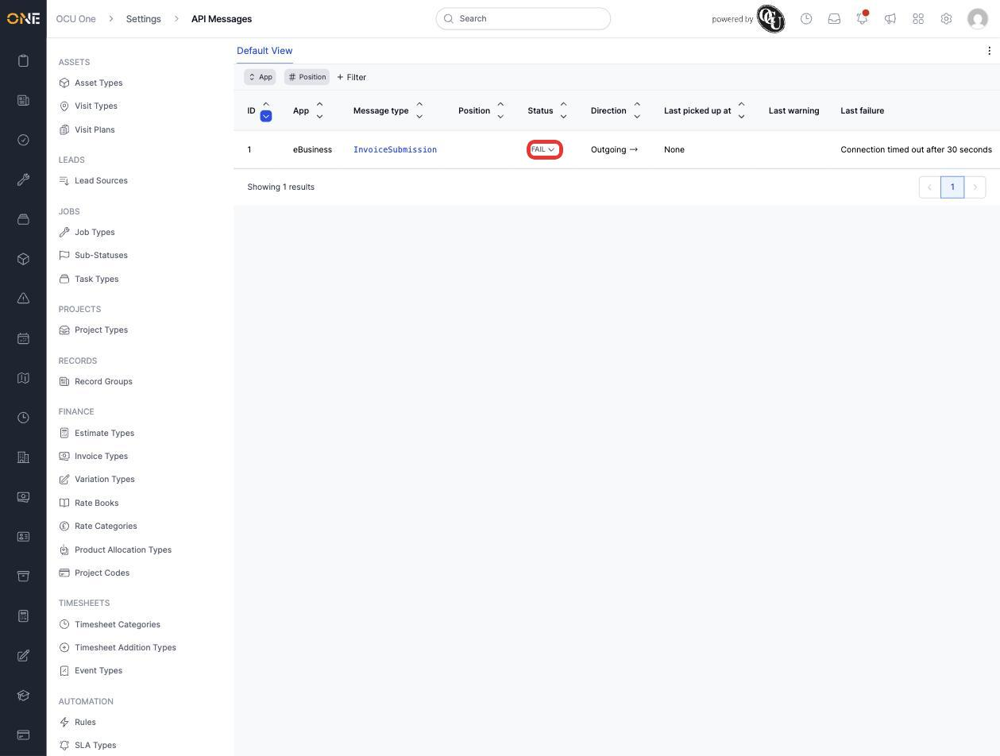
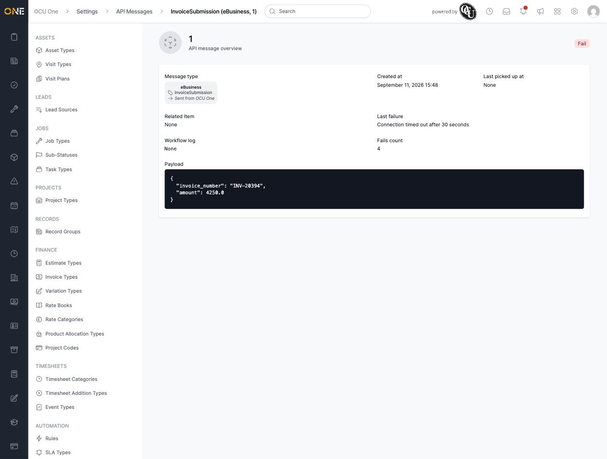
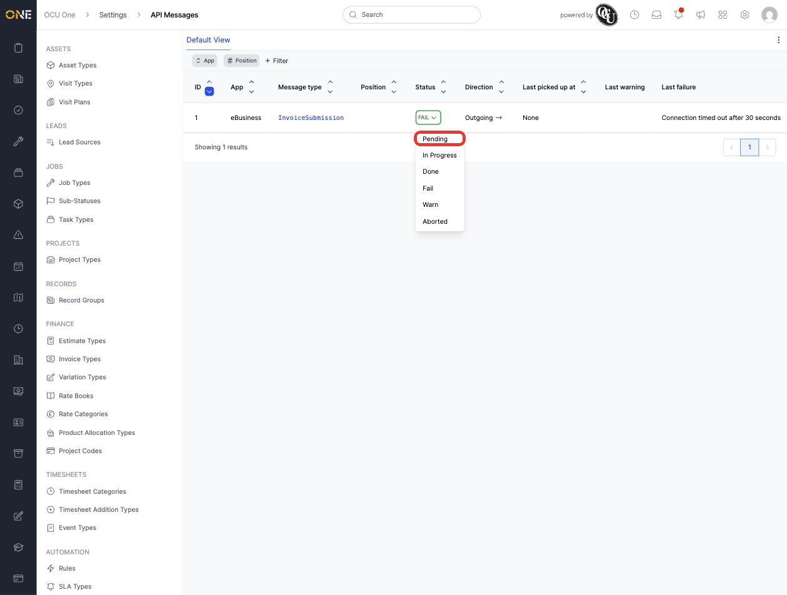
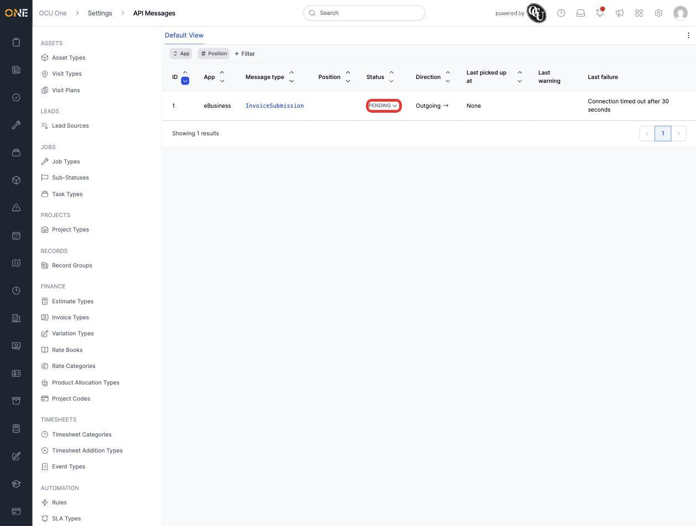

# Monitoring gateway and API messages

**API Messages** are the individual calls flowing between OCU One and connected external systems — accounting platforms, third-party integrations, and other apps. This screen lets an admin see every message, which direction it went, and whether it succeeded.

## Viewing API messages

1. From **Settings > API Messages**, every message is listed with its **App** (which external system it's talking to — for example **eBusiness**), **Message type**, **Status**, **Direction** (incoming or outgoing), and — if something went wrong — its **Last failure**.

   

2. Click a message to see its full detail: the app and message type, **Created at**, **Last picked up at**, **Related Item**, **Workflow log**, **Fails count**, and the raw **Payload** that was sent.

   

## Retrying a failed message

1. From the list, click the **Status** dropdown on a failed message to see every status it could be moved to — **Pending**, **In Progress**, **Done**, **Fail**, **Warn**, **Aborted**.

   

2. Select **Pending** to queue the message for another attempt.

   

## Things to know

- Resetting a message to **Pending** doesn't clear its **Last failure** or **Fails count** history — it just queues it to try again, so those fields stay as a record of what went wrong before.
- **Direction** shows at a glance whether OCU One sent the message out or received it in — useful for narrowing down which side of an integration to investigate first.
- Each **App** represents a distinct external integration — messages for different apps are never mixed together in the same retry queue.
