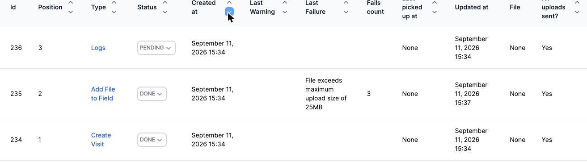
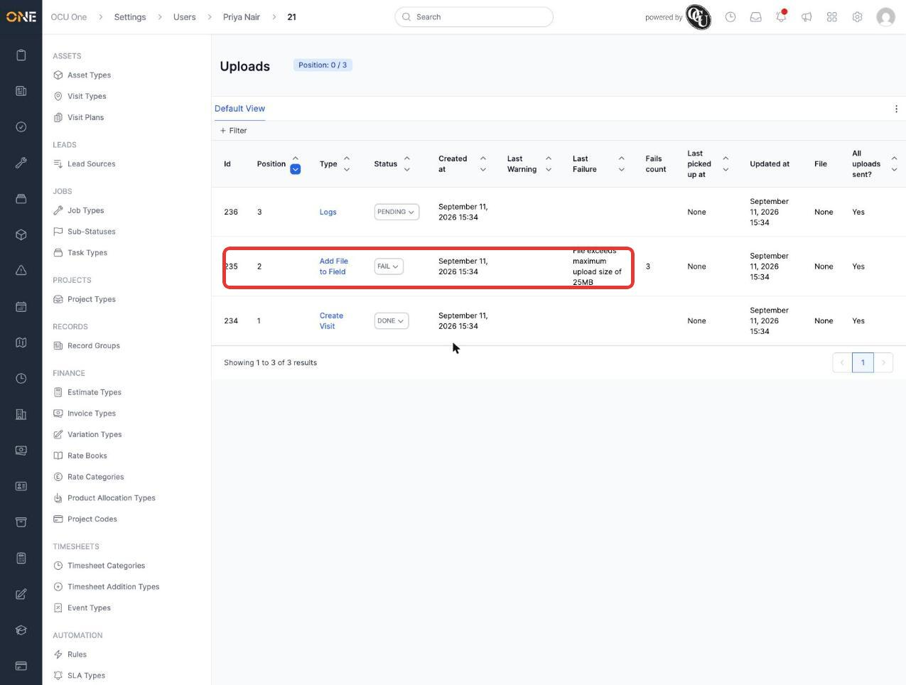
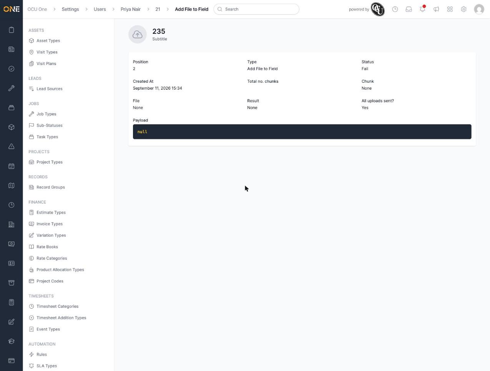
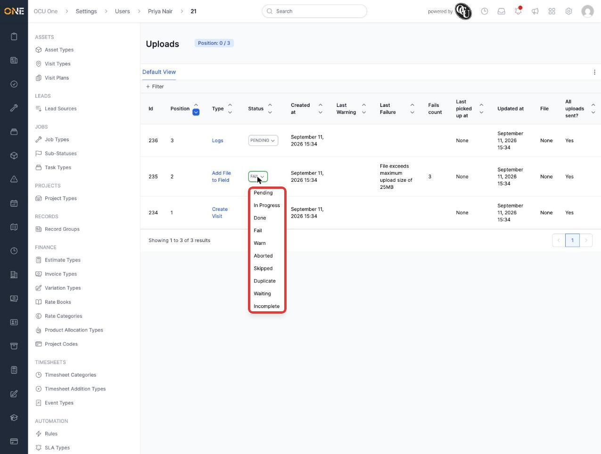
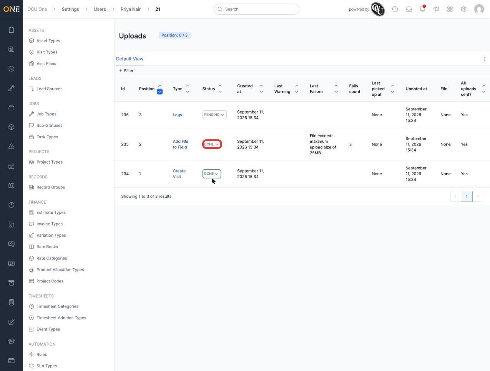

# Monitoring mobile and web uploads

Every piece of data the mobile app queues up — a completed visit, a photo added to a field, a device log — comes through as an **Upload**. This screen lets an admin see exactly what's been sent, what's still pending, and step in when something's stuck.

## Viewing uploads

1. From **Settings > Uploads**, every upload across the tenant is listed with its **Type** (for example **Metrics**, **End Shift**, **Logs**, **Add File to Field**, **Create Visit**), current **Status**, when it was **Created at**, and — if something went wrong — its **Last Failure** message and **Fails count**.

   

2. To dig into one person's device activity, open their user record and its mobile session — this scopes the same list down to just that session's uploads.

   

3. Click any upload to see its full detail — **Position**, **Type**, **Status**, **Total no. chunks**, **File**, **Result**, and the raw **Payload** the device sent.

   

## Resolving a stuck or failed upload

1. From the list, click the **Status** dropdown on any upload to see every status it could be moved to — **Pending**, **In Progress**, **Done**, **Fail**, **Warn**, **Aborted**, **Skipped**, **Duplicate**, **Waiting**, **Incomplete**.

   

2. Pick a new status — for example **Done**, to manually clear an upload that's stuck failing (here, one whose **Last Failure** was **File exceeds maximum upload size of 25MB**). The change applies immediately.

   

## Things to know

- **Last Failure** and **Fails count** only update from real failed attempts — manually setting a status to **Done** doesn't clear that history, it just moves the upload past its stuck state.
- **All uploads sent?** on the list reflects the device's own reporting, not something this screen can change directly.
- Uploads with no attached file (most of them — metrics, status changes, and similar small payloads) show **None** under **File**; only uploads that actually carry a photo, document, or log file will have one to view.
