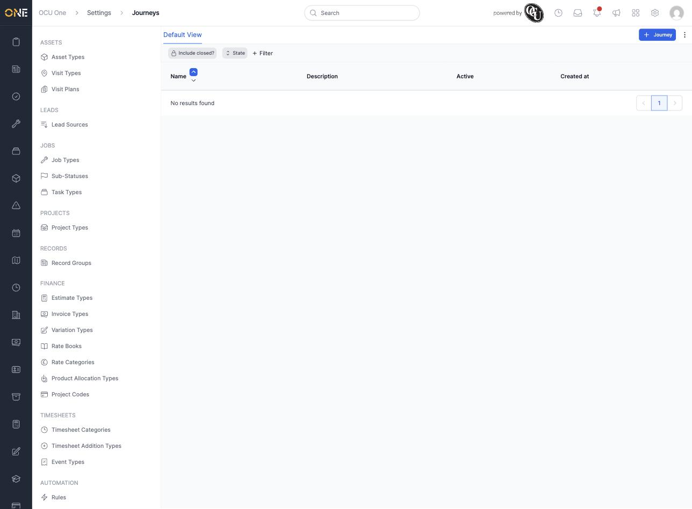
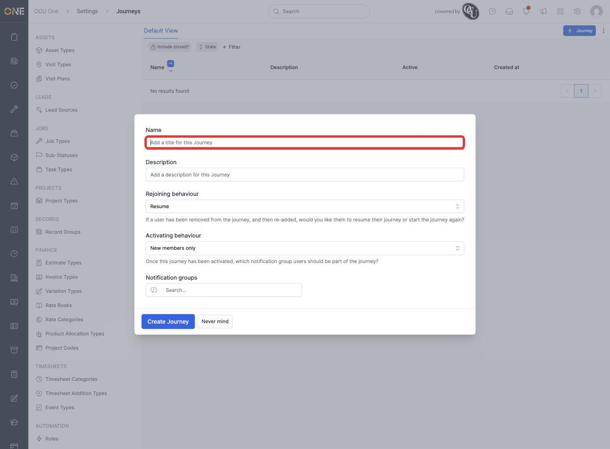
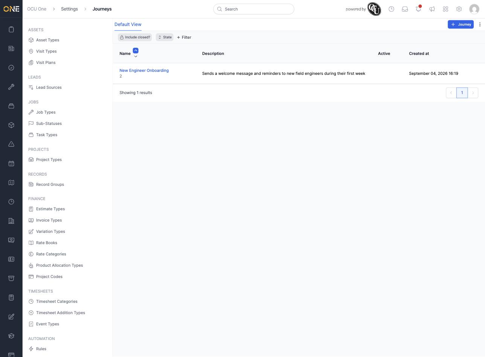
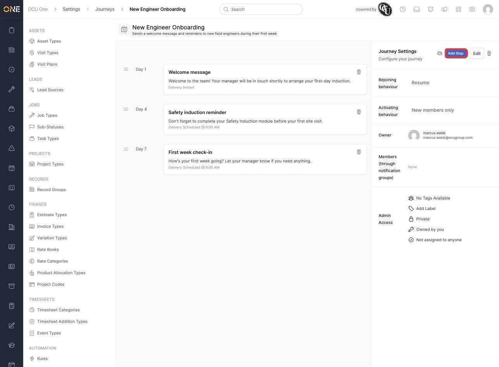
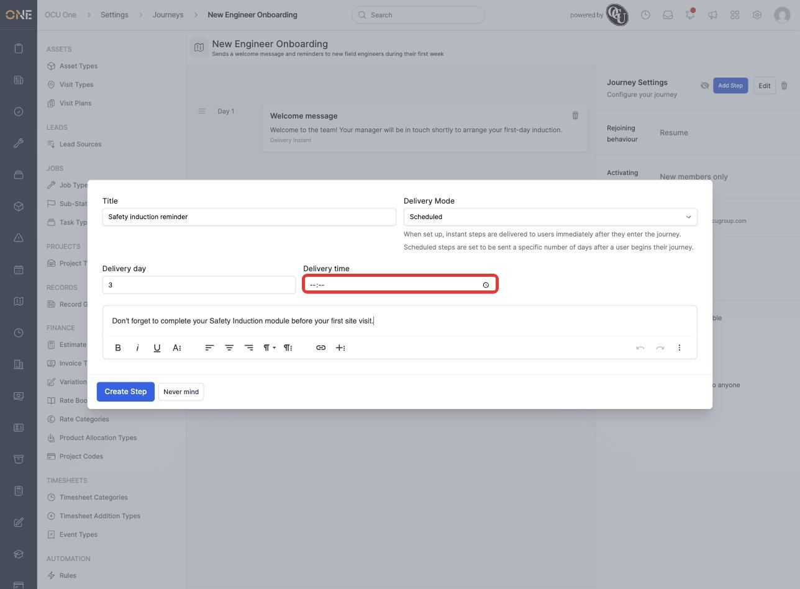
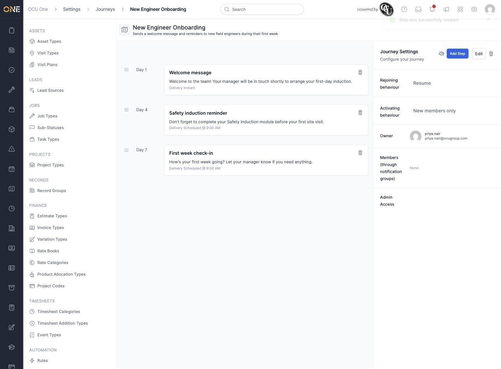

# Building a notification journey

A journey sends a scheduled sequence of notifications to a group of people over time — for example, a series of messages sent to a new starter over their first week. This screen lives under **Settings > Automation** area of the sidebar (or wherever journeys are listed for your organisation).

## Creating a journey

1. From the Journeys list, click **+ Journey**.

   

2. Fill in the journey's details:
   - **Name** and **Description** — for example **New Engineer Onboarding**.
   - **Rejoining behaviour** — if someone is removed from the journey and later re-added, should they pick up where they left off (**Resume**) or start again from the beginning?
   - **Activating behaviour** — once the journey is switched on, should it apply only to people who join afterwards (**New members only**) or everyone already in its notification groups too?
   - **Notification groups** — the group(s) of people this journey applies to.

   

3. Click **Create Journey**. It appears in the list with its member count:

   

## Adding steps to the journey

Open the journey to see its settings and step timeline, then click **Add Step**.

For each step, set:
- **Title** — a short name for the step, e.g. **Safety induction reminder**.
- **Delivery Mode** — **Instant** sends the step as soon as someone enters the journey; **Scheduled** sends it a set number of days after they join.
- For a scheduled step, a **Delivery day** and **Delivery time** appear — both are required.
- The message body itself, in the rich text box below.

Click **Create Step**, then repeat for each step the journey needs. A completed journey with three steps — an instant welcome message, followed by two scheduled reminders:

## Things to know

- A scheduled step's day counts from when someone joins the journey, not a calendar date — a step set to "3 days" shows as "Day 4" in the timeline (day 1 being the day they join).
- Steps are shown in the order they'll be sent, so it's easy to check the whole sequence at a glance before switching the journey on.
- The drag handle to the left of each step lets you reorder steps if you need to change the sequence later.
