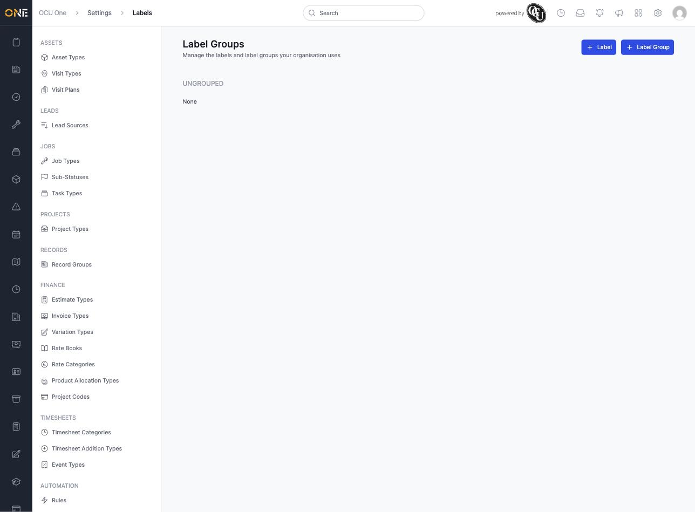
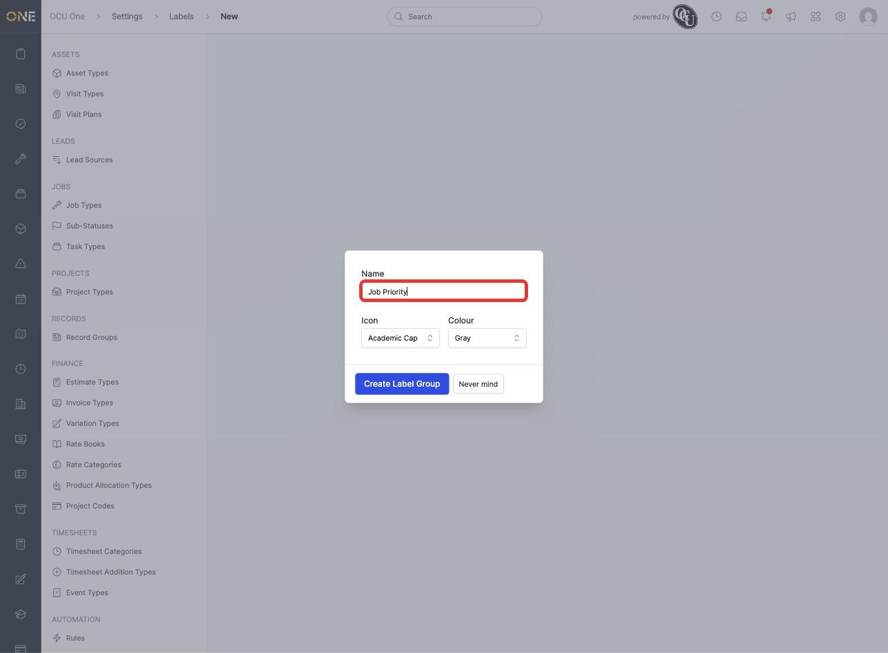
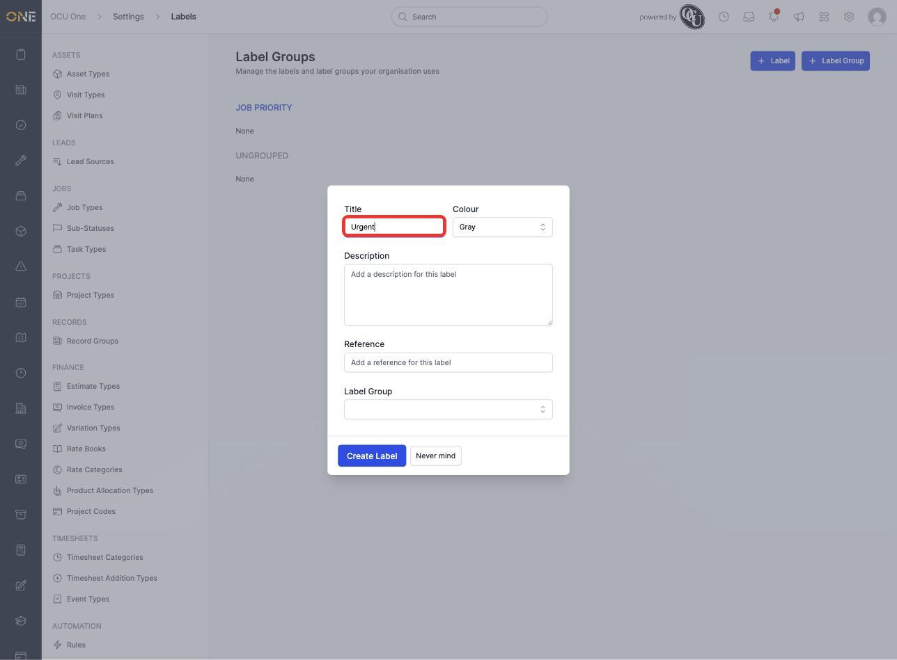
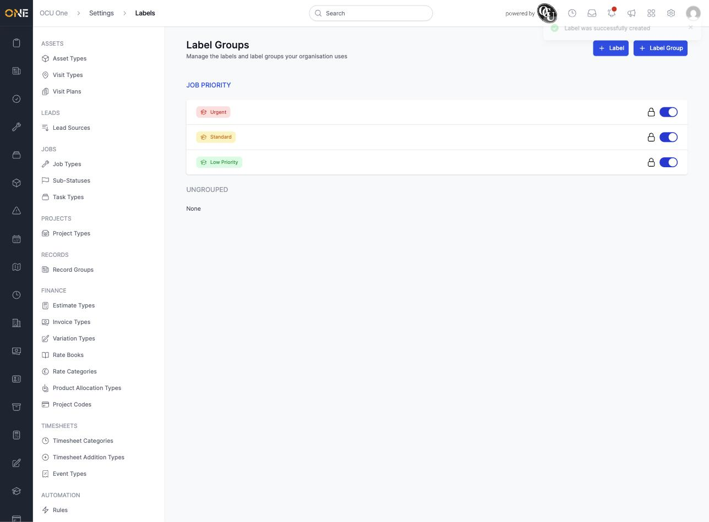

# Configuring label groups

Labels let everyone tag records with quick, colour-coded markers — like "Urgent" or "VIP Client". Label groups keep related labels organised together instead of leaving them as one long, ungrouped list. This screen, under **Settings > Labels**, is where an admin sets both up.

## Creating a label group

1. Click **+ Label Group** in the toolbar.

   

2. Give the group a **Name** — for example **Job Priority** — and choose an **Icon** and **Colour** for it, then click **Create Label Group**.

   

The group appears on the page as a new heading, ready for labels to be added under it.

## Adding labels to a group

1. Click **+ Label**.
2. Give the label a **Title** (for example **Urgent**), an optional **Description** and **Reference**, choose its **Colour**, and pick which **Label Group** it belongs to — here, **Job Priority**.

   

3. Click **Create Label**. Repeat for as many labels as the group needs — for example a full "Job Priority" group with **Urgent** (red), **Standard** (amber), and **Low Priority** (green):

   

## Things to know

- Each label has its own on/off toggle — switching it off removes it from anywhere it can be picked, without deleting it.
- A label doesn't have to belong to a group — labels with no group assigned show up under **Ungrouped** at the bottom of the page.
- Colours make labels easy to tell apart at a glance on any record they're applied to, so pick colours that make sense together within a group (as above, red/amber/green for a priority scale).
