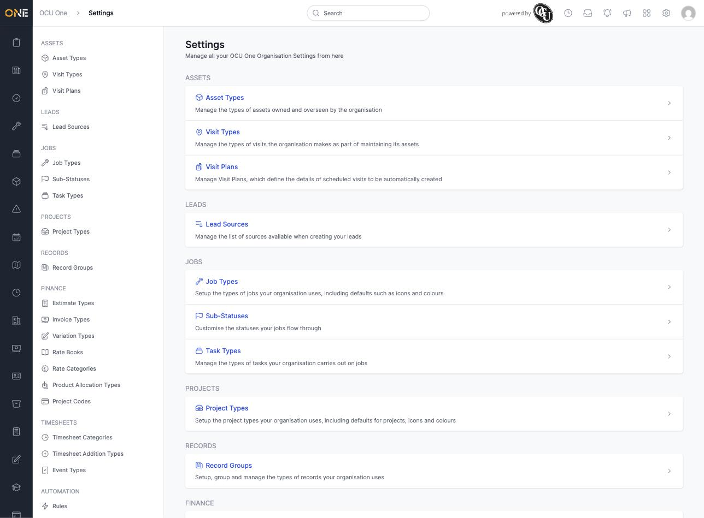

# Finding your way around Settings (landing page)

The Settings landing page is where an admin manages every piece of reference data your organisation uses — from asset and job types to rate books and record groups. Click the gear icon in the left-hand sidebar to get there.

## What's on this page

The page is organised into named sections, each grouping related settings together:

- **Assets** — Asset Types, Visit Types, Visit Plans
- **Leads** — Lead Sources
- **Jobs** — Job Types, Sub-Statuses, Task Types
- **Projects** — Project Types
- **Records** — Record Groups
- **Finance** — Estimate Types, Invoice Types, Variation Types, Rate Books, Rate Categories, Product Allocation Types, Project Codes
- **Timesheets** — Timesheet Categories, Timesheet Addition Types, Event Types
- **Automation** — Rules

Each link takes you straight to that setting area. Which sections and links appear depends on your permissions and on which features your organisation has enabled — an admin with full access will see more sections than shown here.

Scroll down for more sections further down the page, or use the same links repeated in the left-hand sidebar to jump between settings areas without coming back to this page each time.
