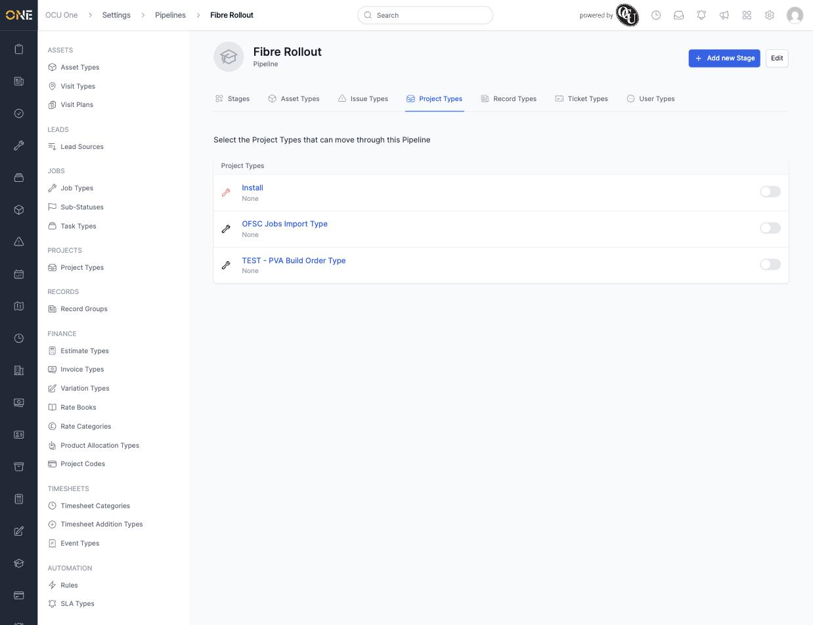
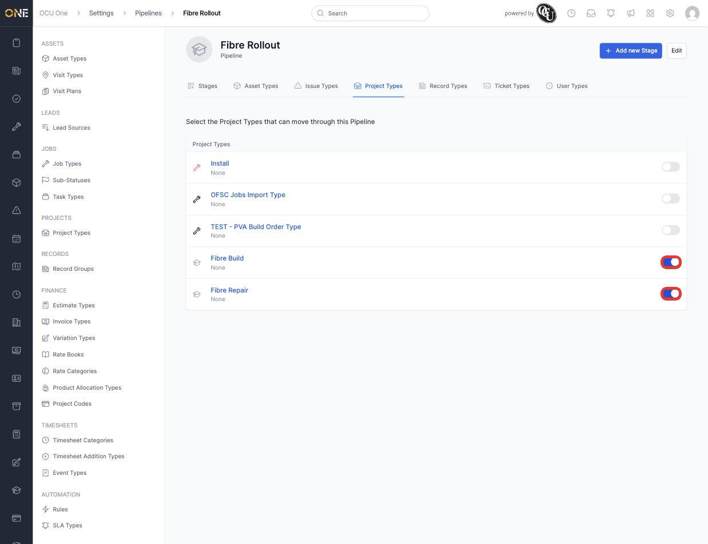

# Attaching a pipeline to a type

A pipeline only starts moving real records once it's attached to the types that should use it. A pipeline can be attached to Asset Types, Issue Types, Project Types, Record Types, Ticket Types, and User Types — all from the same set of tabs on the pipeline's own page.

## Attaching to a type

1. Open the pipeline (**Settings > Pipelines**) and click the tab for the kind of type you want to attach it to — for example **Project Types**.

   

2. Flip the toggle on for each type that should use this pipeline — for example **Fibre Build** and **Fibre Repair**.

   

3. The change saves immediately — there's no separate save step. Projects created under either attached type can now be moved through the pipeline's stages.
4. Repeat on any of the other tabs (Asset Types, Issue Types, Record Types, Ticket Types, User Types) to attach the same pipeline to more than one kind of object at once.

## Things to know

- A type can only use one pipeline at a time per tab — toggling on a different pipeline for the same type effectively switches it (the type moves away from whatever pipeline it was using before).
- Detaching a type (toggling it back off) doesn't delete anything already in the pipeline — it stops new items of that type from being added to it going forward.
- This same tab layout — one row of toggles per type — is identical across all six attachment tabs, so the same idea applies whether you're attaching a pipeline to Tickets, Records, or any of the others.
