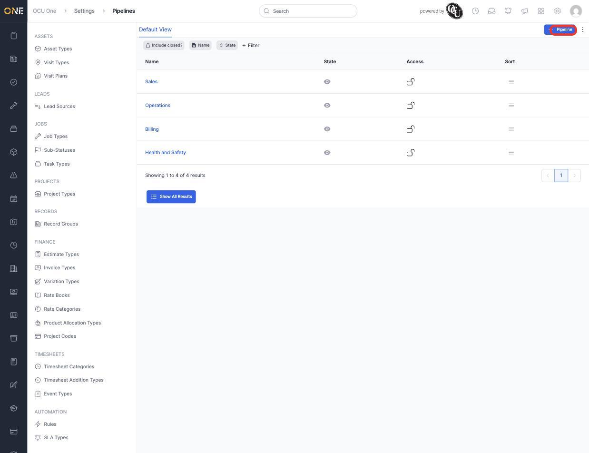
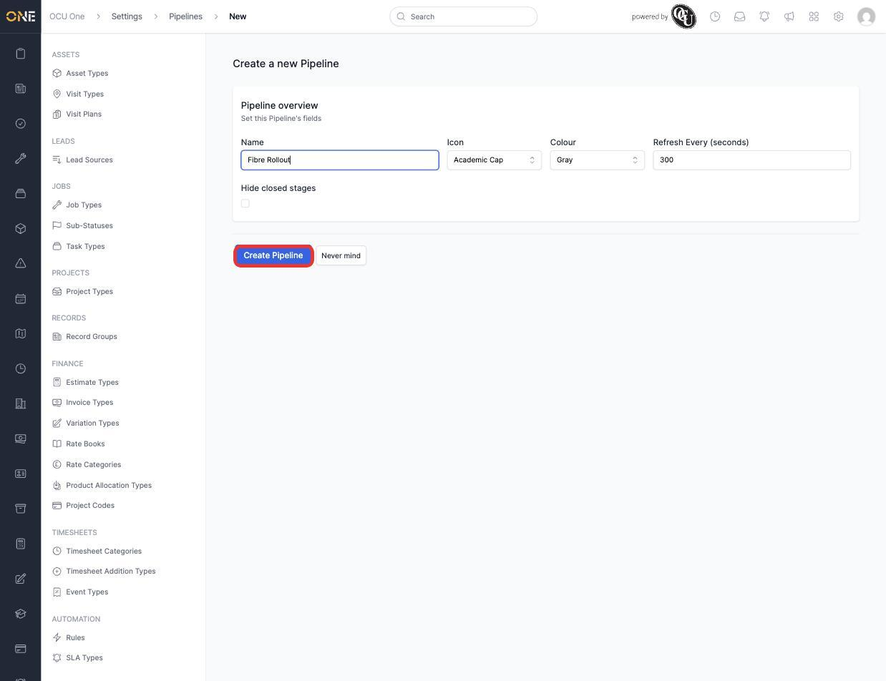
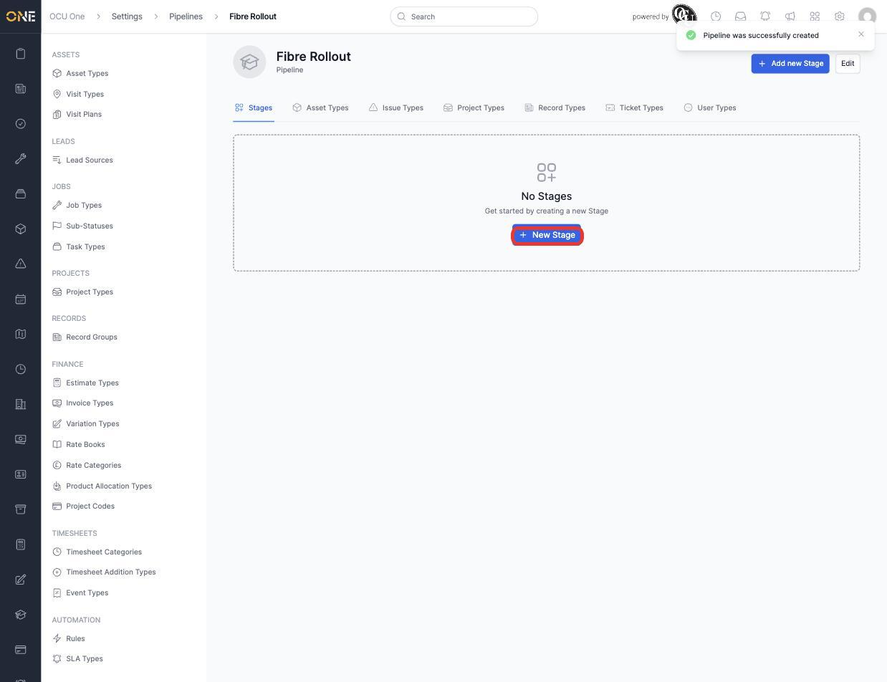
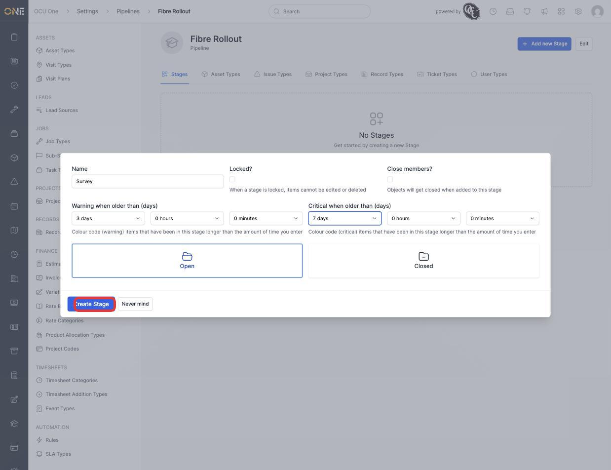
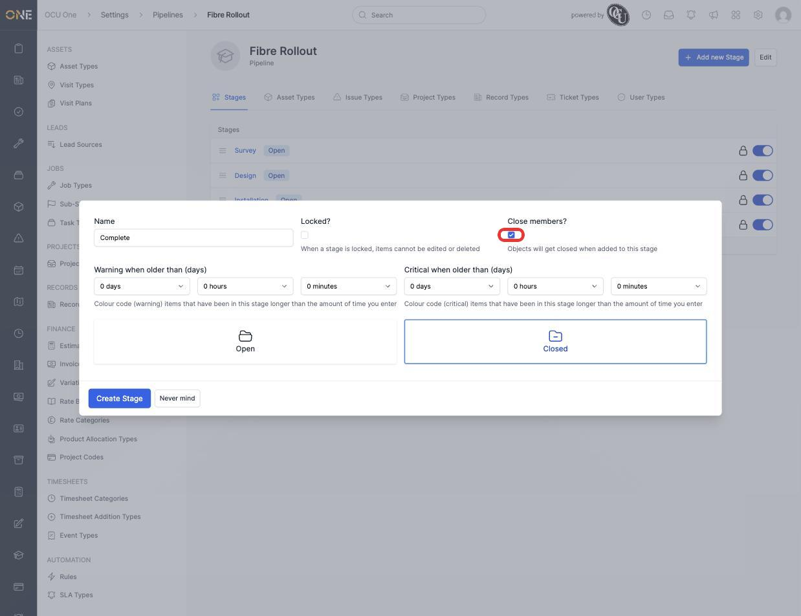
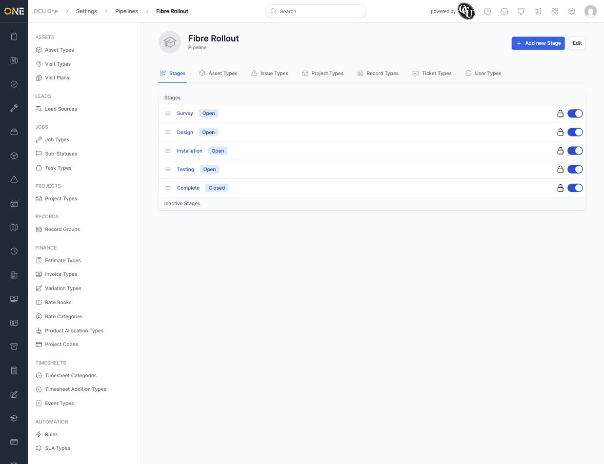

# Building a pipeline with stages

A pipeline is a named sequence of **stages** that a record moves through — for example a sales process or a fibre install workflow. Pipelines are built under **Settings > Pipelines**, then attached to whichever types should use them (see [Attaching a pipeline to a type](Attaching%20a%20pipeline%20to%20a%20type.md)).

## Creating a pipeline

1. From the Pipelines list, click **+ Pipeline**.

   

2. Give it a **Name** (for example **Fibre Rollout**), an **Icon**, a **Colour**, how often it should **Refresh** on-screen (in seconds), and whether to **Hide closed stages** by default.

   

3. Click **Create Pipeline**. The pipeline's page opens with a row of tabs for every type it can be attached to (Stages, Asset Types, Issue Types, Project Types, Record Types, Ticket Types, User Types), starting on **Stages**.

   

## Adding stages

1. Click **New Stage**, then give it a **Name** (for example **Survey**).
2. Set **Warning when older than** and **Critical when older than** — how long an item can sit in this stage before it's flagged amber, then red, on any board showing this pipeline.

   

3. Pick whether the stage counts as **Open** or **Closed** overall, and tick **Close members?** if reaching this stage should automatically close whatever object lands in it (typical for a final stage).

   

4. Click **Create Stage**, then repeat for each stage the pipeline needs. Stages appear in the order created and can be dragged to reorder:

   

## Things to know

- **Locked?** on a stage prevents anything in it from being edited or deleted — useful for a stage representing finalised, signed-off work.
- Ageing thresholds (Warning/Critical) can be set in days, hours, and minutes together, for pipelines that need finer-grained SLA-style tracking than whole days.
- A stage's Open/Closed status feeds into reporting and dashboards elsewhere in the app — it's not just cosmetic.
