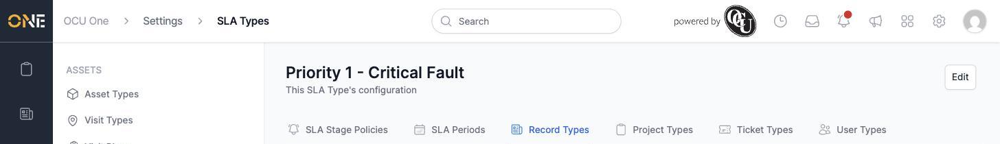
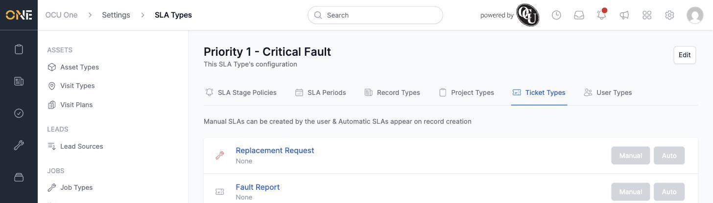
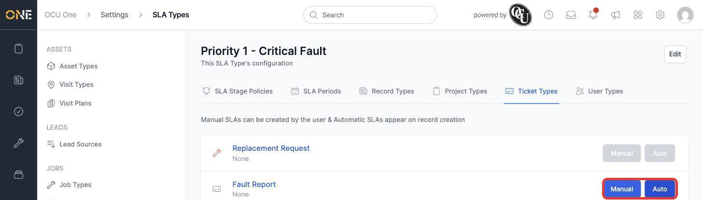

# Assigning SLA types to record, project, ticket, and user types

Creating an SLA type on its own doesn't put it in front of anyone — it needs to be assigned to the kinds of things people actually work with. An SLA type's detail page has four tabs for this: **Record Types**, **Project Types**, **Ticket Types**, and **User Types**, all under **Settings > SLA Types**.

## Assigning to a type

Each of the four tabs lists every active type of that kind, with two toggle buttons next to each one:

- **Manual** — lets someone manually create this SLA on a record of that type.
- **Auto** — automatically creates this SLA the moment a new record of that type is created.

1. Open the tab for the kind of type you want (here, **Ticket Types**).

   

2. Click **Manual** and/or **Auto** next to the type you want this SLA type available on. Each button turns solid blue once switched on.

   

Click either button again to switch it back off.

## Things to know

- **Manual** and **Auto** are independent — a type can have one, both, or neither switched on.
- The same pattern (list of types, Manual/Auto toggles) works identically across all four tabs — Record Types, Project Types, Ticket Types, and User Types — the only difference is which kind of thing the SLA type gets attached to.
- Only active types show up in these lists; deactivating a type elsewhere in Settings removes it from here too.
