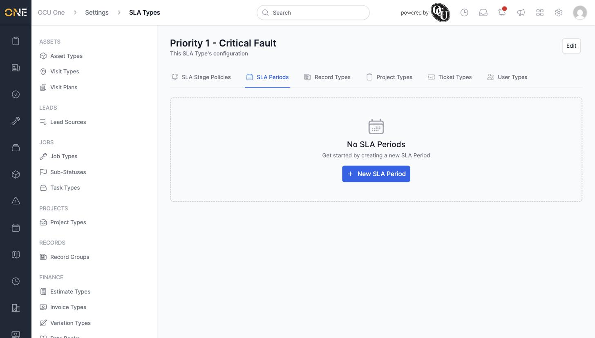
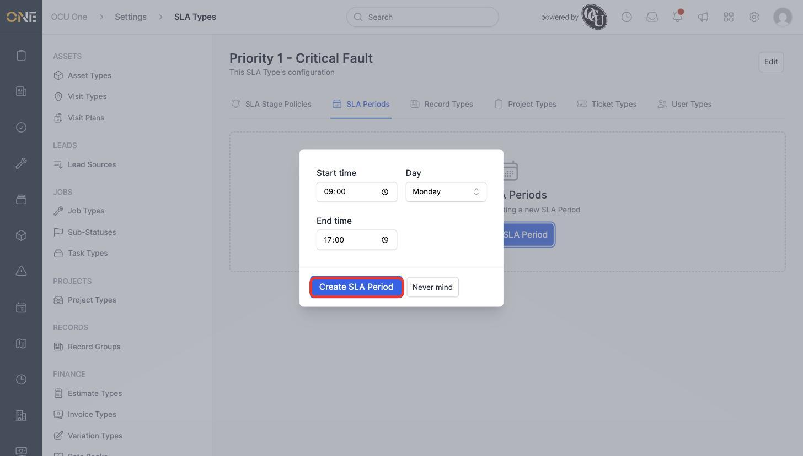
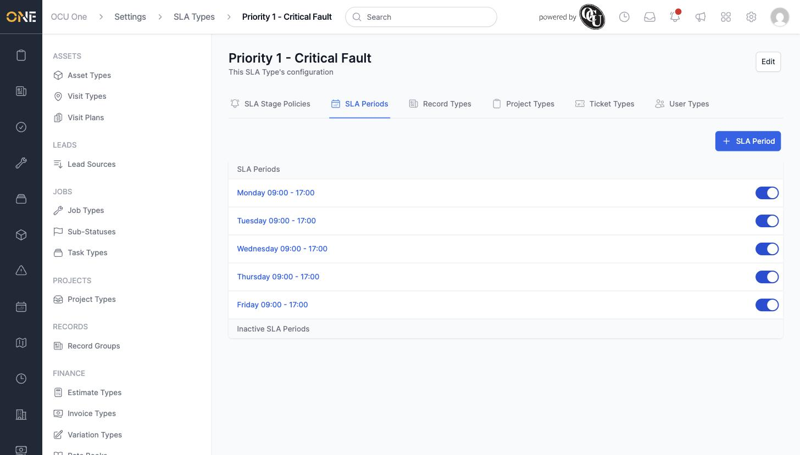
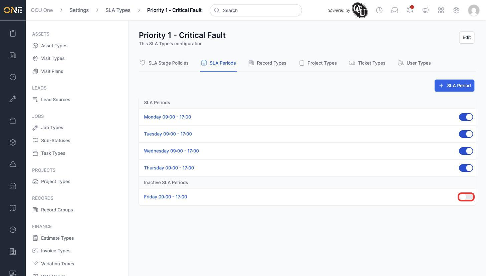

# Configuring SLA working-hour periods

An SLA Period defines the working hours an SLA type's clock actually counts against — outside these windows, time doesn't count towards the amber/red/breach thresholds. This is the **SLA Periods** tab on an SLA type's detail page, under **Settings > SLA Types**.

## Adding a period

1. Open an SLA type and go to the **SLA Periods** tab, then click **+ New SLA Period**.

   

2. Set the **Start time**, **Day**, and **End time** (for example **09:00**, **Monday**, **17:00**), then click **Create SLA Period**.

   

3. Repeat for each day that should count towards the SLA clock — here, a full working week of **09:00–17:00** on Monday through Friday.

   

## Deactivating a period

Switching a period's toggle off moves it into the **Inactive SLA Periods** section below, without deleting it — useful for a temporary change like a bank holiday closure.

Click the toggle again to move it back to the active list.

## Things to know

- A day can't have two overlapping periods — the app blocks saving a period whose time range overlaps an existing one on the same day.
- No periods at all means the SLA clock runs continuously (24/7) — periods are what narrow it down to specific working hours.
- These periods work alongside the **Exclude public holidays** setting on the SLA type itself (see **Creating an SLA type and its escalation thresholds**) for a complete picture of when the clock is actually running.
