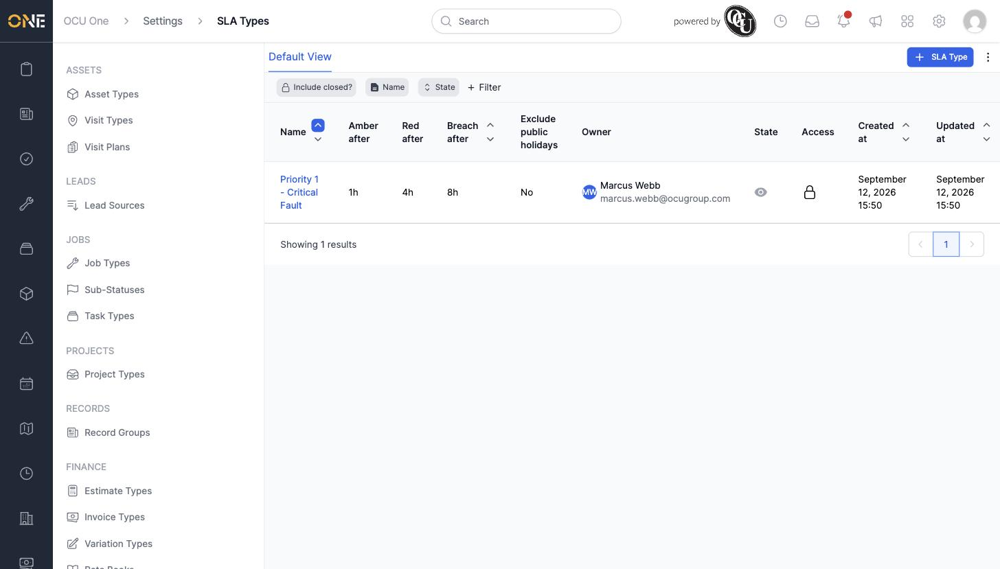
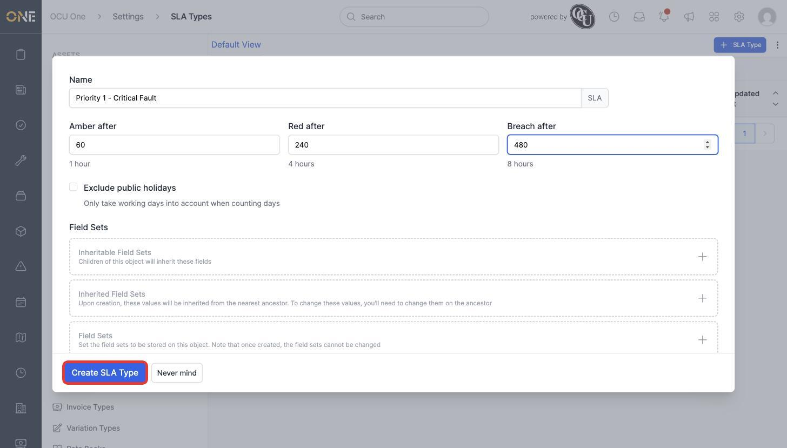
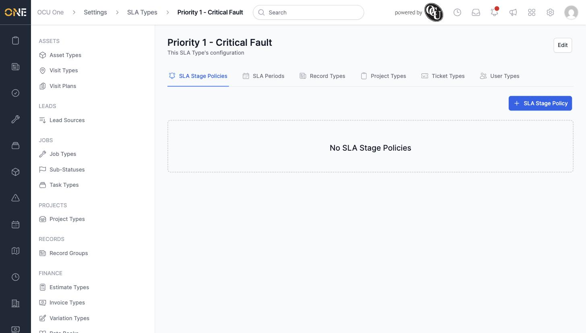
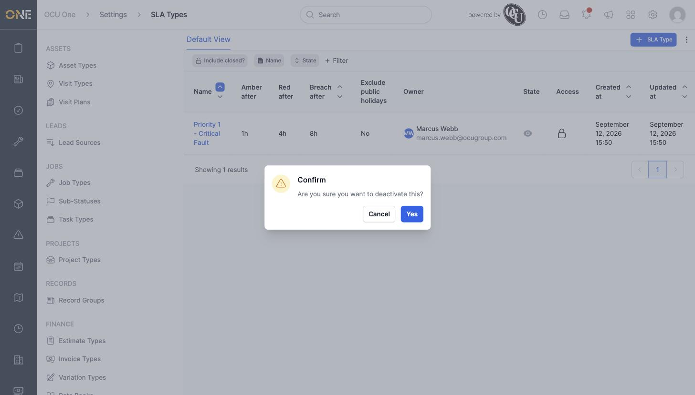

# Creating an SLA type and its escalation thresholds

An SLA Type defines a service-level agreement — how quickly something needs a response before it's considered at risk, critical, or breached. This screen, under **Settings > SLA Types**, is where an admin creates these and sets their escalation timings. Once created, an SLA Type can be attached to record types, project types, ticket types, or user types (see **Assigning SLA types to record, project, ticket, and user types**) so real SLAs get created automatically or offered as an option.

## Creating an SLA type

1. Click **+ SLA Type** in the toolbar.

   

2. Give it a **Name** (for example **Priority 1 - Critical Fault**), then set the three escalation thresholds — **Amber after**, **Red after**, and **Breach after** — all entered in minutes. As you type, the page shows the equivalent in hours below each field so it's easy to check you've entered the right amount.
3. Optionally tick **Exclude public holidays** so only working days count towards these thresholds.
4. Click **Create SLA Type**.

   

## Viewing an SLA type

Opening an SLA type shows its own tabbed configuration area: **SLA Stage Policies**, **SLA Periods**, **Record Types**, **Project Types**, **Ticket Types**, and **User Types**. Each tab is covered by its own guide in this section.

Click **Edit** at the top of this page any time to change the name or thresholds.

## Deactivating an SLA type

An SLA type that's no longer needed can be switched off from the SLA Types list, without deleting it or losing any SLAs already created from it.

1. Click the eye icon in the **State** column for the SLA type, then confirm.

   

2. To bring it back, click the eye-slash icon in the same spot and confirm again.

## Things to know

- **Amber after** must be less than **Red after**, which in turn must be less than **Breach after** — the app enforces this order when saving.
- The thresholds are always entered in minutes on this form, even though the page displays the human-readable equivalent (hours) alongside each one for a sanity check.
- Creating an SLA type on its own doesn't attach it to anything — see the other guides in this section for stage policies, working hours, and assigning it to real record/project/ticket/user types.
