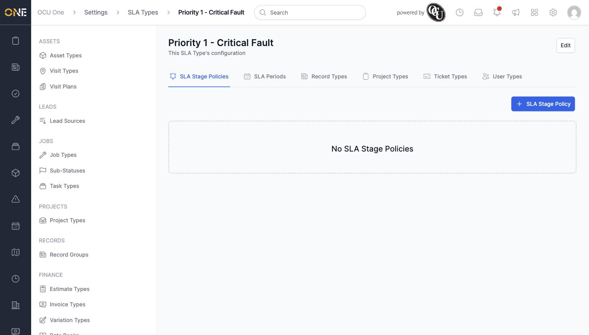
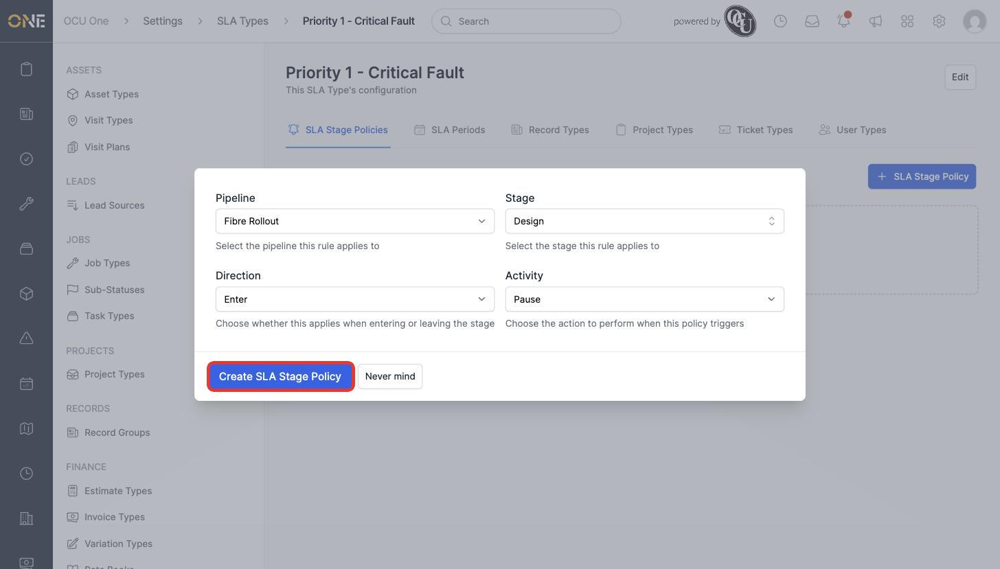
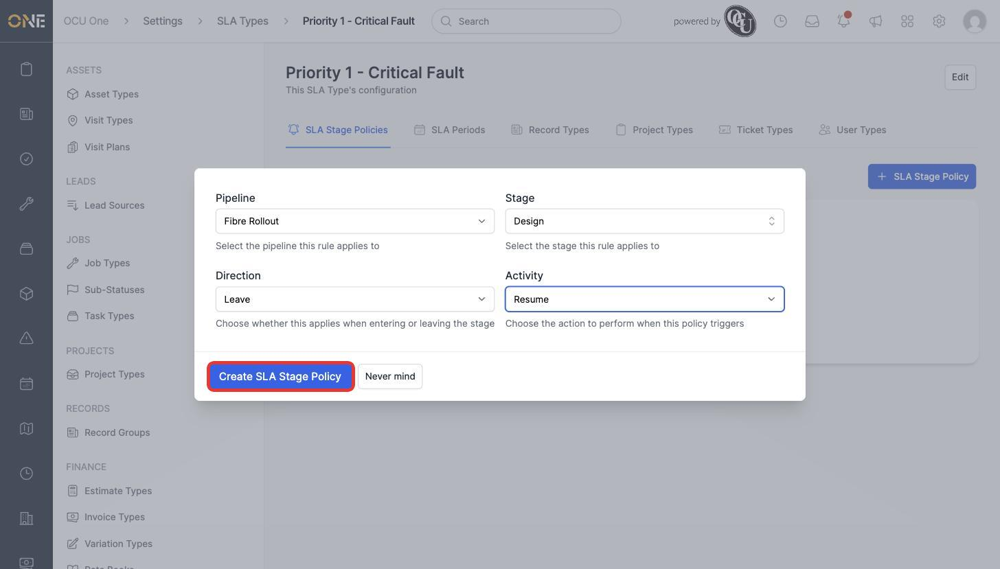
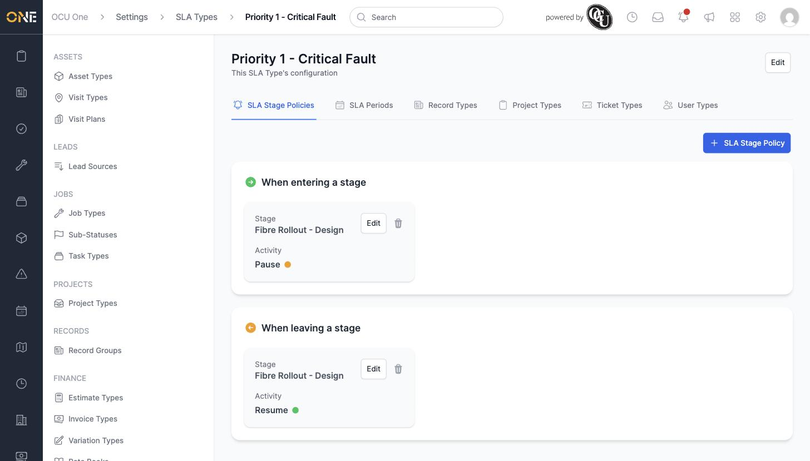

# Defining SLA stage policies

An SLA Stage Policy tells the SLA clock what to do automatically when a record moves through a particular pipeline stage — for example, pausing the clock while work is on hold, and resuming it once it moves on. This is the **SLA Stage Policies** tab on an SLA type's detail page, under **Settings > SLA Types**.

## Adding a stage policy

1. Open an SLA type and click **+ SLA Stage Policy**.

   

2. Choose the **Pipeline** this applies to (for example **Fibre Rollout**), then the **Stage** within it (for example **Design**).
3. Choose the **Direction** — **Enter** (triggers when a record moves into the stage) or **Leave** (triggers when it moves out) — and the **Activity** to perform: **Pause**, **Resume**, **Restart**, **Cancel**, or **Satisfy**.
4. Click **Create SLA Stage Policy**.

   

Repeat to cover the matching direction — here, a **Leave** policy on the same stage set to **Resume**, so the clock picks back up once the record leaves that stage.

## Viewing stage policies

Once saved, policies are grouped into **When entering a stage** and **When leaving a stage** sections, each showing the pipeline, stage, and activity (with a coloured dot — amber for Pause, green for Resume, red for Cancel).

Each policy can be edited or deleted (trash icon) from this same list.

## Things to know

- Only one policy can exist per stage, per direction — you can't have two separate "Enter" policies on the same stage.
- These policies only take effect for SLAs actually built from this SLA type and attached to a record using this pipeline — see **Assigning SLA types to record, project, ticket, and user types** for how that connection is made.
