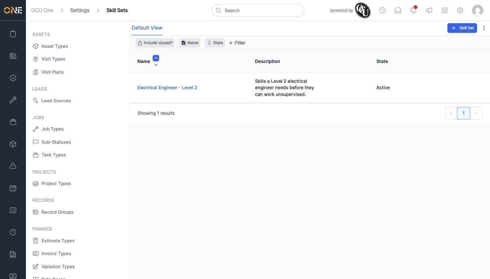
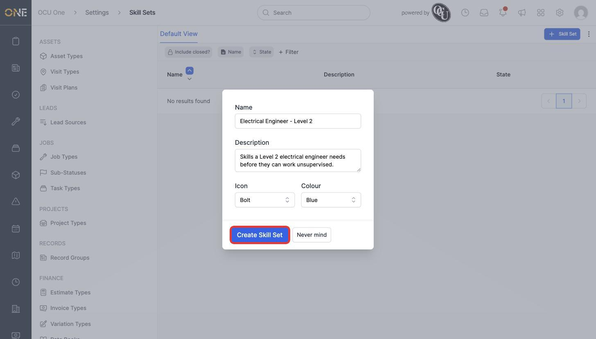
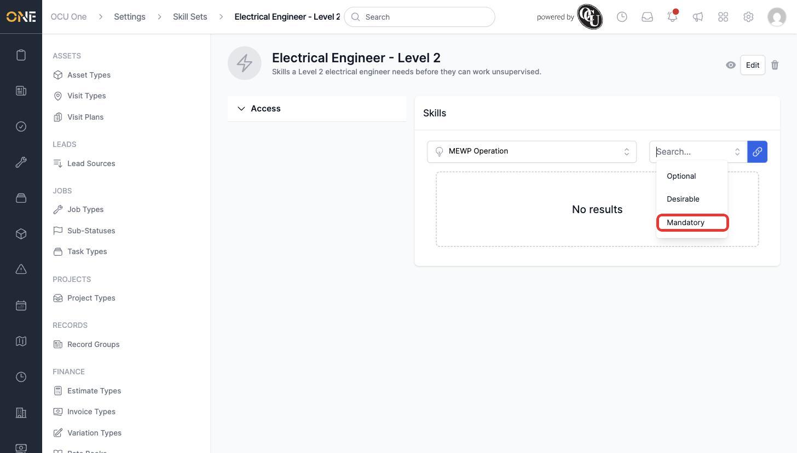
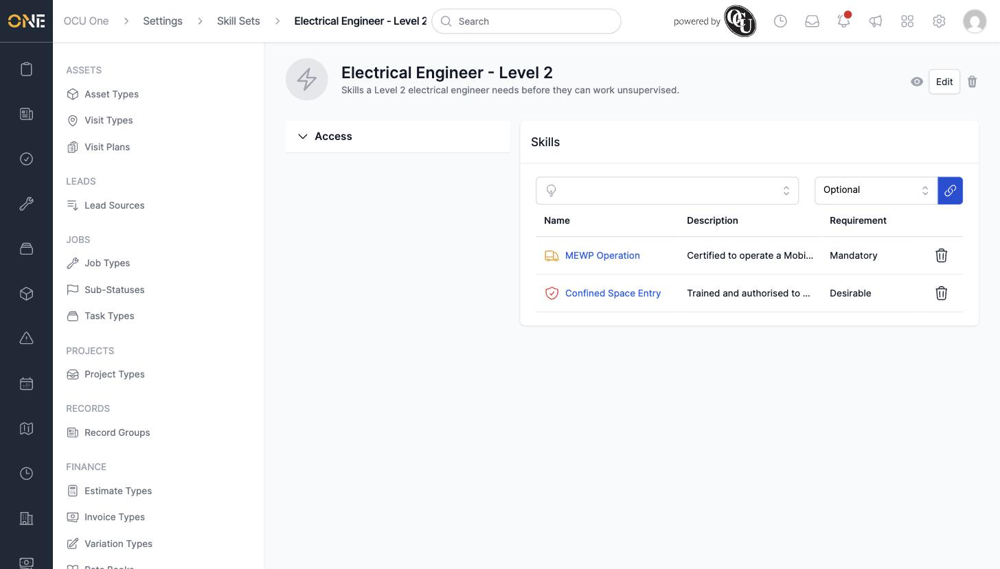

# Building skill sets

A Skill Set groups several individual **Skills** together into the bundle a particular job role needs — for example, everything a Level 2 electrical engineer must hold. This screen, under **Settings > Skill Sets**, is where an admin creates these bundles and decides how important each skill inside them is.

## Creating a skill set

1. Click **+ Skill Set** in the toolbar.

   

2. Give it a **Name** (for example **Electrical Engineer - Level 2**) and an optional **Description**, choose an **Icon** and **Colour**, then click **Create Skill Set**.

   

## Adding skills to a set

Once created, the skill set's page has a **Skills** panel where you attach existing skills and choose how important each one is.

1. Use the first dropdown to search for and select an existing skill (for example **MEWP Operation**), then use the second dropdown to set its requirement level — **Optional**, **Desirable**, or **Mandatory** — before clicking the link icon to attach it.

   

2. Repeat for each other skill the set needs (for example **Confined Space Entry**, set to **Desirable**).

   

## Things to know

- **Mandatory** skills are the ones someone must hold to be considered fully qualified for the set; **Desirable** skills are a bonus but not required; **Optional** skills are tracked but carry no weight either way.
- The trash icon next to an attached skill removes it from the set without deleting the skill itself.
- A skill set is only useful once it's assigned to people — see **Managing a user's skill sets** in Settings > Team & Users for how a skill set gets applied to a real person.
