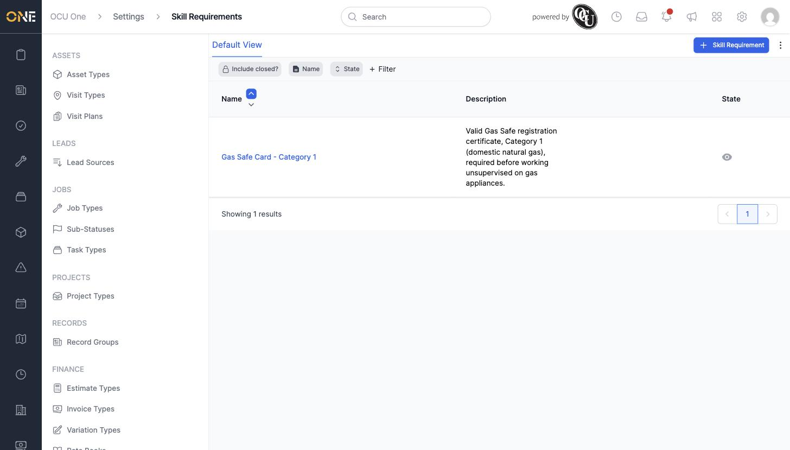
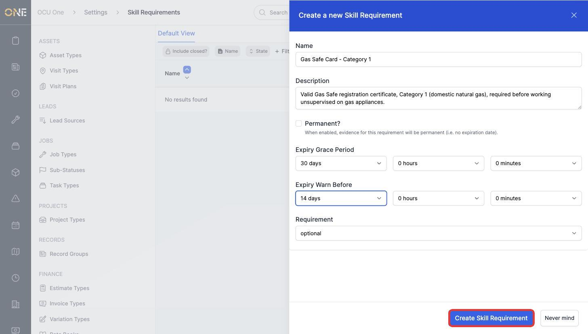
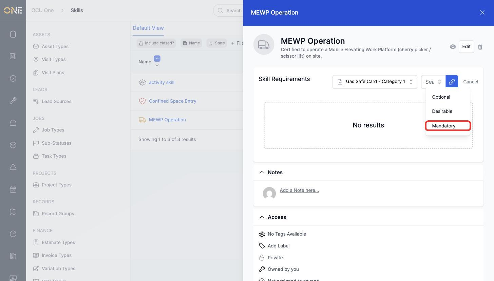
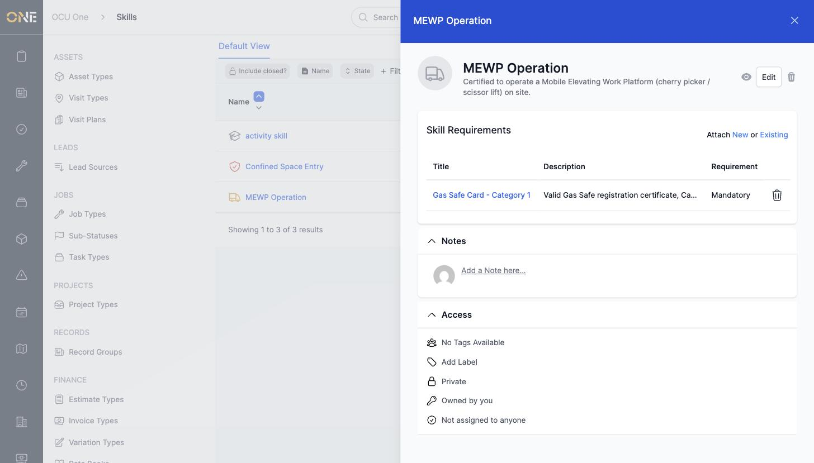

# Defining skill requirements

A Skill Requirement is the actual piece of evidence — a certificate, card, or qualification document — someone provides to prove they hold a **Skill**. This screen, under **Settings > Skill Requirements**, is where an admin defines these requirements and sets how long they last before needing renewal.

## Creating a skill requirement

1. Click **+ Skill Requirement** in the toolbar.

   

2. Give it a **Name** (for example **Gas Safe Card - Category 1**) and an optional **Description**.
3. If evidence for this requirement never expires, tick **Permanent?**. Otherwise, set an **Expiry Grace Period** (how long after expiry the requirement is still treated as valid) and an **Expiry Warn Before** (how far ahead of the actual expiry date a warning is raised).
4. Click **Create Skill Requirement**.

   

## Attaching a requirement to a skill

Creating a skill requirement on its own doesn't connect it to anything — it needs to be attached to a **Skill** before it means someone must hold it.

1. Open the relevant skill (under **Settings > Skills**) and click **Existing** next to **Skill Requirements**.
2. Search for the requirement (for example **Gas Safe Card - Category 1**), then choose how important it is — **Optional**, **Desirable**, or **Mandatory** — before clicking the link icon to attach it.

   

3. The requirement now appears in that skill's Skill Requirements list, showing the level it was attached at.

   

## Things to know

- The same skill requirement can be attached to more than one skill, and the requirement level (Optional/Desirable/Mandatory) is set independently each time it's attached.
- **Mandatory** means someone can't be considered to hold that skill without valid evidence against this requirement; **Desirable** is a bonus; **Optional** is tracked but not required.
- The eye icon on a requirement's row deactivates it without deleting it — useful once a certificate type is retired but you still want historical evidence preserved.
