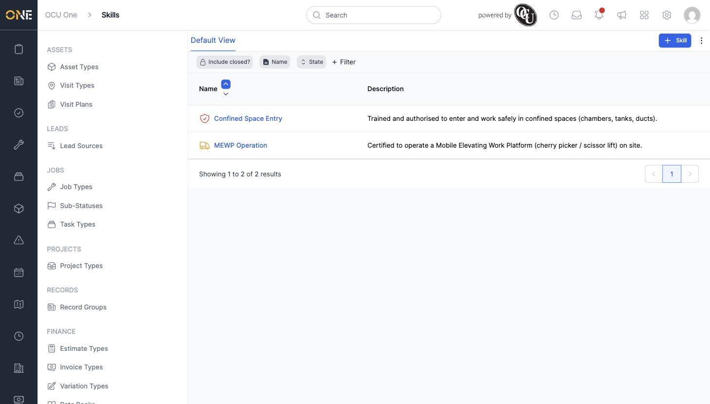
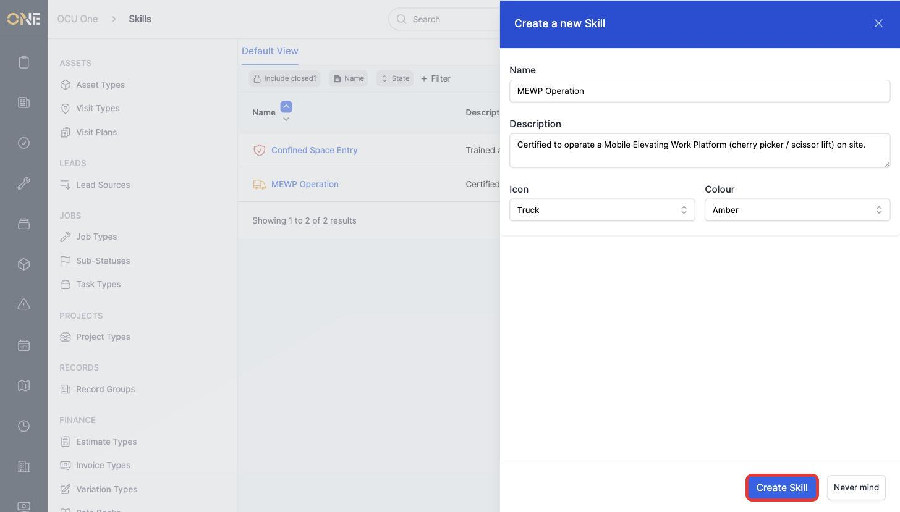
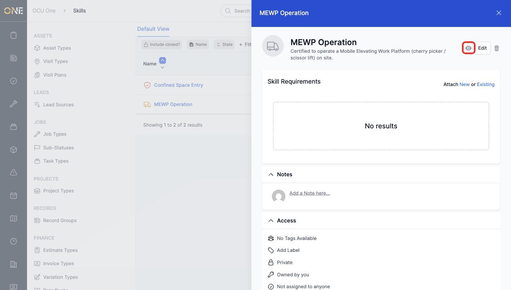
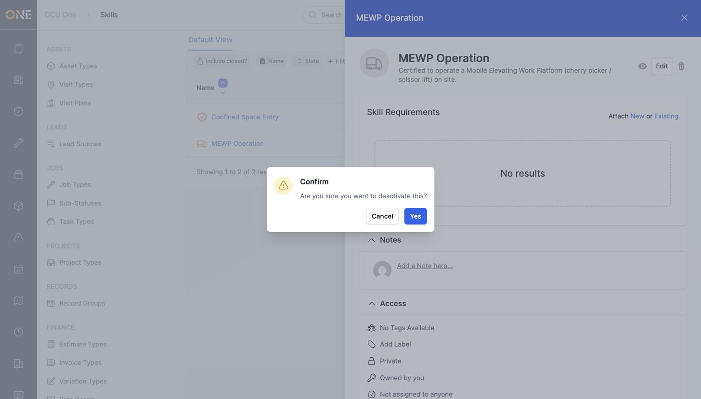

# Managing skills

Skills are the individual certifications, qualifications, or trained abilities your organisation tracks for its people — things like "MEWP Operation" or "Confined Space Entry". This screen, under **Settings > Skills**, is where an admin creates and manages the list of skills available across the app. Skills are the building blocks used elsewhere in Settings to build **Skill Sets** (groups of skills a job role needs) and to attach **Skill Requirements** (the certificates or evidence that prove someone holds a skill).

## Creating a skill

1. Click **+ Skill** in the toolbar.

   

2. Give the skill a **Name** (for example **MEWP Operation**) and an optional **Description**, then choose an **Icon** and **Colour** to help it stand out in lists. Click **Create Skill**.

   

The new skill appears in the Skills list, ready to be used in a Skill Set or to have Skill Requirements attached to it.

## Viewing and editing a skill

Click a skill's name in the list to open its detail panel. From here you can:

- See its **Skill Requirements** — the certificates or evidence needed to prove someone holds this skill — and attach a new or existing one directly from this panel.
- Click **Edit** to change its name, description, icon, or colour.
- Add **Notes** and check its **Access** settings.

## Deactivating and reactivating a skill

Rather than deleting a skill outright, it can be switched off so it no longer shows up as an option elsewhere, without losing its history.

1. Click the eye icon next to **Edit** on a skill's detail panel, then confirm.

   

2. To bring it back, open the skill again and click the eye-slash icon in the same spot, then confirm.

   

## Things to know

- The trash icon on a skill's detail panel permanently deletes it — deactivating is the safer option if you just want to stop it being used going forward.
- A skill on its own doesn't mean much until it's either added to a **Skill Set** (a bundle of skills a job role needs) or given one or more **Skill Requirements** (the actual evidence/certificate needed to prove it).
