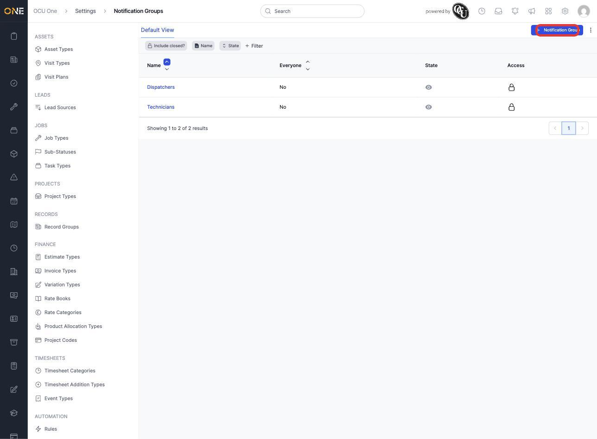
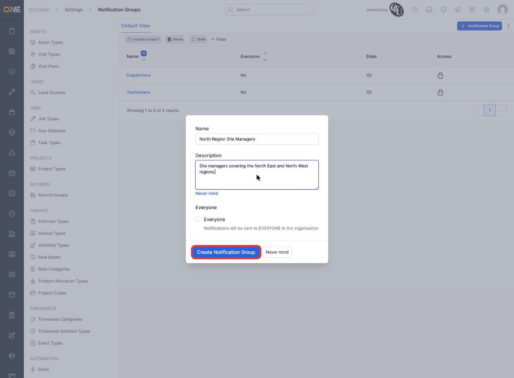
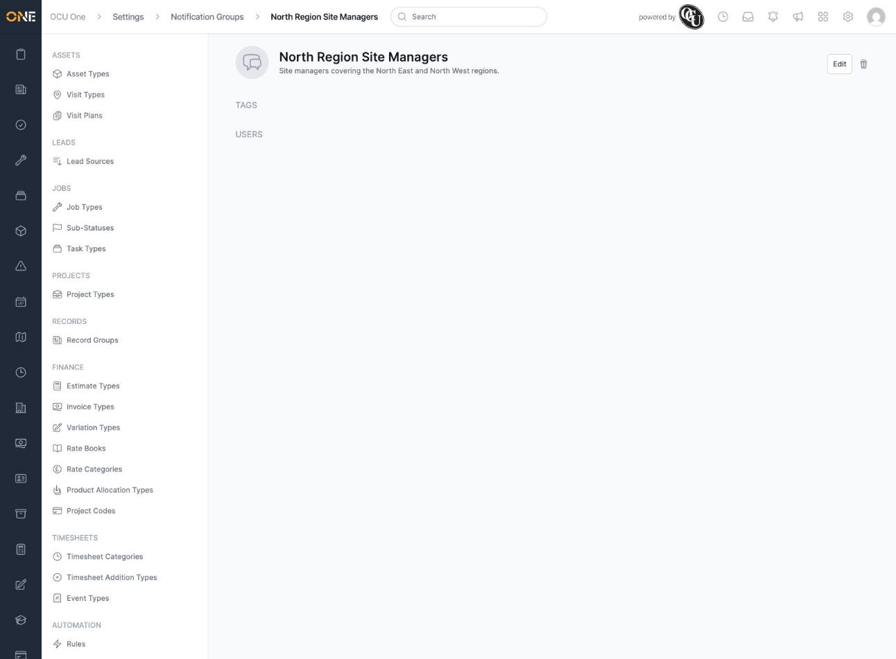
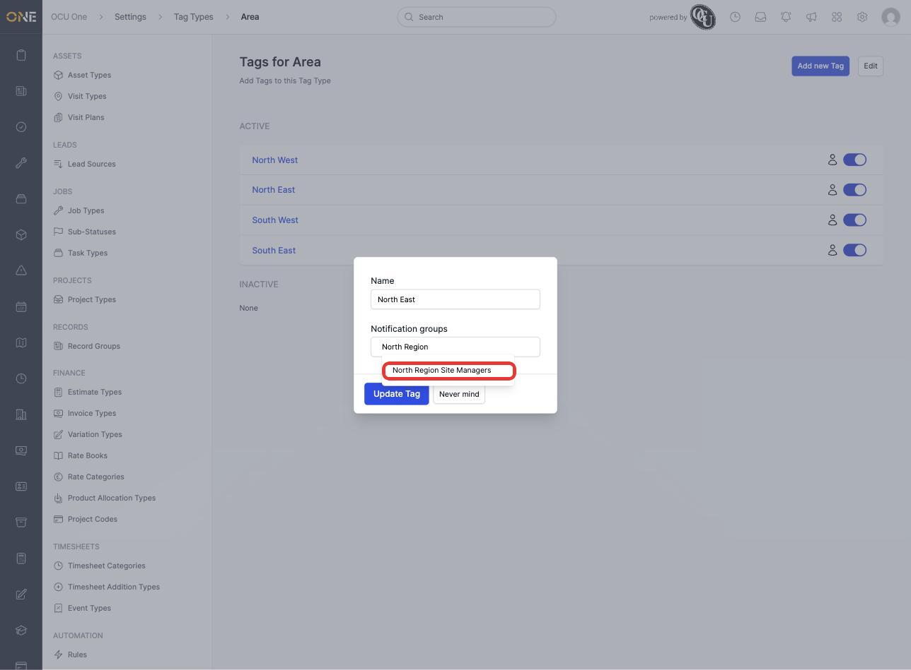
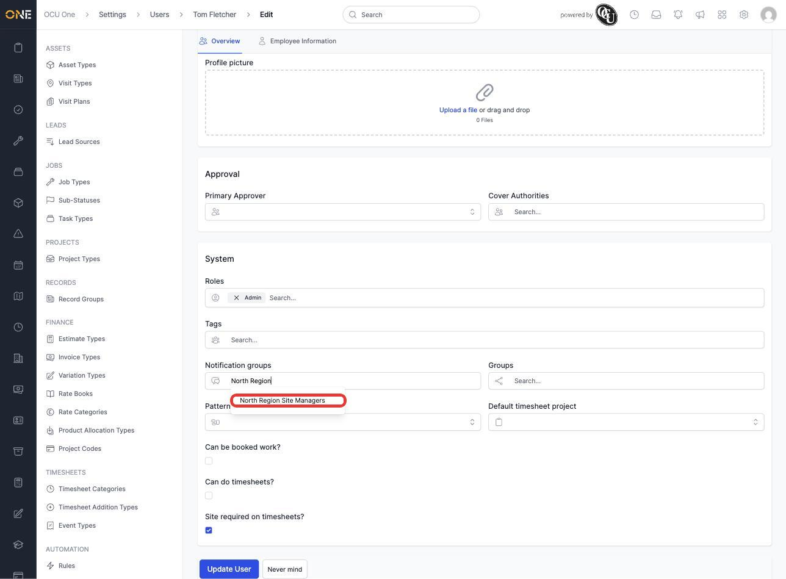
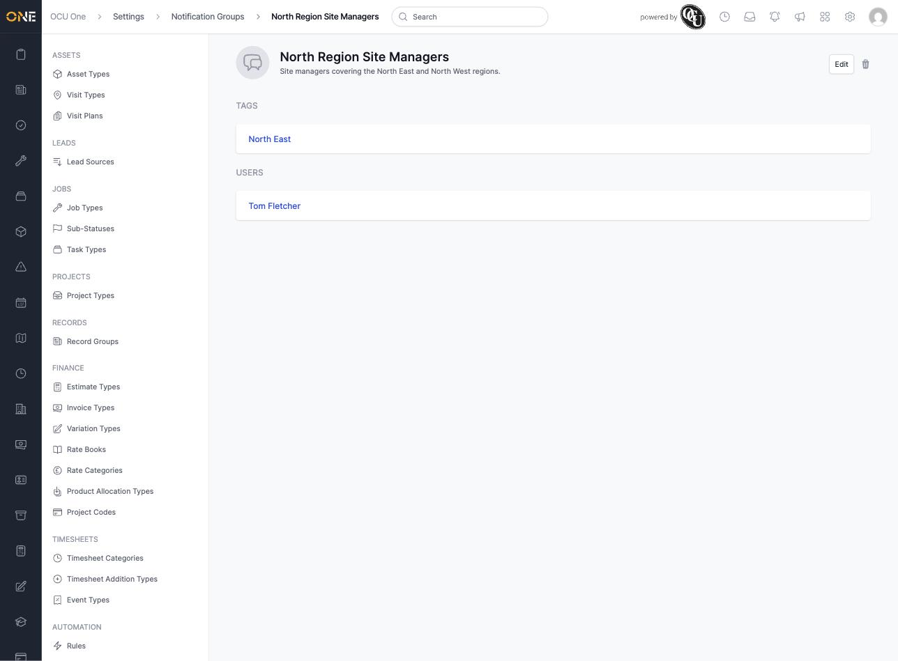

# Setting up notification groups and recipients

A notification group is a named set of people who should all receive the same notifications — for example everyone responsible for a region, or a particular team. This screen, under **Settings > Notification Groups**, is where an admin creates a group and decides who's in it.

## Creating a notification group

1. From the Notification Groups list, click **+ Notification Group**.

   

2. Give it a **Name** — for example **North Region Site Managers** — and an optional **Description**. Leave **Everyone** unchecked unless the group really should include every user in the organisation.

   

3. Click **Create Notification Group**. The group's page opens with empty **Tags** and **Users** sections, ready for recipients to be added.

   

## Adding recipients

A notification group's recipients come from two places, not from an "add recipient" button on the group itself:

- **By tag** — go to **Settings > Tag Types**, open the relevant tag type, and edit the tag. Its **Notification groups** field is where you link it to one or more groups; everyone carrying that tag then becomes a recipient.

  

- **By named user** — go to **Settings > Users**, edit the person, and use the **Notification groups** field on their profile to add them directly.

  

Once both are in place, the group's page lists everyone it now reaches — the tagged group plus the named individual:

## Things to know

- A group's recipients are the union of its tagged users and its directly-added users — someone only needs to match one of the two to receive notifications.
- Checking **Everyone** on a group overrides its tags and users entirely — notifications go to every user in the organisation regardless of what else is set up.
- A tag can be linked to more than one notification group at once, so the same "North East" tag could feed several different groups if needed.
