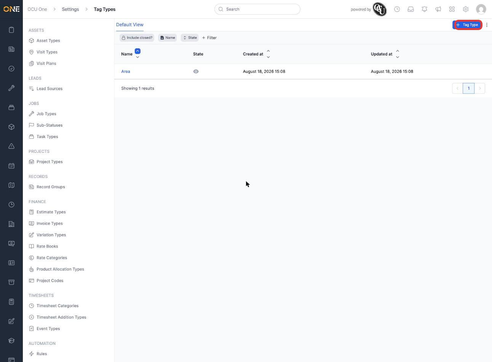
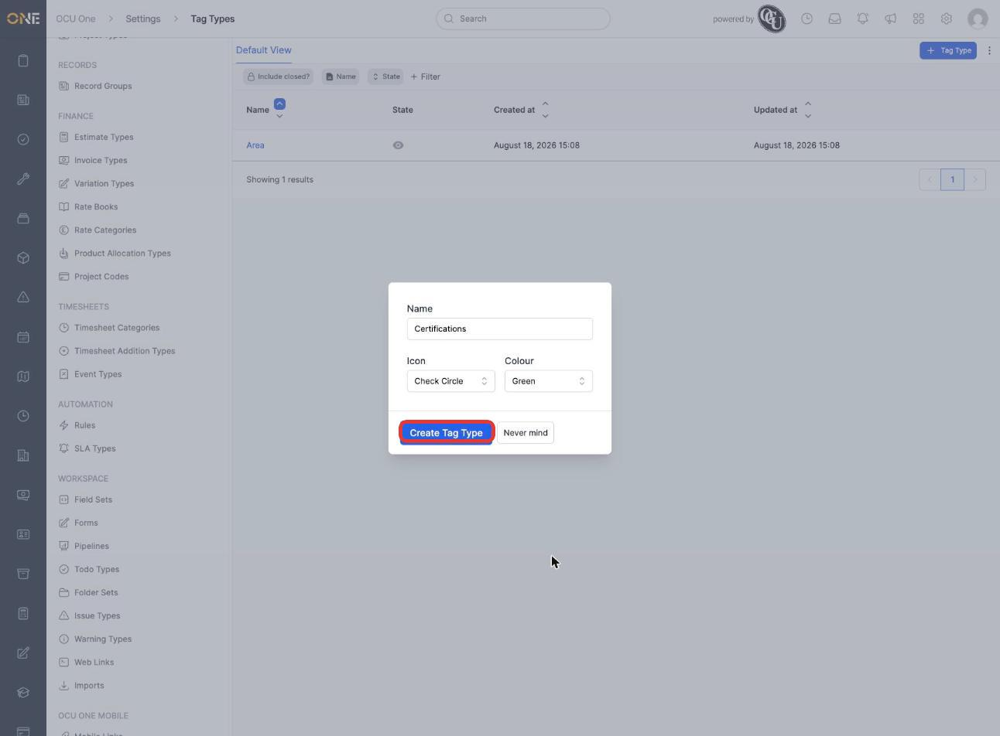
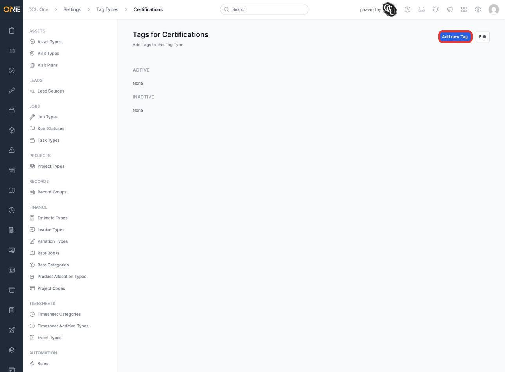
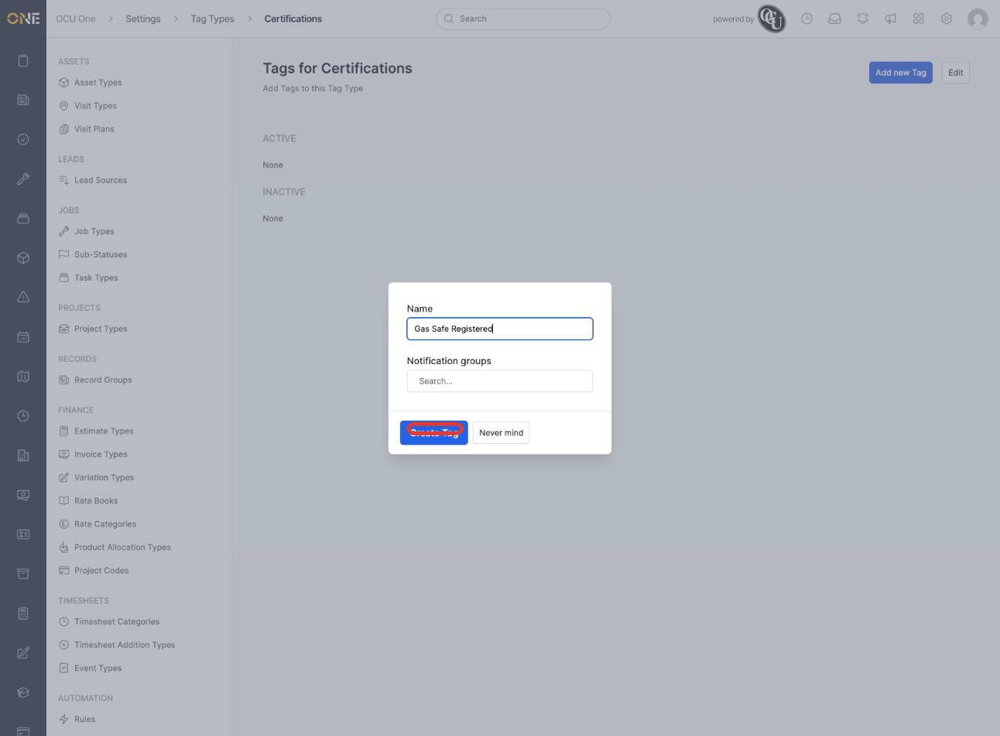
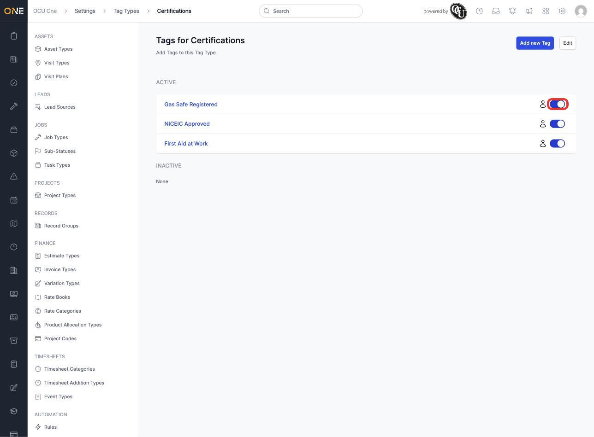
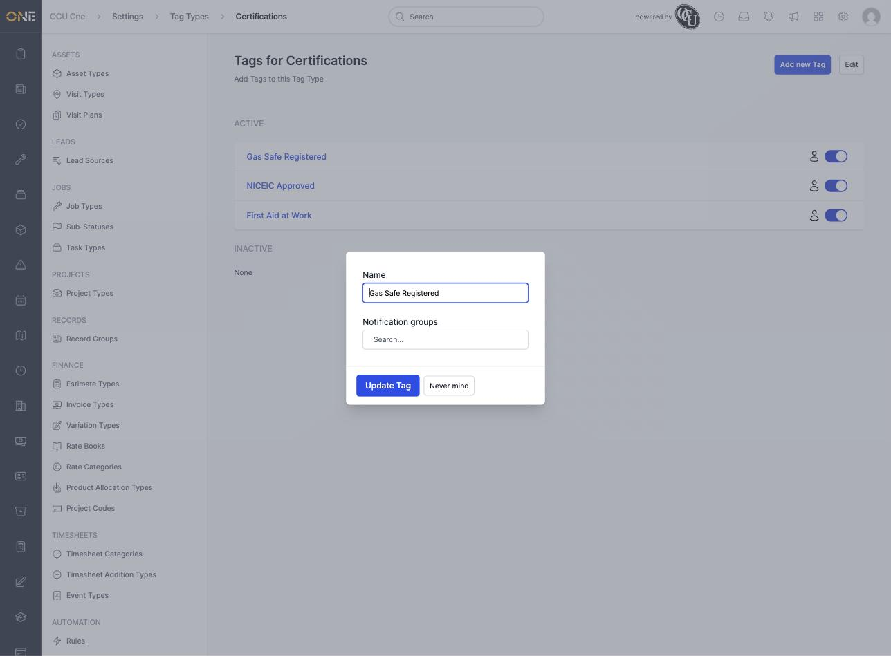

# Setting up tag types and tags

Tags let you mark a person or record with a short, reusable label — for example an area, a certification, or anything else your organisation wants to group people or records by. Tags are grouped under a **Tag Type**, so related tags stay together instead of turning into one long list. This screen, under **Settings > Tag Types**, is where an admin sets both up.

## Creating a tag type

1. From the Tag Types list, click **+ Tag Type**.

   

2. Give it a **Name** — for example **Certifications** — and choose an **Icon** and **Colour** for it.

   

3. Click **Create Tag Type**. You're taken straight to the new tag type's page, ready for tags to be added.

   

## Adding tags to a tag type

1. Click **Add new Tag**.
2. Give the tag a **Name** — for example **Gas Safe Registered**. You can also link it to one or more **Notification groups** here, so anyone in those groups gets notified based on this tag (see [Setting up notification groups and recipients](Setting%20up%20notification%20groups%20and%20recipients.md)).

   

3. Click **Create Tag**. Repeat for as many tags as the type needs — for example a full "Certifications" tag type with **Gas Safe Registered**, **NICEIC Approved**, and **First Aid at Work**:

   

## Editing a tag

Click any tag's name to reopen the same form, where you can rename it or change which notification groups it's linked to.

## Things to know

- Each tag has its own on/off toggle next to it — switching it off keeps the tag on any record it's already applied to, but removes it from anywhere new it could be picked.
- Tags can be applied to users as well as records — a user's tags are what's checked when a notification group is built from tags rather than named individuals.
- A tag type itself also has an **Edit** option (top right of its page) for changing its name, icon, or colour after it's created.
