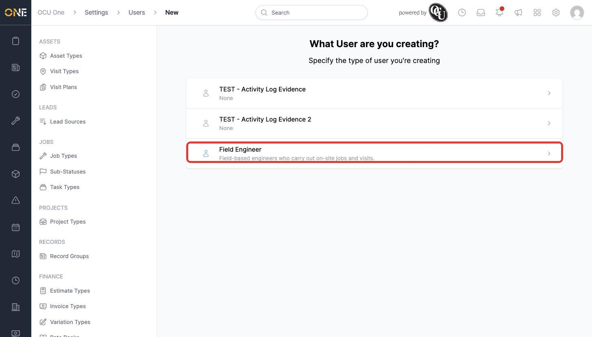
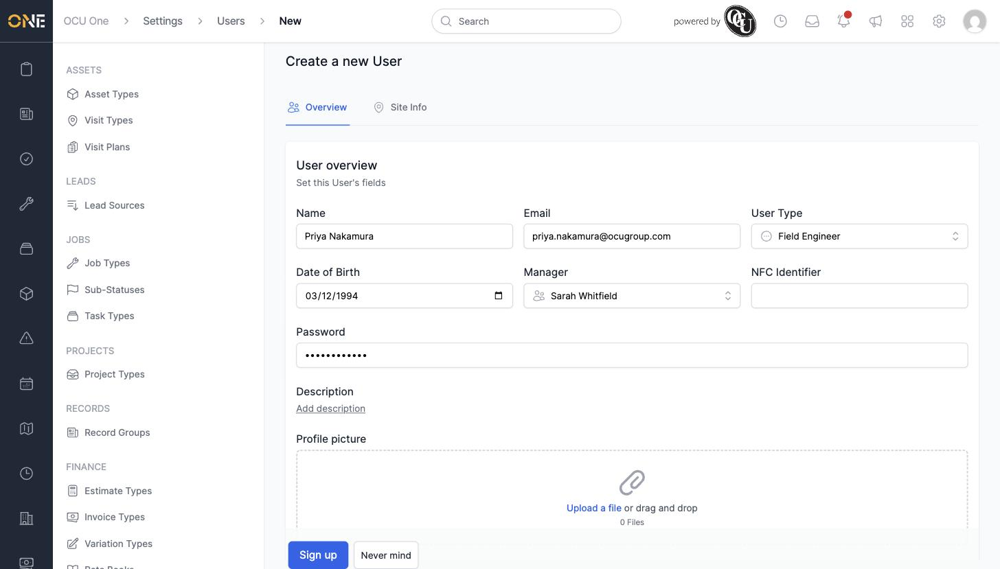
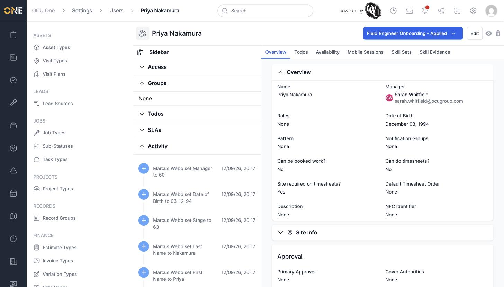

# Adding a new team member

Admins can add new colleagues to the system from **Settings > Team**. Each new person needs a name, an email address, and a **Team Type** (their job role), which controls what they can see and do.

## Creating a new team member

1. From the **Team** list, click **+ User**. You're first asked what type of user you're creating — pick the team type that matches the new person's role, for example **Field Engineer**.

   

2. Fill in their details on the **Overview** tab:
   - **Name** and **Email**
   - **User Type** — already set to the type you picked, but can be changed here
   - **Date of Birth**
   - **Manager** — search for and select their line manager
   - **Password** — sets their initial sign-in password

   

3. If the team type has any extra fields configured (shown under a second tab named after that information, e.g. **Site Info**), fill those in too — they're optional at this stage.

4. Click **Sign up** to create the account.

   

## Things to know

- Once created, the new team member appears at whatever stage a pipeline attached to their team type starts at — Priya Nakamura's profile shows **Field Engineer Onboarding - Applied** immediately after signing her up, because that pipeline's default stage was set to **Applied**.
- Roles, tags, and groups aren't part of the sign-up form — add those afterwards from the **Edit** screen (see *Editing a team member's profile and system settings*).
