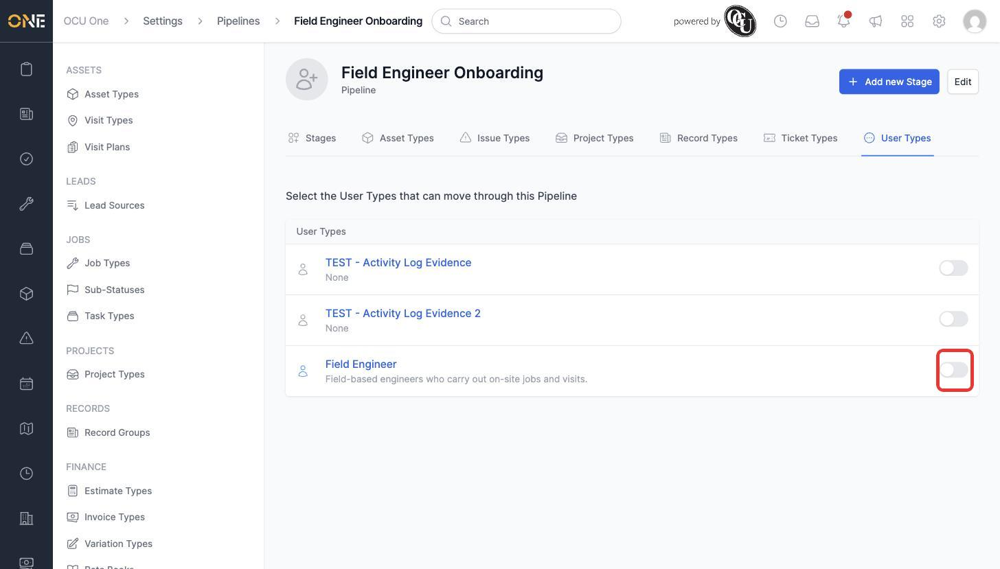
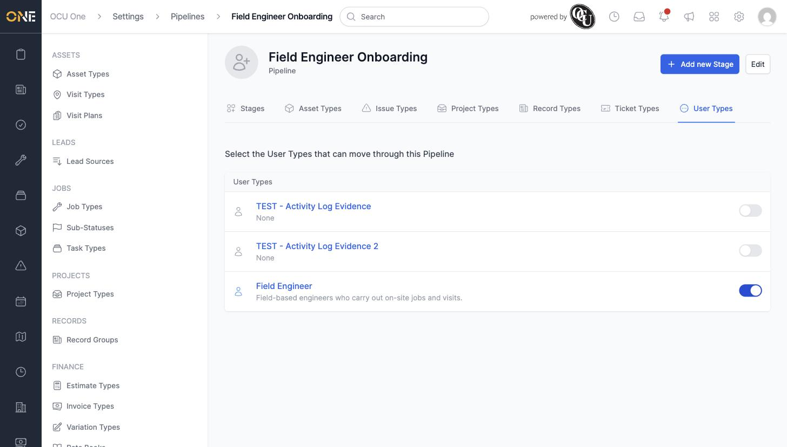

# Attaching a pipeline to user types

To move team members through stages — like an onboarding journey — a pipeline first needs to be told which user types are allowed to use it.

## Attaching a pipeline

1. Open the pipeline from **Settings > Pipelines** and go to its **User Types** tab. Every user type in the system is listed here with a toggle.

   

2. Turn on the toggle for each user type that should move through this pipeline.

   

Once attached, team members of that user type immediately gain the pipeline's stage badge on their profile, and the pipeline's default stage becomes selectable on the user type's own **Default stage** field.

## Things to know

- A single pipeline can be attached to more than one user type at once — useful for a shared onboarding process across several roles.
- Removing a user type's toggle here also removes any of its members from the pipeline's board and progress bar.
