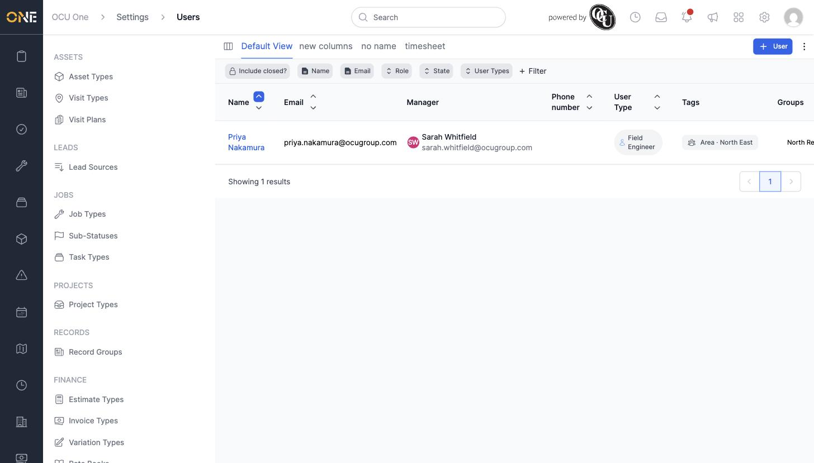
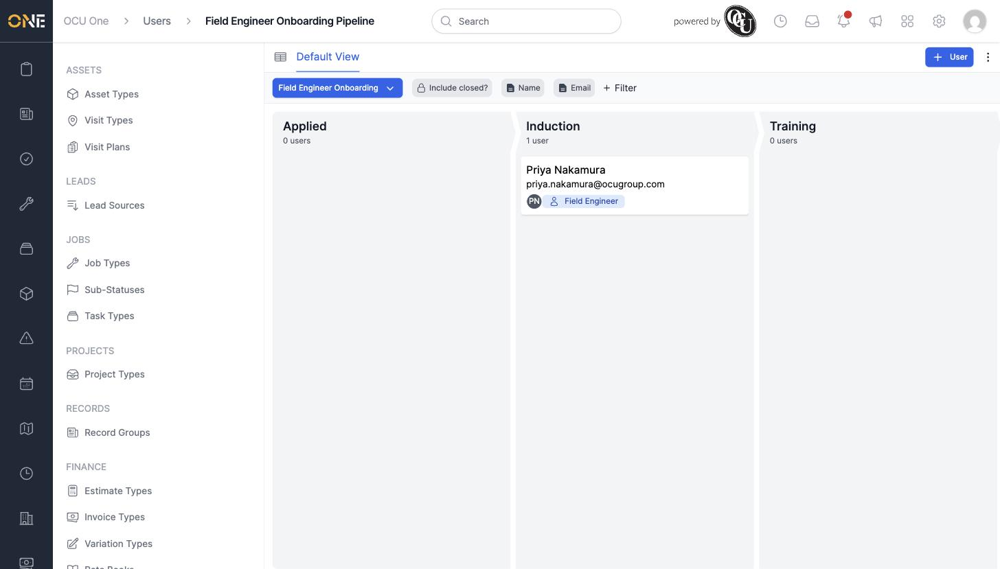

# Browsing team members in a table or pipeline board view

The **Team** list under Settings can be viewed as either a filterable table or a kanban-style pipeline board, depending on what you need to see.

## Table view

Go to **Settings > Team**. The table lists every team member with columns for Email, Manager, Phone number, User Type, Tags, and Groups. Use **+ Filter** to narrow the list — for example by **User Types** or by name.

## Pipeline board view

If a team type has a pipeline attached, its members can also be viewed as a board, with one column per stage. Switch to this view from the pipeline's own page, or via the pipeline picker at the top of the board.

## Things to know

- The board view only shows team members whose type has that pipeline attached — team members of other types won't appear on it.
- Both views support the same filters (**Include closed?**, **Name**, **Email**, and more via **+ Filter**), so you can narrow either one down the same way.
