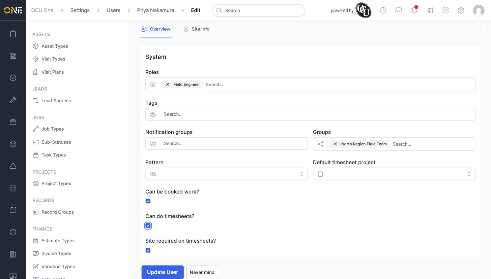
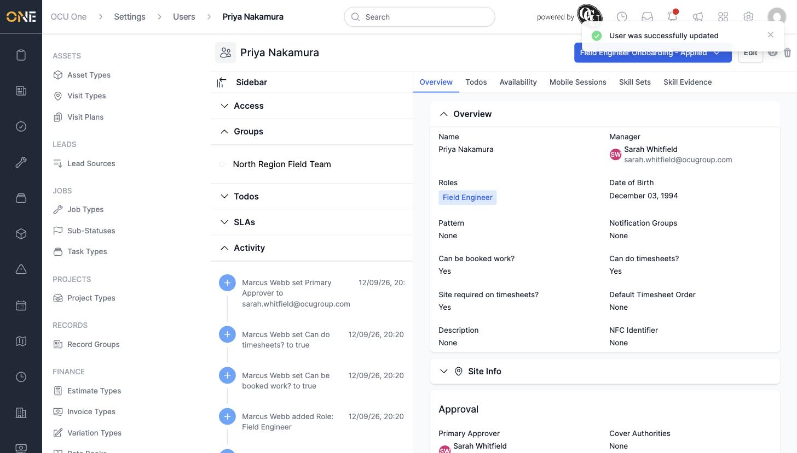

# Editing a team member's profile and system settings

Beyond the basics set when a team member is first added, their **Edit** screen holds everything that controls how they work day to day — who approves their timesheets, what role they hold, which team they belong to, and whether they can be booked onto jobs.

## Editing a team member

1. From their profile, click **Edit**, then scroll down to the **Approval** section. Set:
   - **Primary Approver** — who approves this person's timesheets
   - **Cover Authorities** — anyone who can approve in the primary approver's absence

2. Under **System**, set:
   - **Roles** — determines their permissions (e.g. **Field Engineer**)
   - **Tags**, **Notification groups**, and **Groups** — for organising and notifying this person
   - **Pattern** — a shift pattern, if they work rotating shifts
   - **Can be booked work?** — whether they can be scheduled onto jobs
   - **Can do timesheets?** — whether they can log time
   - **Site required on timesheets?** — whether a site must be picked on every timesheet entry

   

3. Click **Update User** to save.

   

## Things to know

- **Can be booked work?** and **Can do timesheets?** default to **No** for a brand-new team member — turn them on here once the person is ready to be scheduled or to log time.
- Every change made here is recorded on the profile's **Activity** feed, so you can always see who set what and when.
