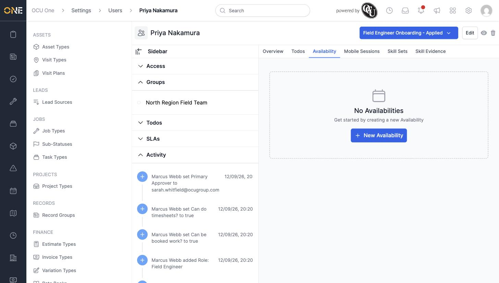
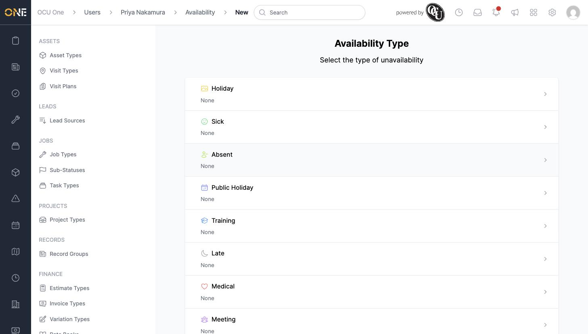
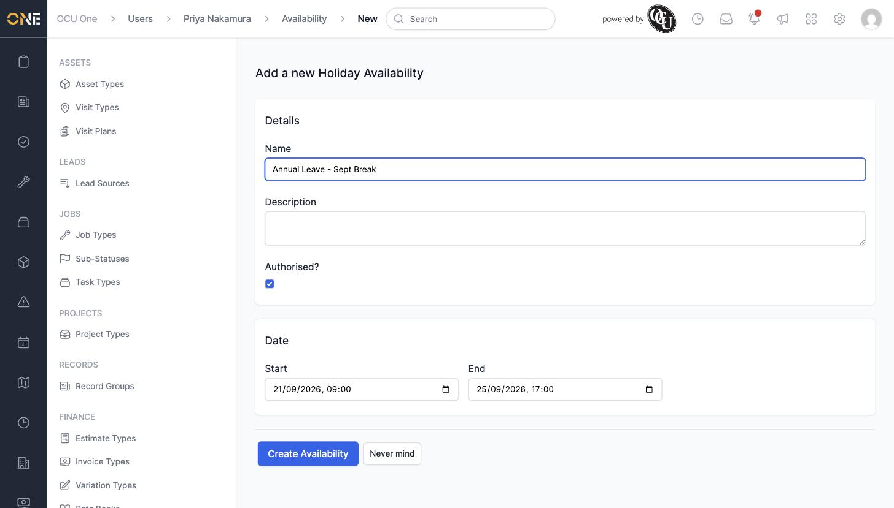
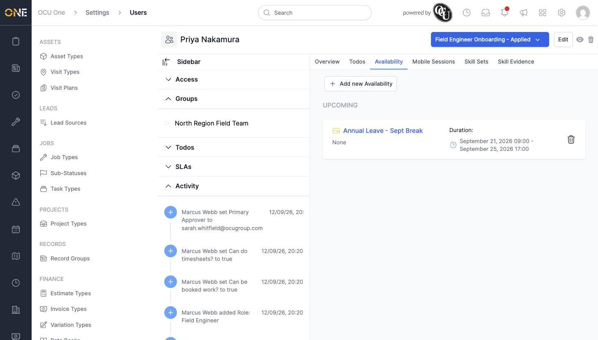

# Managing a user's availability entries

The **Availability** tab on a team member's profile records the times they're *unavailable* for work — holiday, sickness, training, and similar. Recording these keeps them off the scheduler for those dates.

## Adding an availability entry

1. On the team member's profile, open the **Availability** tab and click **+ New Availability**.

   

2. Choose the type of unavailability — for example **Holiday**, **Sick**, or **Training**.

   

3. Fill in the details:
   - **Name** and **Description**
   - **Authorised?** — whether this absence has been approved
   - **Start** and **End** — the date and time range this entry covers

   

4. Click **Create Availability**.

   

## Things to know

- Availability entries are grouped by whether they're upcoming, current, or in the past.
- Choosing an availability type pre-fills the **Name**, **Description**, and **Authorised?** fields from that type's defaults — you can still change any of them before saving.
- Click the trash icon next to an entry to remove it.
