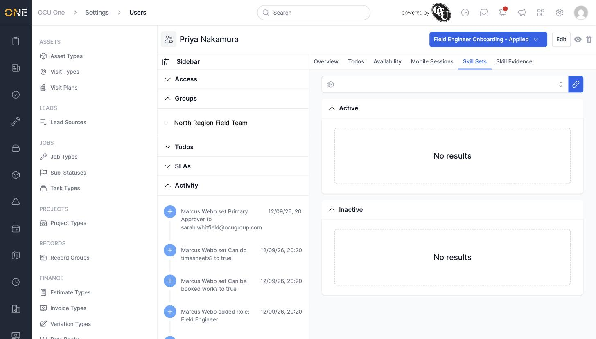
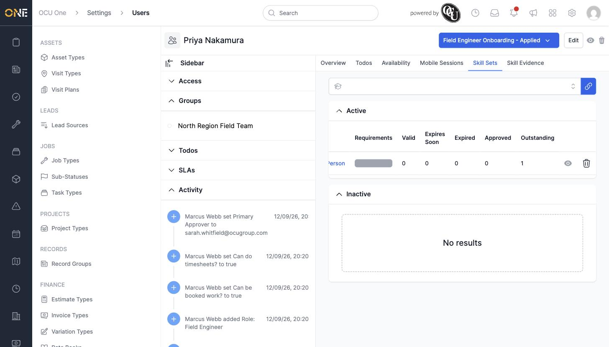
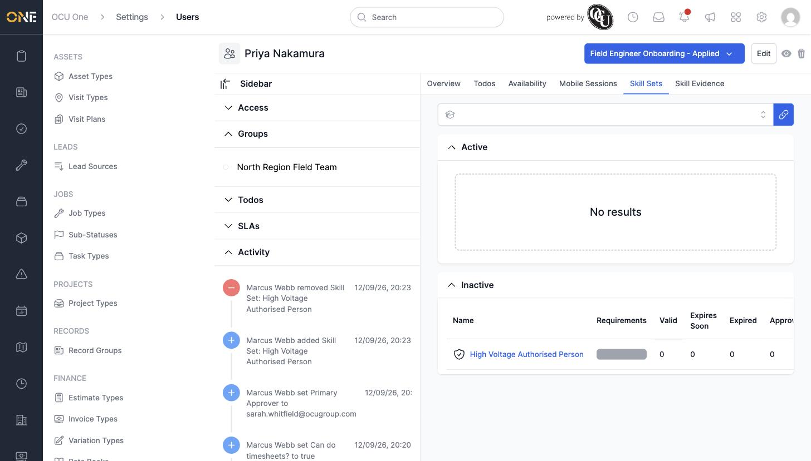

# Managing a user's skill sets

A **Skill Set** groups the qualifications a team member needs for a particular kind of work — for example, everything required to be authorised for high-voltage jobs. Linking a skill set to someone tracks their progress against every requirement inside it.

## Linking a skill set to a team member

1. Open the team member's profile and go to the **Skill Sets** tab. Use the search box at the top to find the skill set you want to add.

   

2. Select the skill set from the list, then click the link icon next to the search box to attach it.

   

## Deactivating a skill set

If a team member no longer needs a skill set — for example they've moved to a role that doesn't require it — click the eye icon on its row to deactivate it. Confirm the prompt to move it to the **Inactive** table.

## Things to know

- The Active table's columns — **Valid**, **Expires Soon**, **Expired**, **Approved**, **Outstanding** — count how many of the skill set's requirements the team member has evidence for in each state, so you can see compliance at a glance without opening every requirement.
- Deactivating a skill set doesn't delete any evidence already submitted against it — it just stops it counting towards this team member's active requirements.
