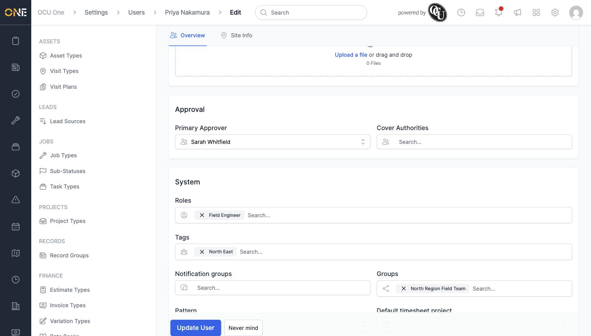
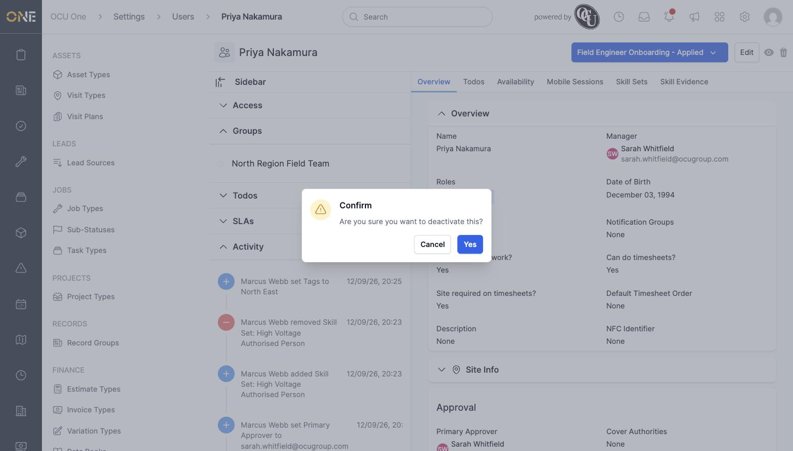
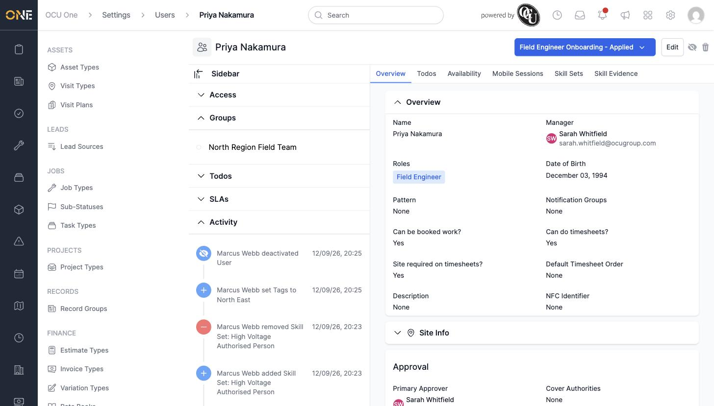
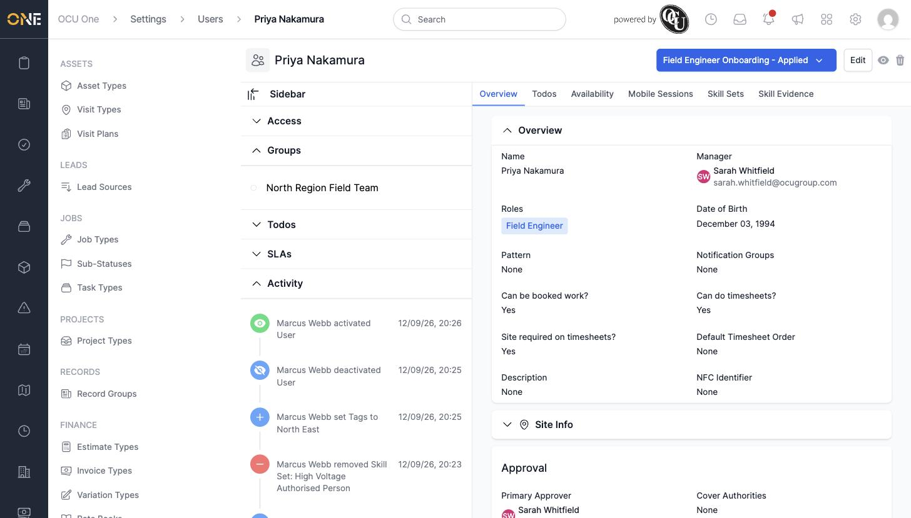

# Managing a user's tags and lifecycle status

Tags help you group and filter team members — by region, certification, or anything else your organisation tracks — and a person's lifecycle status controls whether they still show up as an active member of the team.

## Adding a tag

1. Open the team member's **Edit** screen and find the **Tags** field under **System**.
2. Search for the tag you want, for example **Area · North East**, and select it.

   

3. Click **Update User** to save. The tag now appears on their profile, and the change is recorded in their **Activity** feed.

## Deactivating and reactivating a team member

To deactivate someone — for example when they've left, or are on long-term leave — click the eye icon at the top of their profile, next to **Edit**.

Confirming turns the icon into a crossed-out eye, and the change shows up on the Activity feed as **deactivated User**.

To bring them back, click the same icon again and confirm — this reactivates the account.

## Things to know

- Deactivating a team member doesn't delete anything — their history, todos, and evidence all stay in place, and reactivating them restores full access immediately.
- Tags aren't the same as **Roles** — roles control permissions, while tags are for grouping and filtering only.
